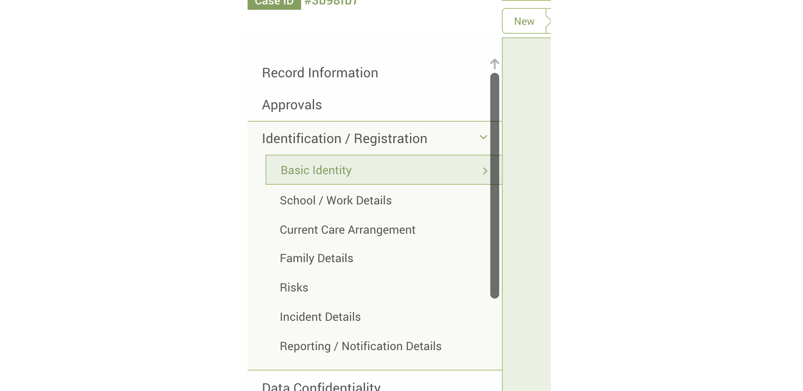
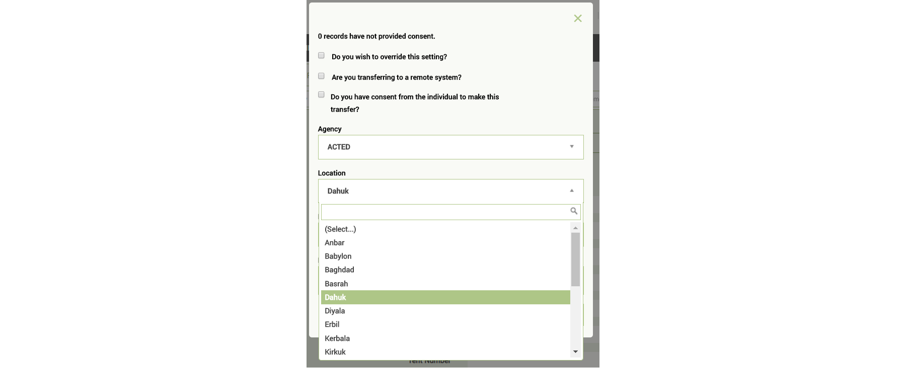
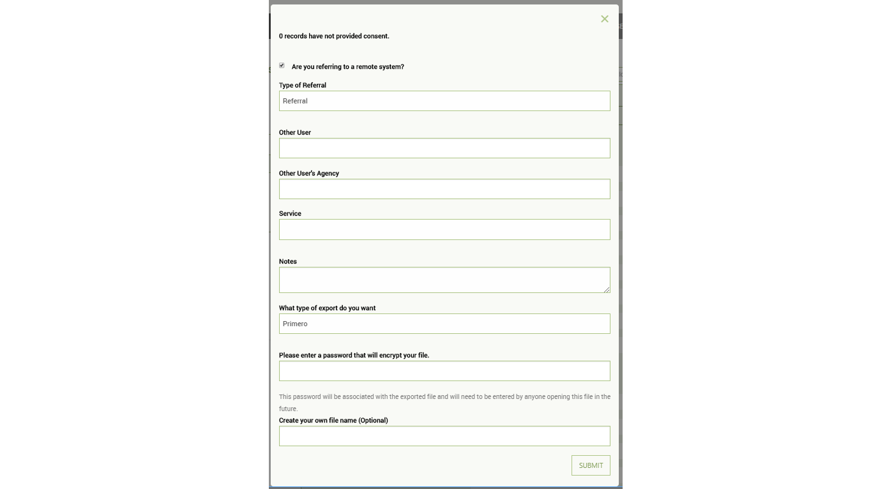
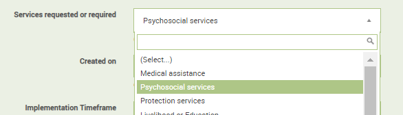
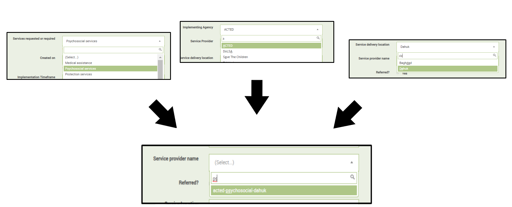

# Introduction

  
The _Information Management and Innovation to Protect Children in Emergencies_ project has developed a software application that will help partners securely collect, store, manage, and share data for protection-related incident monitoring and case management. The new platform is called _Primero_ \(Protection-related Information Management\). _Primero_ supports multiple modules, including the “next generation” of the field-tested, inter-agency CPIMS and GBVIMS systems, which are currently in use in 20+ countries. These new iterations, called the CPIMS+ and GBVIMS+, can operate separately or be deployed as integrated modules on the _Primero_ platform. The inter-agency Steering Committees that govern the use of each of these modules will continue to support the new system.

_Primero_ is flexible and adaptable to accommodate a broad range of protection concerns including GBV, unaccompanied and separated children, and monitoring grave violations of children’s rights in situations of armed conflict. To meet operational challenges, the application was designed to function both on- and off-line, with limited or no connectivity, and in multiple deployment configurations. A strong emphasis has been placed on security and confidentiality, with intuitive workflows designed to simplify processes while promoting good practice. Role-based access and granular security ensures that only those who need to see data will have access to it. All system transactions are time stamped, password protected and encrypted. _Primero_ has a user-friendly interface and intuitive tools, facilitating the work of field personnel while decreasing security risks and duplication. Primero functions as a Progressive Web Application (PWA), which meanssome functionality, such as basic information collection, still work when the user is offline. In addition to exports in a number of formats, Primero has a highly secure application program interface \(JSON API\), which facilitates interoperability with other systems.

_Primero_ functions as a distributed database, meaning that implementing partners can retain ownership of data while contributing and sharing information on shared programmes. In child protection interventions, referrals and case transfers are critical to effective service provision. Sharing sensitive information is a part of good programming. Data exchanges between organizations should be governed by endorsed information sharing protocols adapted to local contexts. _Primero_ design is based on the “need to know” principle; it does not impose data sharing, but facilitates the process when consent is provided, and when it is deemed appropriate and safe by partners.

Good information management practice emphasizes the importance of making data actionable. _Primero_ has built-in customizable reports that can facilitate periodic reporting processes, and be used to analyze data for programmatic insights. A document and photo repository allows end users to organize relevant resources in one convenient place.

>  _A note for end users. Although there are a standard set of forms configured in the CPIMS+ based on the CPWG standard forms that we recommend using, your System Administrator may have configured these forms specific to your location and needs. For any questions about the forms and information you have or need, please reach out to this person. To find contact information for your system administrator, please click the "Support" link in the navigation menu of Primero_

## Logging In

When logging into Primero, you’ll see Username and Password boxes. Click in the Username box and type in the unique user name provided to you by your System Administrator. Then enter your password in the field below and click on 'LOG IN'.

# Navigating Primero

## Navigation Menu

The Navigation Menu appears at the left side of your screen. You can access this menu from any page of the app.

On smaller devices, such as tablets or phones, you will need to click or tap on the menu button to show the Navigation Menu. The menu button will appear at the top left of your screen.

TODO Adjust screenshots

## Dashboard

The Dashboard is where you can quickly find information about the records you manage in Primero. The type of information that appears here will depend on the type of work you do for your organization. For instance, social workers, managers, and agency administrators will each see dashboards which are tailored to the needs of their day-to-day work.

A few notes about dashboards:
- You can always get back to the dashboard by clicking on the "Home" link in the Navigation Menu. 
- Clicking on any of the numbers in the dashboard sections below will take you to a list of the records which that number represents.
- In general, numbers in the dashboard represent records to which you have access. For example:
	- If you have access to only your own cases, numbers in the dashboard will reflect only those cases which you manage directly, or which have been referred to you.
	- If you are a manager and have access to all the cases managed by users in your team (user groups), the numbers in your dashboard will reflect these cases.
	- Administrator dashboards generally reflect all records in the system.
- Dashboard numbers also tend to represent only open records. Unless the dashboard explicitly mentions closed records, assume that it represents only open ones.
- Dashboard numbers also exclude disabled records.

### Case Worker Dashboards

The image below shows an example of the dashboard you might see as a case worker when you first login to Primero.

- *Cases by Assessment Level* - This section tells you how many of your cases are at each "Assessment Level" (sometimes also called "Risk Level")
- *My Cases* - This includes two indicators:
	- "Total" - The total number of cases you manage
	- "New and Updated" - A case is included in this number if 1.) a supervisor has just assigned it to you; or 2.) another user in the system has added information to the case since the last time you saw it.
- *Shared with Me* - This shows you the number of cases which have been referred or transferred to you. We will review referrals and transfers in a later section.
- *Shared with Others* - This shows you how many of your cases have been referred or transferred to someone else in the system. We will review referrals and transfers in a later section.
- *Approvals* - This tells you how many of your approval requests are pending, approved, or rejected. Each type of approval appears with its own column.
- *Workflow - Individual Cases* - This tells you how many of your cases are at each stage of the case management workflow. Please note that different implementations may use different specific workflow stages.

Please note that these dashboard sections are only meant to serve as an example. The exact dashboards you see when you login will depend on your Primero implementation's configuration.

### Manager Dashboards

Below are some examples of sections which may appear in your dashboard if you are a manager.

- *Cases by Assessment Level* - See description above.
- *My Group's Cases* - This shows the total number of open and closed cases managed by all of the case workers in your team.
- *Shared with Me* - See description above. Note that, because the user in the example is not able to receive referrals, they only see information on the number of cases which other users have transferred to them, and which still have not been accepted. We will discuss referrals and transfers in a later section.
- *Shared with Others* - See description above.

- *Shared from My Team* - This is similar to the "Shared with Others" section, except that it shows how many of the cases managed by each of the case workers in your team have been transferred or referred to other users.
- *Shared with My Team* - This is similar to the "Shared with Me" section, except that it shows how many of the cases other users have referred or transferred to case workers in your team.

- *Overdue Tasks* - For each case worker in your team, this section shows how many cases have a task which is past its due date. This is broken down by the four type of task: Assessment, Case Plan, Service, and Follow Up.

- *Workflow - Team Cases* - For each case worker in your team, this section shows how many cases are at each stage of the case management workflow. Please note that different implementations may use different specific workflow stages.

### Admin Dashboards

The below image gives an example of the sections you may see in your dashboard if you are an administrator.

- *Cases by Location* - This table shows the number of cases registered in each location. For each location, the table also shows:
	- "Open Cases" - Total number of open cases registered in this location
	- "New (Last Week)" - Cases registered in this location 7-14 days ago.
	- "New (This Week)" - Cases registered in this location 0-7 days ago.
	- "Closed (Last Week)" - Cases registered in this location which were closed 7-14 days ago.
	- "Closed (This Week)" - Cases registered in this location which were closed 0-7 days ago.
- *Cases by Protection Concern* - Shows the number of cases with each type of protection concern, broken down by:
	- "All Cases" - This includes both open and closed cases.
	- "Open Cases" - This includes only cases which are still open.
	- "New (This Week)" - Open cases registered 0-7 days ago.
	- "Closed (This Week)" - Cases which were closed 0-7 days ago.

## Audit Logs

Some administrative users and team managers may have access to the *Audit Logs*. To access this feature, click the Settings link in the Navigation Menu. Once you are in Settings, click "Audit Logs" in the Settings Navigation Menu.

The Audit Logs page shows you a list of all actions which users have committed in the system. Each row represents a different action, including the username of the user, the type of action, the type (and sometimes the ID) of the record on which the action was performed, and the date and time of the action. Using the filters menu to the right of the list, you can limit which audit log entries are displayed. You can filter by date and time or username. To apply a set of filters, click "Apply," and to clear out all filters, click "Clear."

 

NOTE: The Audit Logs do not contain identifiable information from records. For instance, an audit log entry might tell you that the user "john-case-worker" edited a case with the ID "abcd123" at 10:15 on October 1, 2020. However, it will not tell you what specific information was added to the case.

## Tasks List

If you click on the "Tasks" link in the Navigation Menu, you will arrive at the **Tasks** page.

Here, you will see the incomplete Tasks present for all of the cases you manage. Primero automatically generates Tasks for four types of actions: assessments, case plans, services, and follow ups. For each Task, the list shows:
- Case ID
- Name of the Case
- Priority Level (also sometimes called "Risk Level" or "Assessment Level").
- Type of Action
- Due Date
- Status (either "Overdue" or "Almost due")

Primero automatically generates Tasks based on information you fill out in the Case forms. Each type of Task action has a date field in the Case forms that acts as its due date. As soon as a user enters a date value into one of these fields, Primero generates a Task with that due date. To find out which field sets the due date for a Task, hover over the due date for any Task you find in the Tasks page.

TODO Screenshot

Each type of Task action also has a date field in the Case forms which marks the Task as "complete". Once a user enters a date value into this field, the Task is marked as "complete" and disappears from the Tasks list.

To complete a Task, click on that Task in the list. You will arrive at that Task's Case, on the form which corresponds to that Task and contains its "complete" field. (Note: Usually the "complete" field for a Task will have help text to let you know it is used to complete a Task.) For example, if I click on a Case Plan Task, I will arrive at the Case Plan form for that Case. This form contains the field "Case Plan Initiated". If I fill out this field, the Task will be marked as "complete."

TODO Screenshot

Note that each Primero configuration may have different names for the fields which set and complete Tasks. Below is a list of the fields used for each type of Task action in the Primero default configuration.

- Assessment
	- Due Date: "Date Assessment Due" on the "Basic Identity" form.
	- Complete: "Assessment requested on" on the "Assessment" form.

- Case Plan
	- Due Date: "Date Case Plan Due" on the "Assessment" form.
	- Complete: "Date Case Plan Initiated" on the "Case Plan" form.

- Service:
	- Due Date: "Implementation Timeframe" on the "Services" subform.
		- NOTE: Each Service subform entry will generate its own Task.
		- NOTE: "Implementation Timeframe" is a dropdown, not a date field. In some configurations, the "Appointment Date" field is used to set the Task due date instead.
	- Complete: "Service Implemented On"

- Follow Up:
	- Due Date: "Follow up needed by" on the Follow Up subform
		- NOTE: Each Follow Up subform entry will generate its own Task.
	- Complete: "Follow Up Date" on the Follow Up subform.

## Record Lists

There are three main types of records in Primero: **Cases**, **Incidents**, and **Tracing Requests**. In the Navigation Menu, below the Tasks link are the links to the List pages for each type of record. These are the **Case List**, the **Incident List**, and the **Tracing Request List**. Depending on the work you do for your organization, you may only have access to one or two of these pages. For instance, in most Child Protection contexts case workers only deal with Cases, and so only have access to the Case List. For this reason, we will use the Case List to explain how the record list pages work.

## View and Edit a Record

In the Case List, you can click on any Case to see more details. You will arrive at the View Case page. On this page, you can only _view_ information about the case; you cannot _edit_ it. In order to edit information about the case, click the "Edit" button with the pencil icon at the top right of the page.

You should now be able to update information about the case. Once you have made changes, click the **SAVE** button in the header. NOTE: If you do not click the Save button, your changes will be lost.

### Workflow Status Bar

On the view and edit pages for a Case, the user will see the **Workflow Status Bar**. This tells the user which stage of the case management workflow the case has reached. 

While each configuration will have its own specific workflow statuses, the default Primero configuration has the following:
- **New** - When the case is first created it gets this status by default.

- **Assessment** - This status is set when the user records a value for the "Assessment requested on" field on the Assessment form.
- **Case Plan** - This status is set when the user records a value for the "Date Case Plan Initiated" field on the Case Plan form.
- **Service Provision** - If the user adds an entry to the Services subform, this status gets set.
	- NOTE: In some configurations, services are categorized by "Response Type". In these configurations, the "Service Provision" status is split into multiple statuses - one for each "Response Type" option. The case gets the status which corresponds with the Response Type of the service which the case worker added most recently. For instance, if a case worker refers the case to a service provider for a service with a Response Type of "Immediate Response", the workflow status will also be "Immediate Response."

- **Closed** - This status is applied when a user performs the "Close" action on a Case.
- **Reopened** - This status is applied when a user performs the "Reopen" action on a Case. In this situation, the "Reopen" status appears where the "New" status normally appears in the Workflow Status Bar. This indicates that the case management workflow has started from the beginning.

## Action Buttons

To the right of the "Edit" button on the View Case page, you should see a small button with three dots. This is the **Actions** button.

The actions, depending on your permissions, are:

- Refer
- Assign
- Transfer
- Close / Reopen
	- Note: This action will appear as "Close" if the Case is open, and "Reopen" if the Case is closed.
- Disable / Enable
	- Note: This action will appear as "Disable" if the Case is enabled, and "Enable" if the Case is disabled.
- Request Approval
- Approvals
- Export

NOTE: When using these actions, you must follow the your local Standard Operating Procedures (SoPs). Primero  does not replace normal day-to-day communications (e.g. email, text, WhatsApp) between the people and organizations that perform Child Protection work.

## Language Toggle 

At the bottom of the Navigation Menu, you will see a dropdown with a small globe icon and the your current language. This is the **Language Toggle**. Click this to view Primero in a different language.

## Support

In the Navigation Menu, below the Exports link, you should see the **Support** link. Clicking on this will bring you to page with contact information for your system administrator, as well as links to support forums and documentation.

TODO Screenshot

## My Account and Password Change

In the Navigation Menu, below the Support link, you will see a link with your username. Click this to go to the **My Account** page.

Here, you can see details about your user account. Click the Edit button at the top right of the page to update any of these details or to change your password.

Here, you will be able to update the following:

 * **Full Name**: The name managers and administrators will see when looking at your account.
 * **User Code**: Depending on configuration, may impact composite ID field generated for records you create. This is not often used.
 * **Password**: Must be at least eight characters and contain both letters and numbers.
 	* To update your password, please click the "Change Password" link. Otherwise, your password will stay the same.
 * **Language**: This will be the default language in which you will see the application.
 * **Phone**: Allows other users with the ability to view your profile to contact you.
 * **Email**: Will be used for any email notifications.
 * **Services**: Any services you will be providing through Primero. This will determine whether and when you appear as a potential recipient for record referrals.
 * **Position**: Your official title within your organization.
 * **Current Location**: The location where you are always or most-often based. This will determine whether and when you appear as a potential recipient for record referrals and transfers.
 * **Receive email notifications**: Will determine whether you receive email notifications, including the following:
   * Cases assigned, transferred, or referred.
   * Requests from other users for you to transfer one of your cases to them.
   * Manager approvals and requests for manager approval.

Click the **SAVE** button once you are finished making changes.

# Filtering

On the right side of all of the record list pages, you will see the **Filters Panel**. Filtering is an efficient way to find the record or records that need your immediate attention. 

**NOTE** By default, the record list pages will only show records which are open and enabled. You can choose to show closed or disabled records using the "Status" and "Enabled / Disabled" filters.

The most-commonly-used filters are always visible at the top of the Filters Panel. To expose more specific filters, click the "More" button below the panel. To re-hide these, click "Less".

Once you have set one or more filters, click the "Apply" button at the top of the Filters panel to update your list results. To clear the filters you had selected, click the "Clear" button.

You can also save a set of filters for later use by clicking the "Save" button at the top of the Filters Panel. You will now see the modal pictured below.

Enter a name for your new saved search and click "Save". Once the search has finished saving, click on the "Saved Searches" tab at the top of the filters panel.

Here, you see the search you had saved earlier. Click on the saved search to apply the filters you had saved. To delete a saved search, you can click on the trash can button next to it.

# Flagging

The **Flags** button allows a case worker or manager to leave a message or "Flag" on a record. Usually, this is a reminder to other users that they need to perform an action (example: reminding a case worker to perform an assessment or reminding a manager to approve the Case Plan).

When you click the Flags button, a modal appears with two tabs: "Flags" and "Add New Flag". The "Flags" tab will open by default. Here, you will see a list of all flags that have already been added to this record. To add a new flag, click on the "Add New Flag" tab. Here, you can enter a reason for your flag, as well as a flag date.

Once you click "Save", you will arrive back on the "Flags" tab. Here, you will see the flag you just saved.

Once a flag is no longer relevant (example: your manager read the flag and approved your Case Plan as you requested), you can _resolve_ the flag. To do this, click the "Resolve" button next to the flag. A modal will now appear where you can enter your reason for resolving the flag. NOTE: Only the user who created a flag can resolve it.

Once the flag is resolved:
- It will appear under the "Resolved" header in the "Flags" tab of the Flags modal.
- It will no longer be included in the count of active flags which appears in the record list and on the "Flags" button (see below).

TODO Screenshots

# Close / Reopen

The **Close / Reopen** action allows you to change a Case's "Case Status" field. Only certain users have the ability to perform this action.

When a Case is open, this action appears as **Close** in the Actions menu. Clicking this action will change the Case Status field to "Closed", and the Workflow Status to "Closed". NOTE: Once a Case is closed, it will not appear by default on the Case List page. For information on how to find closed Cases, please see the [Filtering](UsersGuide#filtering) section.

When a Case is closed, the action appears as **Reopen** in the Actions menu. clicking this action will change the Case Status field to "Open" and set the "Case Reopened?" field on the Basic Identity form. It will also set the Case's Workflow Status to "Reopened".

# Approvals

## Requesting Approval for a Form

Case workers can request a manager's approval on the following Case forms:

- Assessment
- Case Plan
- Closure

**NOTE**: Based on your Primero implementation's configuration, only some of these forms may have approvals enabled. If you have questions about which approvals are enabled in your configuration, pleae contact your system administrator.

To request approval for one of these forms, click the **Request Approval** action in the Actions menu.

The below modal will appear. Select the form for which you would like to request approval, then click "OK." In the example here, the user has selected approval for the Case Plan form.

Once you have requested approval, you will notice that an alert appears on the link corresponding form on your Case's Form Navigation Menu (in our example, this would be the "Case Plan" form). Click into this form. Note that there is an alert message at the top of the form. Also, note that the "Approval Status" field is set to "Pending." This means that you are still waiting for your manager to either approve or reject the form.

TODO Screenshot (alert on form name, alert message, and Case Status field)

Now, click into the "Record Information" section of the Form Navigation Menu. Click "Approvals". Here, you will see a list of all approval requests and approvals made on your Case. The approval request you just submitted should appear here.

Now, go to your dashboard. In the "Approvals" section, your case will now be counted as "Pending" in the column for the form where you requested approval (in our example, this is "Case Plan").

## Approving or Rejecting a Form

Managers will also have the ability to approve or reject certain Case forms. Once again, these are:

- Assessment
- Case Plan
- Closure

A manager can check for pending approvals in the "Approvals" section of their dashboard.

The numbers here represent the number of Cases with pending approvals for each approvable form.

Using our previous example, if a manager clicks on the number for "Case Plan," they will arrive at a list of Cases with pending Case Plan approval requests. Clicking into one of these Cases, they will see an alert on the Case Plan form in the Form Navigation Menu. The manager can then click into the Case Plan form, read through the Case Plan that the case worker has recorded, and decide whether to approve or reject it.

To approve or reject the Case Plan, the manager clicks the **Approvals** action in the Action Menu.

In the modal that appears, the manager can select "Approve" to approve the Case Plan, or "Not Approve" to reject it. Note that the manager can also use the "The form for" dropdown to select a different form to approve. The manager can also leave a comment about their decision to approve or reject the form. This will appear both on the approved / rejected form and in the Approvals form.

Once a manager has approved or rejected the Case Plan, the "Approval Status" on that form will update to be either "Approved" or "Rejected." The alert will also disappear from the "Case Plan" form. For both the case worker and the manager, the "Approvals" section of the dashboard will show one less pending Case Plan approval. In the "Approvals" section of the case worker's dashboard, the number for "Approved" or "Rejected" Case Plans will have increased by one, depending on how the manager responded.

# Add Notes

Managers overseeing a team of case workers may want to add notes to a particular Case so that they can give the case worker guidance on case management.

**NOTE**: This action is particularly useful for managers who do not have the ability to edit Cases. If managers do have the ability to edit Cases, they can always add a note by editing the case, going to the Notes form, and adding a subform entry.

To add a note, in the Actions menu, click the **Add Notes** action.

A modal will appear. Here, you can write the subject of your note, as well as its full text. Click **SAVE** to add the note to the case.

When the case worker logs in and views this case, an alert will appear on the link for the Notes form in the Form Navigation Menu.

If the case worker then clicks on the form, they will be able to see the manager's note, including the subject, full text, the manager's username, and the date the note was added.

# Searching for Records

On all of the record list pages, you will find a search bar at the top right of the page. When you perform a search, Primero compares your query against the following fields for each record type:
- **Cases**: “Long ID,” “Case ID,” “proGres ID,” “Name,” “Nickname,” “Other Name,” “Ration Card Number,” “ICRC Ref No.,” “RC ID No.,” “UNHCR ID,” “UN Number,” “National ID Number,” “Number of Other ID Document,” and “Other Agency ID.”
- **Incidents**: "Long ID," "Incident Code," "Account of Incident," "Survivor Code", and "Incident ID IR."
- **Tracing Requests**: “Long ID,” “Inquirer ID,” “Name of inquirer,” and “Nickname of inquirer.”

**Note**: You can search and filter the record liats at the same time (example: Search for Cases with the name "Smith" while filtering for only Male Cases with a Risk Level of "High").

## Searching for Cases Managed By Other Users

Depending on your Primero implementation's configuration, some users may have the ability to search for and view limited information about records managed by other users. When users with this ability perform a search and arrive at the Search Results page, they may see Cases for which they have full access (for example, a Case they manage) as well as Cases for which they _do not_ have full access (for example, a Case managed by another user at another organization). 

When the user clicks on a Case in the Search Results page...
- If they have full access, they arrive at the View Case page.
- If they _do not_ have full access, the **View Details** modal appears.

## The View Details Modal

The **View Details** modal displays a small set of fields about a Case. This allows you to see some limited information about a Case managed by another user without endangering the data confidentiality of the Case.

**NOTE**: Depending on the system's configuration, you may also be able to see the Case's photo in this modal.

For more information on configuring the **View Details** modal and which information appears there, please see the **Primero Administration Guide**.

## Adding Incident to Case from List View

Depending on your configuration, a user may be able to add an incident to a case from the list view or when searching for a case. To add an incident to a case, select your case's check box on the search results page, then, under the action button dropdown, select "Add Incident."

You will see the following modal. Here, enter information on the incident you are adding, and then save.

Depending on your user's configuration, you may also see a second button, marked "Save and Add Service Provision." Clicking on this will save the incident details you have entered and then take you directly to the add service modal, where you can enter information on a service rendered for the child.

## Adding Service Provision to Case from List View

Depending on your configuration, a user may be able to add a service provision to a case from the list view or when searching cases. To add a service to a case, select your case's check box on the search results page, then, under the action button dropdown, select "Add Service Provision." You will see the following modal. Here, enter information on the service you are adding, and then save.

# Exporting Information on Records

Exporting individual cases or a list of cases can be useful in a number of ways. This action can be found in the **ACTIONS** header button which   will display a drop down to select what format you want to export - PDF, XLS, CSV, etc.

| **Format** | **Description** | **Fields Included** |
| --- | --- | --- |
| CSV | Stands for “Comma-Separated Values.” Readable in excel, and can be imported back into any Primero instance. | All fields to which the user’s role has access. |
| Excel | Exports to a standard .xls file, which can be re-imported back into Primero. | All fields to which the user’s role has access. |
| JSON | Easiest format to be read \(only\) by Primero, and the preferred format for importing. | All fields to which the user’s role has access. |
| Photo Wall | Exports a PDF file with the photo of each selected case along with the case’s ID. Cannot be re-imported into Primero. | Photo, ID. |
| PDF | PDF file containing a profile on each case, including the fields from the forms specified by the user. Cannot be imported. | All fields specified by the user, to which the user’s role has access. |
| UNHCR | CSV file specifically formatted to be compatible with UNHCR’s data import. | All fields to which the user’s role has access. |
| Custom | Excel file containing all the fields specified by the user. Can be imported back into Primero. | All fields specified by the user, to which the user’s role has access. |

Once you’ve selected your format, the export window will appear, allowing you to set your own password for the file, and create your own file name.

To export a list of cases, while in the case list view, you can select as many as you’d like to export via the check boxes:

To export all cases, you can leave all unchecked and it will export all cases you have access to. The bulk export will generate in the background. You can continue to use the app while it is generating. To access it, click on the tab with the download icon. 

To export a single case, you can either check only that case in the case list, or enter into the case to view it, then use the ACTIONS button to export.

# Navigating Primero Forms

Once you are creating or editing a record, you will see a navigation list in the left panel. This list is an organized way to navigate through your forms. The initial titles you see are called **Form Groups** and are set up by your site administrator. The current form you are on will be highlighted - see below:

If a Form Group has only one form, you can simply click on it and it will populate the form. If it has more than one, you can click on the Form Group name or the expand icon to the right of the name to expand it and see all the forms in the group. Once expanded you can then click on any of the form names to enter into the chosen form. For example, in the image above, the user has selected the **Identification / Registration** form group and the **Basic Identity** form.

## Navigating Sub-Forms

In certain data sets and forms, we find that information pertaining to an event or entity is nearly identical. For example, information on specific family members can be the same form, just labeled per family member name and relationship. So in cases like this, we’ve designed these forms as “sub-forms,” and you manually add additional individual forms to add information on family members, individual follow ups, etc. To navigate those, there is an expand/collapse function, and an add/remove function.

## Alerts

When an incident has been added to your case, you will see a small alert badge next to the incident subform. This helps users keep track of updates to a given case's situation and immediately undertake any necessary services.

There are two other situations which would cause an alert to appear: the addition of a service provision to your case, and an approval request being made on a case. In the first situation, if another user adds a service provision to your case, an alert will appear next to the Services form tab in the forms side bar. (Depending on your configuration, this form may also be called "Response Overview.")

You may also see a message at the top of the form informing you of the reason for the alert.

An alert may also appear on a case form if a request was recently requested for case plan, closure, or best-interest assessment approval. Whenever an approval is requested for one of these situations, an alert will appear next to the appropriate form tab: Services (also called Response Overview in some implementations) for case plan approval, Closure for closure approval, and BIA for best interest assessment approval.

# Creating, Updating, or Editing a Case

## Creating a Case

To create a case from the case list view, click on the "NEW CASE" button. You will see a modal like the one pictured below. Here, you have two options. The first option is to simply create a case by clicking the "CREATE CASE" button. However, you can also check to see if a case already exists for a child by running a search. \(For a list of fields that are searchable, read the "Quick Search" section.\) To run a search, simply type your search query into the search box and click the "SEARCH" button. This will take you to a search results page. If no search results appear, you can just create a case by clicking on the "NEW CASE" button again on the search screen.

Once you have reached the new case page, you can navigate to different forms as we describe in the “Navigating Primero Forms” section.

## Editing a Case

To edit a case, simply located it in the case list view and then click on it. Once you’ve entered into the case you would like to update, you must click the **EDIT** button in the actions header. The page will then refresh and allow you edit individual form fields.

There are a number of different field types in which you can edit differently.

* **Text** - Type normally using your keypad or keyboard.

* **Text Area** - Similar to the Text field. Type normally, the field expands for more information as you continue to enter information.

* **Date** - Multiple ways to edit

  * You can type in a numerical date in the format of dd-mm-yyyy

  * You can type in the first three letters of the month in the format of 01-Jan-2014

  * You can use the calendar widget to go to the correct day and select it directly

* **Check Boxes** - You may click one or many of the options using the mouse.

* **Tick Box** - You may click on the box using the mouse.

* **Select Drop Down** - Click any option to select it.**Multi-Select Drop Down** - Begin typing and either hit ‘enter’ or click to select multiple options.

* **Radio Button** - Similar to Tick Box, click on the correct answer using the mouse

* **Numeric Field** - Key the number into the field.

* **Tally Field** - Key in the number you need for each tally. The total automatically calculates based on the tally fields and is not editable in itself.

When you attempt to save, there is always the possibility that one or more of the fields you entered will be formatted incorrectly. For instance, if you try to fill in the “Date of Registration or Interview” field--which is supposed to be a current or past date--with a date in the future, Primero will be unable to save the information. In this case, after you hit the “save” button, the case will fail to update with your new information, and the “Date of Birth” field’s label will be highlighted in red, to inform you that the field has been entered incorrectly.

In addition, it may be possible that, when you try to save, you will have forgotten to fill out some fields that are required. In this case, the required fields will be highlighted in red to inform you that they are required. In addition, a message will appear at the top of the form, telling you which un-filled fields are required, and on which forms these fields are located. In the form tabs, small red numbers will appear next to each form section or form group name to tell you how many fields on each need amending, due to their being either blank or improperly formatted. Another way to tell which fields are required is that each will have a small, red star to its right.

When a required field is located on a nested subform, a user must either fill out the required field or remove the subform entry with the un-filled field. The red number next to the name of each form section representing the number of un-filled fields in a form section will reflect the total number of required fields across all subform instances in that form section. So, for instance, if there are two required fields on the Family Details subform, and the user has created subform entries for each of three family members without filling out any of the required fields, the number '6' will appear next to **Family Details** form section name in the forms list (2 × 3 = 6).

Once again, if you wanted to avoid filling out the fields on one of these subform entries, you could just click the "Remove" button to remove that subform entry. For more information on how you can set which fields are required, please see the **Primero Administration and Configuration Guide**.

# Assignments, Transfers, and Referrals

There are three actions which allow you give another user access to your case: *Assign*, *Transfer*, and *Refer*.

## Assignments

Managers have ability to assign a case to a different user. If you select the Assign option from the Actions dropdown menu, a modal will appear that allows you to select from existing users. Assigning the case will change the record owner to the selected user, that record will no longer be available to the previous case worker.

## Transfers

Much like assignments, transfers send a record to a different user. Unlike assignments, however, transfers give the recipient the opportunity to accept or reject the record. If they reject it, the record will stay with its original owner. If they accept it, the recipient will now have full ownership of the record, and the original owner will no longer have access. 

The following modal form will appear and allow you to select options for your transfer. Consent of the individual \(or a consent override\) is required for transfers. You will also be asked if you are transferring to a remote system. This means that you are transferring the case to someone who does not use your Primero system. See the **Transferring to a Remote System** section below for details.

To select the user that you are transferring to, first select the agency and location associated with the user.

Once you have selected an agency and location for your transfer, the "Existing User" field will only display users who are part of that agency and based in that location.

If the desired user is not in the drop down, it means this user does not have privileges to be transferred to or that the user does not meet the criteria selected in the Agency or Location fields.

### Transferring to a Remote System

The "Remote System" option allows you to create a password-protected export file which you can give to the recipient.

The "Type of Transfer" field indicates the level of information access your export file will include. The options in this list will generally be roles in the system which are permitted to see specific forms on the child's case, depending on the role's expertise. For instance, one option might be "Medical Service Provider." Selecting this option will produce an export file which only contains the information a Medical Service Provider would be able to see in Primero.

There are three types of exports which you can create as part of an "external" transfer, each for a different type of recipient:
 * **Primero**: Someone who uses a different instance of Primero. This produces a JSON file which can then be imported into the recipient's Primero instance. 
 * **Non-Primero**: Someone who is using a different type of information management system. This also produces a JSON file.
 * **PDF**: Someone who is not using an information management system, and does not have a user account in Primero. 

> _Note:  
> When transferring any such password-protected export/import file, the means of sending the file, filename, and the password that opens it, will be determined by the Information Sharing Protocol \(ISP\) decided by the appropriate local steering committee. When determining this policy, on-the-ground security considerations will be at play, as well as the ease and speed of physical transport within the country._

### Accepting or Rejecting Transfers

Based on your deployment's configuration, you may have the ability to accept or reject a case that has been transferred to you. You will be able to see if any cases have been transferred to on your dashboard. If you click on the Referrals and Transfers form for the case that has been transferred to you, you will see that the status is in progress and that there are buttons to either accept or reject the transfer. If you click to accept the case, the status will change to accepted, and you will become the record owner, rather than an “other assigned user”. The record information is updated with this change. If you click Reject, it brings up a dialog box with an OK button and a textbox to enter the Rejection Reason. When you click OK, the rejection reason is saved to the nested subform. The status is changed to 'rejected, and you are removed from 'other assigned users' and no longer have access to the record.

### Requesting a Record Transfer

If you find a record owned by another user and need full access to it, you can ask the record owner to transfer the record to you. In Primero, this is known as a *Transfer Request*. Your ability to perform a *Transfer Request* will depend on your instance's configuration. To request a transfer, first search for your case from the case list view. When you identify the entry in the list for the case you are seeking, click the "View" link at the right of the case's row.

Scroll to the bottom of the *View Details* modal. Here, you will see a button marked "Request Transfer". Click it, and a modal will appear.

Here, you will see information on the record owner and a text box where you can enter a note to the owner of the record. Click "Send Request" to submit.

#### Notifications for the Case Owner

Once you have sent the transfer request, the record owner - if their user account is configured with an email address and the ability to receive email notifications - will receive a notification telling them about your request for a record transfer.

If the case owner clicks on the link in the email, they will be redirected to the Primero login page and then to the case record, where they will see a notification in the forms side bar and on the *Transfers and Referrals* form alerting them to the transfer request. Here, they will also see the note you included in your request.

At this point, the record owner can choose whether or not to transfer the record to you.

## Referrals

Referring a record is a way of giving a user limited access to a record without transferring it completely. While referring a record allows the recipient to access your record, the referring user will maintain full record ownership and will be able to remove the recipient's access at any time. To refer a record from either the individual record page or the list view, go to the Action menu at the top of the page and select "Refer Case."

You may also refer a case directly from the services subform. For more information on how to do this, see the **Referring From Services Form** section below.

The following modal form will appear and allow you to select options for your referral.

As with transfers, consent of the individual is required for referral. Consent for referral is found on the Data Confidentialty form under the Identification/Registration Form Group. 

The following fields are important for selecting a user:
 * **Service** you are requesting the other user perform
 * **Agency** you would like to perform the service
 * **Location** where you would like the service to take place

Now, select the “Existing User”--a user within your deployment of Primero. A list of all users that perform the service selected, from the agency selected, and in the location selected will appear. If the desired user is not in the drop down, it means this user does not have privileges to be referred to or does not meet one of the three criteria listed above.

For more information on how to specify the Agency a user belongs to, the Location where they are based, and the Services they offer, please see the **Primero Administration and Configuration Guide**.

### Referring to a Remote System

The "Remote System" option allows you to create a password-protected export file which you can give to the recipient.

The "Type of Referral" field indicates the level of information access your export file will include. The options in this list will generally be roles in the system which are permitted to see specific forms on the child's case, depending on the role's expertise. For instance, one option might be "Medical Service Provider." Selecting this option will produce an export file which only contains the information a Medical Service Provider would be able to see in Primero.

There are three types of exports which you can create as part of an "external" referral, each for a different type of recipient:
 * **Primero**: Someone who uses a different instance of Primero. This produces a JSON file which can then be imported into the recipient's Primero instance. 
 * **Non-Primero**: Someone who is using a different type of information management system. This also produces a JSON file.
 * **PDF**: Someone who is not using an information management system, and does not have a user account in Primero. 

> _Note:  
> When referring any such password-protected export/import file, the means of sending the file, filename, and the password that opens it, will be determined by the Information Sharing Protocol \(ISP\) decided by the appropriate local steering committee. When determining this policy, on-the-ground security considerations will be at play, as well as the ease and speed of physical transport within the country._

### Revoking a Referral

To remove a referral recipient's access to a case, start by editing the case using the **EDIT** button.

In the **Record Information** form, find the _Other Assigned Users_ field. Under this field, there will be a link labelled "Remove Referrals." Click this.

The field will now allow you to remove the names of users who have access to the case. Click the 'x' next to the name of the user whose access you would like to revoke.

Once you have removed their name from the list, click **SAVE**. The referral recipient will no longer have access to the case.

For more information about how to edit a case, please see the **Editing a Case** section.

### Relinquishing a Referral

Based on the deployment, you may have the ability to relinquish a case that has been referred to you. You can see if any cases have been referred to you on your dashboard. When you click on the **Referrals and Transfers** form for the case that has been referred to you, you will see a DONE button next to the referral that has been made to you. If you are done reviewing the case, you can click the done button. Once clicked, it will be removed from your case list and you will no longer have access to it.

# Services

A core part of the case management process is responding to the needs of a case. Primero manages these through the **Services** form and through the provision of services (sometimes also referred to as "responses").

## Services Form

To add a service to a case, simply go into the **Services** form on the case edit page, and click the "add" button. You will see a subform like the one in the picture below. Here, you can enter information on the service.

When selecting a "Type of Response", remember that this will help determine the workflow status of your case. So, for instance, if you select "Action Plan," your workflow status will also be "Action Plan" so long as you do not add any other services or close the case.

Another important field to fill in is the type of service that will be rendered for this particular response, whether it be medical, legal, or whatever other options have been specified in your implementation's configuration. This field will help service providers properly take care of your case.

Choosing a timeframe for the service will help generate reminders in you or your manager's dashboard when the service is coming due or overdue. This timeframe, depending on your configuration, will take one of two forms: the time period after which the service will be due (e.g. three hours, one day); or the actual due date for the service (e.g. November 30, 2017). Both these forms are displayed in the pictures below. For more information on these reminders, check out the Dashboards section.

Selecting a service provider in this form will allow you to refer your case to the service provider directly from the form. When selecting a service provider, fill in Implementing Agency and Service delivery location. When you fill in the "Service Provider Name" field you will be shown a list of users filtered by the selected agency, delivery location, and service type. So, for instance, if you specified the "ACTED," "Psychosocial Service," and "Dahuk", you will only see users which are part of ACTED, located within Dahuk, and capable of providing a Psychosocial Service.

## Referring from **Services** Form

Once you have saved the case with this new service, and have been redirected back to the view page, go to the **Services** form and the service you just added. If you have filled out the the _Response Type_, _Service Type_ and _Service Provider Name_ fields for your service, the "REFER" button will appear in the subform header.

Click on this button, and you will see a modal like the one pictured below. Here, you can enter information on your referral just like you normally would. However, if you have already filled out a service provider and a service type for your service, these fields will be pre-entered for you. Remember to ensure that your case has provided consent, or that you choose the override consent option before referring.

# Workflow Status

## The Workflow Status Bar

The **Workflow Status** allows the user to quickly understand where in the case management process the current case stands. This value can be seen at the top of the case forms, in the **Workflow Status Bar**. By default, Primero is not set to display this bar, but the system can be configured to change this. (See the **Primero Administration and Configuration Guide**.)

Above is the default **Workflow Status Bar**. Here you see the following statuses: "New," "Case Plan," "Care plan," "Action plan," "Service provision," "Service Implemented," and "Closed." The first of these statuses, "New," is applied when a case is first created. The second, "Case Plan," is applied after the "New" status, when the field "Date Case Plan Initiated" (or any other field with the id "date_case_plan") is filled out by the user.

The next three statuses, "Care plan," "Action plan," and "Service provision," correspond to the three potential "Response Type" values for a service. A case is given one of these statuses if the case is still open, and still has non-implemented services planned for it. The "Response Type" value for the most-recently-added, non-implemented entry in the **Services** form will be the new workflow status.

For example, let's suppose I have a case with three services: one created on June 1 with a type of 'Action plan' which is *implemented*; one created on June 20 with a type of 'Care plan' which is *not implemented*; and one created on June 25 with a type of 'Service provision' which is *implemented*. In this situation, the case's workflow status would be 'Care plan', since this is the Response Type of the most-recently-added, non-implemented entry in the **Services** form.

These statuses will vary depending on the options in your configuration for the "Response Type" lookup. So, for instance, if your "Response Type" options are "Remote Contact" and "In-Person," you will see these two as potential workflow statuses, rather than the three that we see here.

The next status, "Service provision," is deprecated, and should be left out of any configuration. The "Service Implemented" status, meanwhile, applies when all of the entries in the **Services** form have been implemented. One of these services is considered implemented if the "Service Implemented" field (or any field with the id "service_implemented") on the service subform is set to "Implemented."

Finally, the "Closed" status applies when a case's case status has been set to "Closed."

Please see the **Primero Administration and Configuration Guide** for more details on how to change which workflow statuses appear for your implementation.

# Notification Emails

Users may receive notification emails that either welcome them to the application, or alert them to changes to their cases. Only user accounts which have been designated to receive notification emails will receive anything, and only if the system as a whole has been set to send notification and welcome emails. The following users will receive emails in the following circumstances:

* Managers whose case workers have requested approval for case plans, closures, etc.

* Case workers whose managers have responded to approval requests for case plans, closures, etc.

* Users who have received a case transfer

* Users who have received a case assignment

* Users who have received a case referral

Welcome emails will look something like the below message. If the new user clicks the "Primero" link in the message, they will be sent to the system login screen. Once again, users will only receive welcome emails if the system has been configured to send them, and if the user in question has been set up to receive them.

For more information on how turn welcome and notification emails on or off in the system's configuration, please see the **Primero Administration and Configuration Guide**.

# Tracing

Using Primero's **Tracing** functionality, users can perform searches on behalf of parents or guardians looking for unaccompanied or separated children.

## Consent for Tracing

**IMPORTANT NOTE**: Cases will only appear as potential matches for tracing request if they have provided consent for tracing. Users can record a case's consent to take part in tracing by filling out the tracing consent field in the "Data Confidentiality" form. This field is pictured below.

## Tracing Requests

If your user is configured for tracing activities, you should have access to **Tracing Requests**, and you should see the "Tracing Requests" link in the navigation bar at all times.

If you click on this link, you will see a list of all the tracing requests you have access to. Click "New Tracing Request" to begin tracing.

First, you will fill out the "Inquirer" form. This contains information on the parent or guardian who has initiated tracing. Primero will use much of the information in this form to search against information recorded about family members in each case's "Family Details" subform entries. So, for instance, if a child's father, named "Ibrahim," is the inquirer, Primero will search for cases with a family member whose relationship to the child is recorded as "Father", and whose name is "Ibrahim."

Next, you will fill out information on the child by filling out a subform entry in the "Tracing Request" form. Primero will use the information here to search for cases with similar attributes. So, for instance, if the father mentioned above is looking for a daughter named "Fatima," who is 15 years old, Primero will search for cases with the name "Fatima" and an age of 15.

## Matches

Once you have saved the tracing request, you will see a "Find Match" link at the top of your "Tracing Request" subform.

If you click on this link, you arrive at a page which displays a number of cases which are potential matches for your tracing request. This list will contain the case's ID, the record owner's user name, the record owner's agency, the approximate likelihood of the case being the right match (either "Possible" or "Likely"), and (depending on your user's configured permissions) a link which displays the *View Details* modal (See "Viewing Record Details" section above).

The records provided as potential matches are based a scoring system that weight many attributes as detailed in the scoring section below. 

### Scoring

Primero gives potential matches a score based on how similar they are to the tracing request *compared to other potential matches Primero has found*. This means that, if scoring were done on a 1-10 scale, the lowest potential match in a list would get a score of 1, the highest would get a 10, and the median match would get a 5. A high scoring match Primero will record as "Likely" and a medium-to-low scoring match, Primero will record as "Possible."

When looking at the potential matches for your tracing request, you can see which case attributes matched your tracing request by clicking on the score label (Likely or Possible). This will reveal a modal which compares a number of case attributes side-by-side with the attributes you gave your tracing request. Attributes which are the same get a '✔', attributes which are different get a red 'X', and attributes which were left blank on both the case and the tracing request get a '-'. 

### Adjustable Matching Criteria

On the right side of the screen you will see a dynamic list of fields named "Matchable Case Fields." Each form containing matchable fields is represented by a select box representing a Case or Tracing Request form. For instance, the _Basic Identity_ field contains all attributes used for matching found on the **Basic Identity** form.

By selecting the dark grey 'X' on each attribute you can remove any attribute that you do not wish to use for comparing cases and tracing requests in the current matching search. If you wish to add an atribute to the the searching criteria, simply begin to type the attribute into select box of the form the attribute is found on. Only fields which are included in the global Matching Configuration will be available. (For more information on which fields are included in the global Matching Configuration, contact your Primero Administrator.) After modifying the matching criteria, click **APPLY**.

The matching results will change based on your new criteria. To see more details about a potential match, click the "View" link to the right of the result (this may or may not appear, depending on your configuration).

You will then see the *View Details* modal, which will display a number of attributes of the case. (For more information on the *View Details* modal, please see the **Viewing Record Details**) section above.

### Linking Tracing Requests with Cases

Once you have identified a match which you think is the correct one, you can link this case to your tracing request, provided your user is configured to be able to see the case record in its entirety. If so, you should be able to click on the case's ID.

You will now arrive at the case record page. At the top of the page, you should see a button that says "Match." 

Click on this button to link the case to your tracing request. You should then see a notification at the top of the screen, indicating that your match succeeded.

Now, if you return to your tracing request's list of matches by hitting the back button, you will see that the entry for the case you just linked to your tracing request is in bold.

Similarly, when the user responsible for the case goes to the case's "Tracing and Separation Details" form, they will see a label marked "Matched tracing request," and to the right of this, a link to the tracing request which you created.

At this stage in the tracing process, the user who initiated the tracing request would manually contact the user and/or agency responsible for the case to initiate the verification and reunification process.

### Initiating Tracing From a Case

Depending on the system's configuration, some users may also be able to search for matching tracing requests from the View Case page. A case must have indicated consent for tracing in order for a user to have access to this feature. This field will be found on the **Consent** / **Data Confidentiality** form.

Once you indicate that the child has given consent to share information for tracing and save the case, you should see a button marked **FIND TRACING MATCH** at the top of the View Case page.

If you click on this button, you will arrive at a list of potentially matching tracing requests for your case.

# Reports

Reports allow users to see a high-level, aggregate view of data, helping them to understand trends and coming challenges in their work. Only certain roles--and thus certain users--will have the ability to create or view reports. Some users will be able to navigate to the **Reports** section of the application and view existing reports but not edit them or create new ones, while others will have the ability to view, create, edit, and export reports.

## Creating a Report

To create a report, first click the **Reports** icon in the top toolbar. You will see that there are already a number of pre-built reports which you can view at any time. To start your own, click the **Create Report** button at the top of the screen.

When you have reached the new report form, be sure to enter a name and description for your report. You must then specify the module from which to draw the records for your report, as well as the type of records you want to be drawing upon. Here, we have chosen the Child Protection module, and the Case record type.

Next comes choosing the row and column attributes by which you want your data to be grouped. The first item you choose in each field will be the outer grouping layer, with each successive item acting as a sub-categorization. Taking a look at the example below, we can see that the columns of our report have been first divided by sex, and then sub-divided by permanent district/chiefdom, since these are the first and second “Group by column” attributes, respectively. We can see that the rows of the report follow the same pattern.

The columns of your report will be augmented by a final “Total” column, which shows the aggregate for each row. It is important to note that the numbers in each of your columns may not add up to the number in your total column, since many attributes will go undefined by the workers doing registration. For instance, in the example below, three cases with the “child has been abandoned” protection concern were never assigned a sex, resulting in a report with one female, no males, and four total cases.

Furthermore, any reports based on fields within certain nested forms will automatically count a field for each saved record, even if a nested form for this field was never filled out. This is because Primero automatically populates an empty subform on the page for form sections such as “Protection Concerns,” so that the user can easily enter information. When a user fails to enter information for that field, however, the field still counts as a single item. For instance, if you were to create a case and fail to enter any information into the blank Protection Concerns subform, a report outlining how many cases had each type of protection concern would still count your case as having a single protection concern type, even though you had never entered any information on the Protection Concerns subform. This would then count into the total, without counting into the column for any single one of the protection concern types. Taking a look at the example below, we can see that, in the Freetown district, one child has been registered as abandoned and one with a protection concern type of “Extreme levels of poverty.” But the total number of protection concerns for this district is three, meaning that one case was registered with a protection concern form where the protection concern type was never filled in.

After you have defined the row and column attributes for your report, you will choose the fields from which you will receive an aggregate count. This feature obviously only works on numeric fields. To give an example of how it works, imagine we have a report that disaggregates your cases based on number of children in the family and date of birth \(by year\). Three cases end up going into the report: one born in 2004 whose family has three children, one born in 2001 whose family has six children, and another born in 2001 whose family also has six children. Here is what the report would normally look like:

As you can see, the 2001 column has the number “2” in the “7” row, since there are two cases born in 2001 whose families have seven children. We see this same number in the “Total” column for the “7” row for the same reasons. If we choose to have aggregate counts on the “Number of children” field, however, the report would look like this:

Now, instead of seeing that there are two cases that meet the criteria for being born in 2001 and having a family with seven children, we instead see the number “14,” representative of fourteen total children. Once again, this field also shows up in the “Total” column.

### Age Range

The next field, specifying age range, helps make reports involving age more manageable by grouping them into a smaller list of ranges. The two images below exemplify the usefulness of this feature. The first shows part of a sprawling report without age ranges enabled. The second shows the same report with age ranges.

### Date Ranges

The next field, “Use date ranges,” allows you to do much the same thing, but with date fields instead of ages. Now, instead of having to have a column for every date over a two year period--as would be the case with the default, day-long range--you can disaggregate your records by whether or not they fit into week-, month-, or year-long spans of time.

### Filters

Next, you can put filters on the records you are using to eliminate irrelevant data. By default, each report filters to include only those records with a “Case Status” of “Open” and a “Valid Record?” value of “Yes.” You can create a filter on any single-select, multi-select, tick box, check box, radio button, number, tally, or date field, and for each one, you can specify which values are acceptable for records being included into the report.

Finally, you are asked whether you would like to generate an exportable graph of your report.

## Viewing your reports

If you click save on your report, and it saves successfully, you should arrive at the view page for your report. You will first see a table representing your report. Above the table, you should see either one or two tabs. The first, marked “Table,” represents what you currently see. The second, which will only appear if you specified that your report should generate a graph, will be marked “Graph” and will show you just that.

You can also use the **Export** button above the tabs to export either the data \(in CSV form\) or the graph \(as a .png image file\). Below is an example of a graph generated and then exported from a report.

