# Introduction

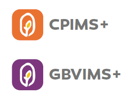  
The _Information Management and Innovation to Protect Children in Emergencies_ project has developed a software application that will help partners securely collect, store, manage, and share data for protection-related incident monitoring and case management. The new platform is called _Primero_ \(Protection-related Information Management\). _Primero_ supports multiple modules, including the “next generation” of the field-tested, inter-agency CPIMS and GBVIMS systems, which are currently in use in 20+ countries. These new iterations, called the CPIMS+ and GBVIMS+, can operate separately or be deployed as integrated modules on the _Primero_ platform. The inter-agency Steering Committees that govern the use of each of these modules will continue to support the new system.

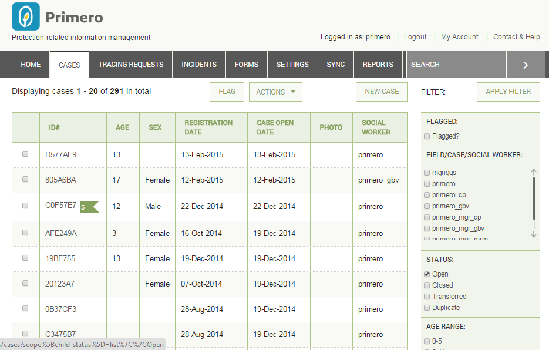
_Primero_ is flexible and adaptable to accommodate a broad range of protection concerns including GBV, unaccompanied and separated children, and monitoring grave violations of children’s rights in situations of armed conflict. To meet operational challenges, the application was designed to function both on- and off-line, with limited or no connectivity, and in multiple deployment configurations. A strong emphasis has been placed on security and confidentiality, with intuitive workflows designed to simplify processes while promoting good practice. Role-based access and granular security ensures that only those who need to see data will have access to it. All system transactions are time stamped, password protected and encrypted. _Primero_ has a user-friendly interface and intuitive tools, facilitating the work of field personnel while decreasing security risks and duplication. The application can leverage mobile data gathering tools such as RapidFTR on smart phones and tablets. In order to optimize results, _Primero_ was designed to be able to exchange data internally between modules, as well as externally with other IM systems. In addition to imports and exports, Primero has a highly secure application program interface \(JSON API\).

_Primero_ functions as a distributed database, meaning that implementing partners can retain ownership of data while contributing and sharing information on shared programmes. In child protection interventions, referrals and case transfers are critical to effective service provision. Sharing sensitive information is a part of good programming. Data exchanges between organizations should be governed by endorsed information sharing protocols adapted to local contexts. _Primero_ design is based on the “need to know” principle; it does not impose data sharing, but facilitates the process when consent is provided, and when it is deemed appropriate and safe by partners.

Good information management practice emphasizes the importance of making data actionable. _Primero_ has built-in customizable reports that can facilitate periodic reporting processes, and be used to analyze data for programmatic insights. A document and photo repository allows end users to organize relevant resources in one convenient place.

>  _A note for end users. Although there are a standard set of forms configured in the CPIMS+ based on the CPWG standard forms that we recommend using, your System Administrator may have configured these forms specific to your location and needs. For any questions about the forms and information you have or need, please reach out to this person_

## Logging In

When logging into Primero, you’ll see Username and Password boxes. Click in the Username box and type in your unique user name provided to you by your System Administrator. Then enter your password in the field below and click on 'LOG IN'.

# Navigating Primero

## Header Navigation Bar

The header navigation is the dark bar across the top of the screen in which you navigate to your home page \(or dashboard\), Cases, Tracing Requests, Reports, and bulk export downloads. It also has a quick search field that can help you find a specific case quickly. Your current page will be highlighted. See below:

## Dashboard

The Dashboard, or Home Page, is where you can quickly find information for your cases. Depending on the work you do in your organization, it contains a number of different types of information, which can include caseload summaries, recently flagged cases, cases for which approval has been requested or cases that are pending approval, referred cases, etc. The case worker dashboard will be different, from the managers and from the administrator.

## Case Dashboards

If your user has access to cases through either the CP or GBV module, you will see one--and only one--of the following three case dashboards.

### Cases Dashboard

The first example below is the basic Cases Dashboard. If you have any access to cases, but you are not a manager or an administrator, you will see this dashboard. The dashboard is divided into two main sections: one for cases, one for responses. The first section (first picture below) begins with a few key metrics: total cases, total new cases, transfers awaiting acceptance, new incidents, services implemented, total referrals, new referrals, pending transfers, and rejected transfers. \(In these metrics, “new” means anything which has not been edited since its creation, or since it was assigned to the current user, while "updated" means anything that has been changed since the user last saved the case. This latter situation may arise, for instance, if another user adds an incident to the case.\) Below these key metrics lie two columns. The first shows the number of total and new cases, subdivided by assessment level. The second column shows all the number of pending, rejected, and new approvals, subdivided by the type of approval.

For any of the numbers shown in this dashboard, clicking on the number will take you to a list of cases which meet the criteria represented by that number. So, for instance, if you click on the number "6" shown for "New & Updated" cases, you will be redirected to a list of all six cases which count as new and/or updated.

The second portion of the cases dashboard outlines all responses for the user's cases, with a column for each response type. Within each column, responses are broken down by priority level, at which point numbers are given for total responses as well as those nearing or past their deadlines \(as determined by the timeframe specified for a given response\). Clicking any of these numbers will take the user to a list of the cases in question. This allows users to easily manage the most urgent tasks for their cases, in order of priority.

### Manager Dashboard

The Manager Dashboard, meanwhile, appears if you have managerial tasks in your organization. This dashboard is similar to the cases dashboard, but includes the cases of the team you manage, and involves some tasks that managers have to perform. The first section, labeled "Cases," tells the manager how many of the team's cases are open or closed, as well as the number of cases have pending transfer requests, or whose transfer requests have been approved or rejected. Beneath that, a second section tells the manager how many unassigned cases have each priority level. These cases are then further broken down by due date. 

Next comes the third section, composed of two columns. In the first of these, figures are given for the number of cases with each priority level, and for each of these classifications, how many of the cases are new. The second column, meanwhile, gives the number of pending approvals, broken down by approval type (in this case, case plan approval and closure approval).

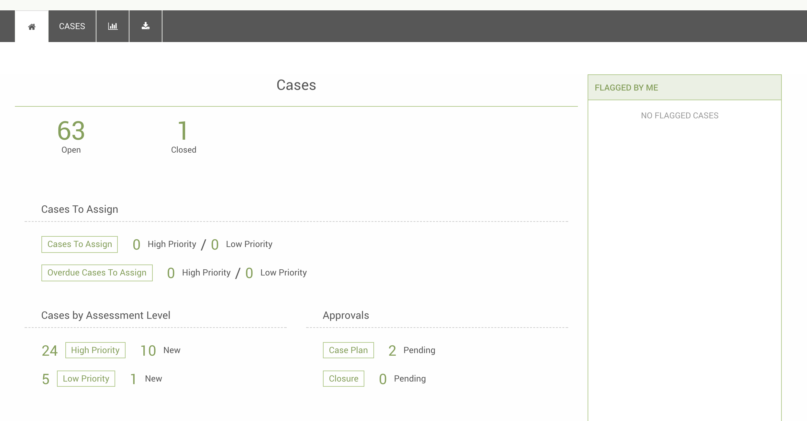

Once again, clicking on any of the numbers shown in the dashboard will take you to a list of cases which meet the criteria represented by that number.

### Admin Dashboard

Finally, you will see the Admin Dashboard upon login if your user’s role has access to all records in the system \(thus giving you an administrator’s functionality\). On this dashboard, you will see a table of cases by district, with each row broken down into total open cases, cases created last week, cases created this week, cases closed last week, and cases closed this week. \(Here, a week is measured from midnight Monday morning to 11:59 Sunday night. This means that for a case to have been created this week, it must have been created during or since the immediately preceding Monday morning.\) As stated previously, if you see the Admin Dashboard, you will not see the Cases Dashboard or the Manager Dashboard, since one user can only have one of the case dashboards display on their Dashboard Page.

Flags are, once again, on the right. Like the Manager Dashboard, and for similar reasons, the Admin Dashboard only lists those cases which you have flagged.

## Flagged Case Lists

If you see any of the case dashboards, the right of your screen will show one or two lists of flagged cases. These lists will keep you reminded of pending flags. The first list, shown above, consists of the cases which you have flagged most recently. The second list, shown below, is a list of your cases which someone else has flagged, and only displays for the Casesand Admin Dashboards. \(Since managers often do not even have the ability to make cases, it makes no sense for them to have a list of flagged cases which they own.\)

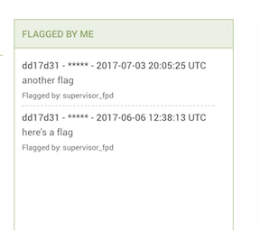

## GBV Incident Dashboard

The GBV Incident Dashboard will appear below whichever case dashboard you have if your user’s role has access to incidents through the GBV module. The table in this dashboard lists out each incident, with columns for “Incident \#ID,” “Date of Interview,” “Date of Incident,” and “Violence Type.” Each incident’s id will link to the incident’s page, and each incident will feature an icon indicating the number of flags it has, provided it has at least one. To the right of the GBV Incident Dashboard will be a list of incidents flagged by the user.

## List View

When selecting the record type or page you want to visit via the header navigation, you can see all cases or tracing requests that belong to you when you click on CASES. Once there, you see a list of the possible matching records, that you are able to filter and/or sort. See below:

## Edit and View a record

When creating a new record, you automatically are brought to the “Edit” page for that record. You can enter in all the relevant information you need at this time and save when done. 

When selecting an existing record, you are brought to “View” the record. This means you can view all the data and forms you have permission to, but cannot edit. You must click the Edit button in the Action Buttons section of the header to change any information that is currently represented.

## Case Status Bar

On the view and edit pages for a case, the user will see the case status bar, which lets the user know the current case management stage of the record.

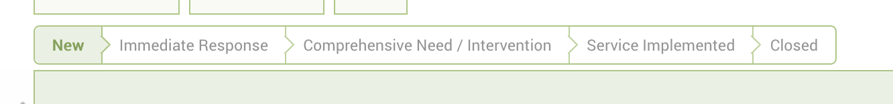

When the case is first opened, before any services are added, the status bar will highlight the "New" status. Once a service has been added, however, the case status will correspond with the most recently-added response type. So, for instance, after a case is opened, if a case worker refers the case to a service provider for a service with a response type of "Immediate Response", the case status will also be "Immediate Response." When the case is closed, with manager approval, the case status will become "Closed." Keeping track of the case status helps the case worker keep track of the case's needs. Please note that the case status bar may or may not appear, depending on a given implementation's configuration.

## Action Buttons

Our Action Buttons are the buttons just below our Header Navigation, which allow a user to act on a case or cases. The actions, depending on your permissions, are:

* Flagging

* Export

* Custom Exports

* Import \(List View\)

* Transfer

* Refer

* Assign

* Disable

* Save \(edit view only\)

* Cancel \(edit view only\)

* Mark for mobile

* Un-mark for mobile

* Request Approvals

* Approvals

Please note that when using these actions you must work according to the CP SoPs that are in place. Also, the system does not replace the communication that you need to have in a child protection case management program, through case conferences, emails or other to ensure that people are aware of transfers and referrals and to follow up on referred and transferred cases.

This bar, along with the Header Navigation bar and the case status bar, are part of what is called the **Anchored Header**, meaning, they never leave the screen when scrolling. This allows a user to easily navigate or act on a case or number of cases at any time.

## My Account and Contact & Help links

Above the Header Navigation bar, there are small links that bring you to pages that help you manage your account and contact information, as well as find out who is your site administrator. Clicking on the Primero icon from any page will take you back to the dashboard from anywhere.

# Filtering

Filtering your Case List or search results is an efficient way to narrow down to the case or cases that need your immediate attention. You can filter the list to show not only if a case has other characteristics but contains specific information within those characteristics as well. For example, you can filter by males only, but you can also filter by specific Protection Concern, Current Location, and the case registration date range.

The Filter panel is on visible on search results page or when you click **CASES** tab in the header. See below:

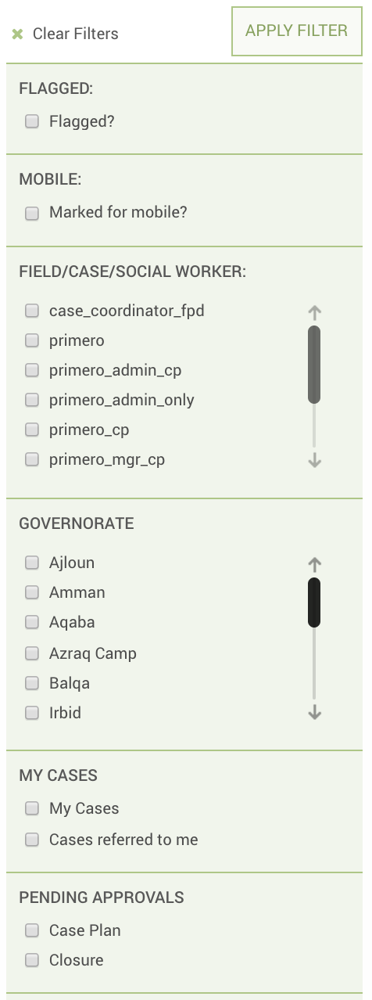

In the image, there is the normal checkbox filter selection, in which you click using your mouse, but also date range and drop down fields. For Date Ranges, you can enter these using any of the date field type actions. You can set the range for one day as well. For the drop down field, this is clickable with the mouse and you can only select one value.

# Flagging

Flagging a case is a way to alert either yourself or a manager that a case needs additional work or attention. To flag a case:

 1. Once you have opened the case, click on Flags
 2. Enter the flag reason and if applicable the Date by which this flag
    needs to be addressed
 3. Click flags to complete

Note that only the person who flagged the case can unflag the case. To do so:

 1. Click on the (+) button next to the flag, under the Unflag Case heading.
 2. Enter a reason for unflagging the case.

A history of the flags and unflags for the case is stored. To see the history, click on the View History tab, you can view the details of the flags and unflags.

# Assign Users

Managers have ability to assign a case to a different user. If you select the Assign option from the Actions dropdown menu, a modal will appear that allows you to select from existing users. Assigning the case will change the record owner to the selected user, that record will no longer be available to the previous case worker.

# Reopen

Users have the ability to reopen closed cases. Reopen displays in the Action menu on the case view page below Disable; it does not display on the case list view . Clicking Reopen brings up a confirmation dialog saying that clicking ok will change the status of the case to open. When the user clicks OK, the “Case Reopened?” field in the Basic Identity form is checked, the case status is set to Open, and the case’s state is set to Valid. This also creates an entry on the Record Information form.

# Approvals

## Caseworker

Case worker roles have the ability to request approval for a case plan, BIA, or closure from the manager. This is done by going into the ACTIONS button dropdown, clicking on "Request Approval," and then clicking on the type of approval you would like to request. This will produce a modal to submit the request.

If you request a case plan approval, the below modal will appear. Select a case plan type \(the options will correspond with the various response types\) and then click "OK."

The modal for requesting closure approval will be similar, except that it wil not have a dropdown for case plan type. Here, simply click "OK" to request approval.

Once the approval request is made, it will show up as pending under the approvals section on the caseworker dashboard. It will also appear on the manager’s dashboard as a pending approval. Once the manager approves or rejects the form for the case, the status will change on both the case worker and manager dashboards.

All approvals for a case will also appear in the Approvals form section on the case edit and view pages. Here, you will see the type of approval (case plan or closure), the approval's status, the date of the approval request, and, if the approval is for a case plan, the type of case plan.

## Managers

Managers may have the ability to approve a case's case plan and/or closure, depending on configuration. To check to see if any approvals have been requested for a case, a manager can go to the Approvals form on the case view page (pictured above). As you can see, an entry for an approval in the forms will tell you what type of approval it is (BIA, Case Plan or Closure).

To perform an approval, go into the ACTIONS button dropdown, click "Approvals," and then click either "Approve Case Plan," "Approve Closure," or "Approve BIA," depending on the type of approval. You will see a modal like the one pictured below. To complete the approval, simply click the "Yes" check box, add in any necessary comments, then click "SUBMIT."

# Create Incident from Case

When viewing a GBV case, a case worker can create an incident directly from the case by clicking the "CREATE INCIDENT" button, located next to the ACTIONS button in the **Anchored Header**. Doing so will re-direct the user to the create incident form, with case information automatically loaded into the Survivor Information form.

Alternatively, a user--depending on configuration--can create an incident from any case from the case list or search results views. To learn more about this capability, read the section labeled "Adding Incident to Case from List View".

# Search and Advanced Search

## Quick Search

Quick Search refers to the search field in the header navigation bar. From here you can type in your search and return a list of possible matches. If you are searching from the cases page you can enter your case’s value for one of the following fields to find a match: “Long ID,” “Case ID,” “proGres ID,” “Name,” “Nickname,” “Other Name,” “Ration Card Number,” “ICRC Ref No.,” “RC ID No.,” “UNHCR ID,” “UN Number,” and “Other Agency ID.” When looking for a tracing request, you can search these fields: “Long ID,” “Inquirer ID,” “Name of inquirer,” and “Nickname of inquirer.” After searching, you can filter results further.

## Searching for Records Owned By Others

Depending on your configuration, some users may have the ability to search for records owned by other users. In this case, the records are only visible in the list view. Clicking on a record in this view does not take the user to the view page for that record. Instead, the user can perform actions on the record from the list review.

To do this, go to the record list page, and search for your record using an id or other searchable field. Once your search results appear, select the check box for the record on which you wish to perform an action. Now, select the action you wish to perform in the action button dropdown.

## Adding Incident to Case from List View

Depending on your configuration, a user may be able to add an incident to a case from the list view or when searching cases. To add an incident to a case, select your case's check box on the search results page, then, under the action button dropdown, select "Add Incident." You will see the following modal. Here, enter information on the incident you are adding, and then save.

## Adding Service Provision to Case from List View

Depending on your configuration, a user may be able to add a service provision to a case from the list view or when searching cases. To add a service to a case, select your case's check box on the search results page, then, under the action button dropdown, select "Add Service Provision." You will see the following modal. Here, enter information on the service you are adding, and then save.

# Exporting Information on Records

Exporting individual cases or a list of cases can be useful in a number of ways. This action can be found in the **ACTIONS** header button which   will display a drop down to select what format you want to export - PDF, XLS, CSV, etc.

| **Format** | **Description** | **Fields Included** |
| --- | --- | --- |
| CSV | Stands for “Comma-Separated Values.” Readable in excel, and can be imported back into any Primero instance. | All fields to which the user’s role has access. |
| Excel | Exports to a standard .xls file, which can be re-imported back into Primero. | All fields to which the user’s role has access. |
| JSON | Easiest format to be read \(only\) by Primero, and the preferred format for importing. | All fields to which the user’s role has access. |
| Photo Wall | Exports a PDF file with the photo of each selected case along with the case’s ID. Cannot be re-imported into Primero. | Photo, ID. |
| PDF | PDF file containing a profile on each case, including the fields from the forms specified by the user. Cannot be imported. | All fields specified by the user, to which the user’s role has access. |
| UNHCR | CSV file specifically formatted to be compatible with UNHCR’s data import. | All fields to which the user’s role has access. |
| Custom | Excel file containing all the fields specified by the user. Can be imported back into Primero. | All fields specified by the user, to which the user’s role has access. |

Once you’ve selected your format, the export window will appear, allowing you to set your own password for the file, and create your own file name.

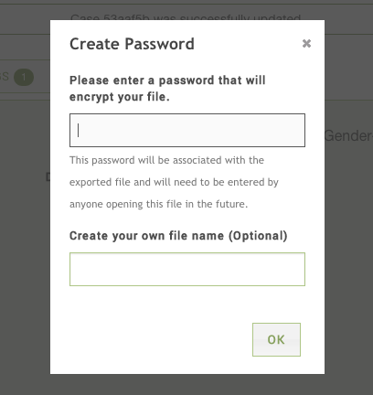

To export a list of cases, while in the case list view, you can select as many as you’d like to export via the check boxes:

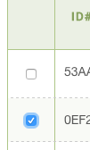

To export all cases, you can leave all unchecked and it will export all cases you have access to. The bulk export will generate in the background. You can continue to use the app while it is generating. To access it, click on the tab with the download icon. 

To export a single case, you can either check only that case in the case list, or enter into the case to view it, then use the ACTIONS button to export.

# Navigating Primero Forms

Once you are creating or editing a record, you will see a navigation list in the left panel. This list is an organized way to navigate through your forms. The initial titles you see are called **Form Groups** and are set up by your site administrator. The current form you are on will be highlighted - see below:

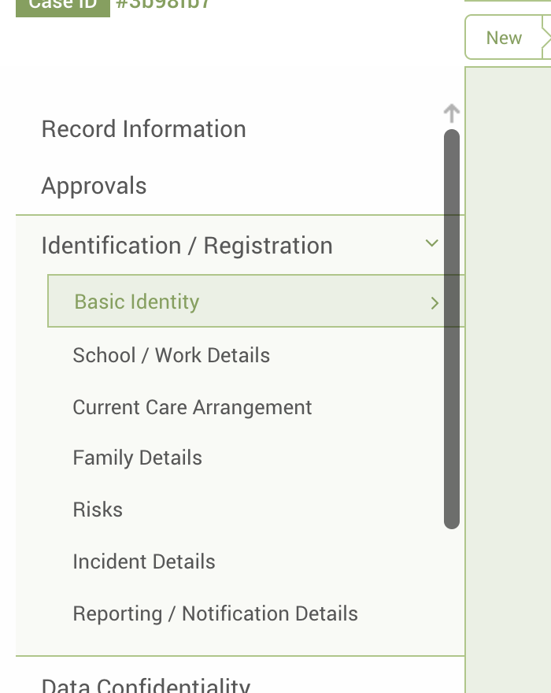

If a Form Group has only one form, you can simply click on it and it will populate the form. If it has more than one, you can click on the Form Group name or the expand icon to the right of the name to expand it and see all the forms in the group. Once expanded you can then click on any of the form names to enter into the chosen form. For example, in the image above, the user has selected the “Identification / Registration” form group and the “Case Information” form.

## Navigating Sub-Forms

In certain data sets and forms, we find that information pertaining to an event or entity is nearly identical. For example, information on specific family members can be the same form, just labeled per family member name and relationship. So in cases like this, we’ve designed these forms as “sub-forms,” and you manually add additional individual forms to add information on family members, individual follow ups, etc. To navigate those, there is an expand/collapse function, and an add/remove function.

## Alerts

Alerts appear in the case forms when an important change has been made to your case. One example of such a change is when an incident has been added to your case. In this situation, you will see a small alert badge next to the incident subform. This helps users keep track of updates to a given case's situation and immediately undertake any necessary responses.

There are two other situations which would cause an alert to appear: the addition of a service provision to your case, and an approval request being made on a case. In the first situation, if another user adds a service provision to your case, an alert will appear next to the Services form tab in the forms side bar. (Depending on your configuration, this form may also be called "Response Overview.")

You may also see a message at the top of the form informing you of the reason for the alert.

An alert may also appear on a case form if a request was recently requested for case plan, closure, or best-interest assessment approval. Whenever an approval is requested for one of these situations, an alert will appear next to the appropriate form tab: Services (also called Response Overview in some implementations) for case plan approval, Closure for closure approval, and BIA for best interest assessment approval.

# Creating, Updating, or Editing a Case

## Creating a Case

To create a case from the case list view, click on the "NEW CASE" button. You will see a modal like the one pictured below. Here, you have two options. The first option is to simply create a case by clicking the "CREATE CASE" button. However, you can also check to see if a case already exists for a child by running a search. \(For a list of fields that are searchable, read the "Quick Search" section.\) To run a search, simply type your search query into the search box and click the "SEARCH" button. This will take you to a search results page. If no search results appear, you can just create a case by clicking on the "NEW CASE" button again on the search screen.

Once you have reached the new case page, you can navigate to different forms as we describe in the “Navigating Primero Forms” section.

## Editing a Case

To edit a case, simply located it in the case list view and then click on it. Once you’ve entered into the case you would like to update, you must click the **EDIT** button in the actions header. The page will then refresh and allow you edit individual form fields.

There are a number of different field types in which you can edit differently.

* **Text** - Type normally using your keypad or keyboard.

* **Text Area** - Similar to the Text field. Type normally, the field expands for more information as you continue to enter information.

* **Date** - Multiple ways to edit

  * You can type in a numerical date in the format of dd-mm-yyyy

  * You can type in the first three letters of the month in the format of 01-Jan-2014

  * You can use the calendar widget to go to the correct day and select it directly

* **Check Boxes** - You may click one or many of the options using the mouse.

* **Tick Box** - You may click on the box using the mouse.

* **Select Drop Down** - Click any option to select it.**Multi-Select Drop Down** - Begin typing and either hit ‘enter’ or click to select multiple options.

* **Radio Button** - Similar to Tick Box, click on the correct answer using the mouse

* **Numeric Field** - Key the number into the field.

* **Tally Field** - Key in the number you need for each tally. The total automatically calculates based on the tally fields and is not editable in itself.

When you attempt to save, there is always the possibility that one or more of the fields you entered will be formatted incorrectly. For instance, if you try to fill in the “Date of Birth” field--which is supposed to be a format-specific date--with the words, “a pretty long time ago,” Primero will be unable to save the information. In that case, after you hit the “save” button, the case will fail to update with your new information, and the “Date of Birth” field’s label will be highlighted in red, to inform you that the field has been entered incorrectly.

# Generating Automatic Follow Ups

While you are making changes to a case, you can make your job managing the case easier by having Primero generate reminders to perform a follow up every two weeks. To do this, click on the “Protection Concerns” Form Section, under the “Identification / Registration” Form Group and check the “Generate follow up reminders?” tick box. If you click save, Primero will automatically create a flag \(to be discussed later\) on the case for you, once every two weeks, which will remind you to perform a follow up. This feature may or may not be turned on.

# Transfers and Referrals

## Transfers

Transferring a record is a basic form of reassignment. There are some processes surrounding this for a transfer to a non-Primero individual or a Primero user outside your instance. But those will be determined by your organization and the sharing protocol of the organization of the person you are transferring to.

To transfer a record from either the individual record page or the list view, use the ACTIONS button in the Action Header to initiate the drop down of options. Within the options, select “Transfer Case.”

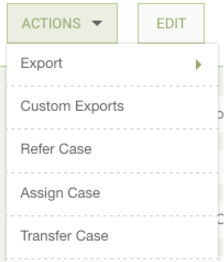

The following modal form will appear and allow you to select options for your transfer. Consent of the individual \(or a consent override\) is  
generally needed for transfers, although not for those which take place within the same Primero instance.

If you are transferring within your Primero instance, select the “Existing User”--a user within your deployment of Primero. If the desired user is not in the drop down, it means this user does not have privileges to be transferred to.

If you are not transferring within the Primero instance, check the “Are you transferring to a remote system?” tickbox, and more options will appear for this “remote” transfer. A remote transfer creates a transfer export that is password protected to be shared outside the system.

If you are transferring to a user outside your system who is using another Primero instance, you simply select “Primero” in the drop down marked “What type of export do you want.” In this case, the file Primero exports will be a JSON file which can be imported into the remote Primero system.

> _Note:  
> When transferring any such password-protected export/import file, the means of sending the file, filename, and the password that opens it, will be determined by the Information Sharing Protocol \(ISP\) decided by the appropriate local steering committee. When determining this policy, on-the-ground security considerations will be at play, as well as the ease and speed of physical transport within the country._

## Accepting or Rejecting Transfers

Based on the deployment, you may have the ability to accept or reject a case that has been transferred to you. You will be able to see if any cases have been transferred to on your dashboard. If you click on the Referrals and Transfers form for the case that has been transferred to you, you will see that the status is in progress and that there are buttons to either accept or reject the transfer. If you click to accept the case, the status will change to accepted, and you will become the record owner, rather than an “other assigned user”. The record information is updated with this change. If you click Reject, it brings up a dialog box with an OK button and a textbox to enter the Rejection Reason. When you click OK, the rejection reason is saved to the nested subform. The status is changed to 'rejected, and you are removed from 'other assigned users' and no longer have access to the record.

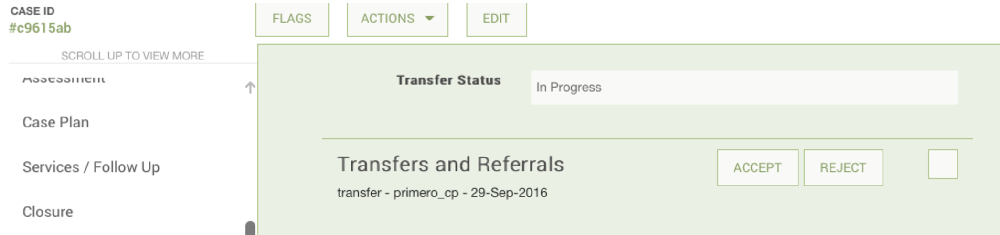

## Referrals

Referring a record is a way of giving a user limited access to a record without transferring it completely. As with transfers, there are some processes surrounding this action when referring to a non-Primero individual or a user outside your instance. These processes, however, will be determined by your organization and the sharing protocol of the organization of the person you are referring to.

To refer a record from either the individual record page or the list view, use the ACTIONS button in the Action Header to initiate the drop down of options. Within the options, select “Refer Case.”

The following modal form will appear and allow you to select options for your referral. As with transfers, consent \(or a consent override\) of the individual is generally required for a referral.

If you are making a referral within your Primero instance, select the “Existing User”--a user within your deployment of Primero. If the desired user is not in the drop down, it means this user does not have privileges to be referred to. You must also select the type of service that will be rendered by the user to whom you are referring.

If you are not making a referral within the Primero instance, check the “Are you referring to a remote system?” tickbox, and more options will appear for this “remote” referral. A remote referral creates a referral export that is password protected to be shared outside the system.

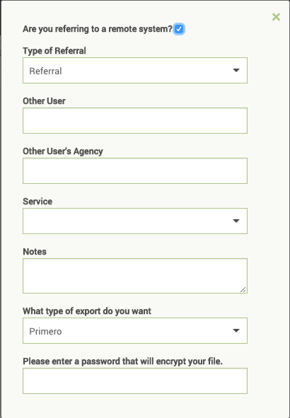

If you are making a referral to a user outside your system who is using another Primero instance, you simply select “Primero” in the drop down marked “What type of export do you want.” In this case, the file Primero exports will be a JSON file which can be imported into the remote Primero system.

To specify which service a referral is for, go to the services form and click on the "refer" button on the header for any service you have saved.

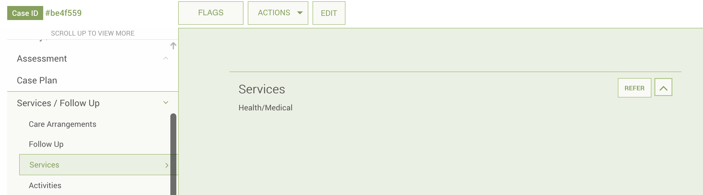

Once you have clicked "refer" you will see the below modal. Once again, make sure you have consent \(or a consent override\), and select a user who will receive the referral. The service type should already be selected for you, based on what you entered in the Services form.

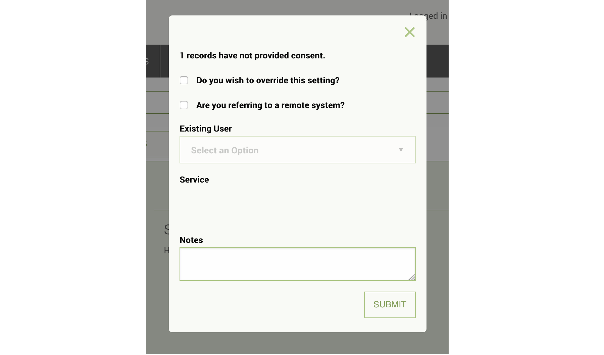

## Relinquishing Referral

Based on the deployment, you may have the ability to relinquish a case that has been referred to you. You can see if any cases have been referred to you on your dashboard. When you click on the Referrals and Transfers form for the case that has been referred to you, you will see a DONE button next to the referral that has been made to you. If you are done reviewing the case, you can click the done button. Once clicked, it will be removed from your case list and you will no longer have access to it.

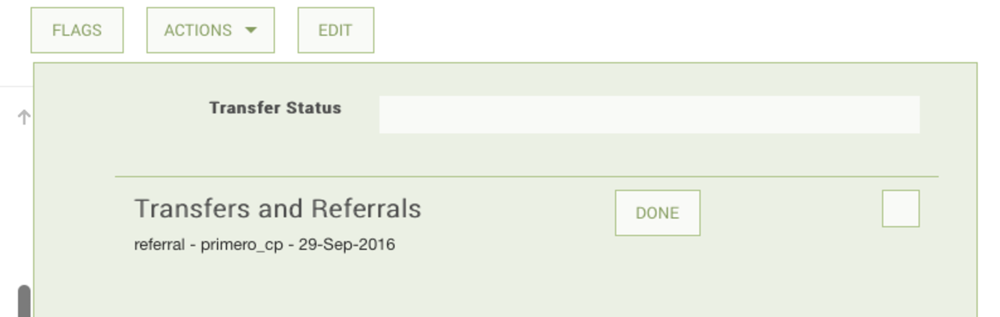

# Workflow Status

Primero provides a flexible way of keeping track of a case's place in the child protection workflow. As it stands, a case can have one of a few standard statuses: "New," "Service Implemented," "Closed," and then a status associated with each of the various types of services (also called "responses" or "interventions," depending on your implementation). The workflow status is represented in the Workflow Status Bar. In the image below, there are five statuses, since a service can be classified as either an "Immediate Intervention" or a "Comprehensive Intervention."

In this situation, the case has a status of "Comprehensive Intervention." All cases start off as "New." Once a service is added, the case assumes a status associated with the most recent service's type. Clearly then, for this case, the most recent intervention was a "Comprehensive Intervention."

Once all services have been implemented, the case's status will switch to "Service Implemented." Finally, if a case is closed (using the "Case Status" input), the status of the case will change to "Closed."

Once again, this case status, as represented in the Workflow Status Bar, helps keep track of the case's place in the Child Protection workflow. That being said, this cannot replace the robust human processes needed to ensure that cases are properly assessed and cared for. Please closely follow your particular program's Child Protection SoP's to ensure that best practices are followed in the handling of all cases.

# Responses

A core part of the case management process is responding to the needs of a case. Primero manages these through the "Response Overview" form and through the provision of services.

## Response Overview Form

To add a response to a case, simply go into the Response Overview form on the case edit page, and click the "add" button. You will see a subform like the one in the picture below. Here, you can enter information on the response.

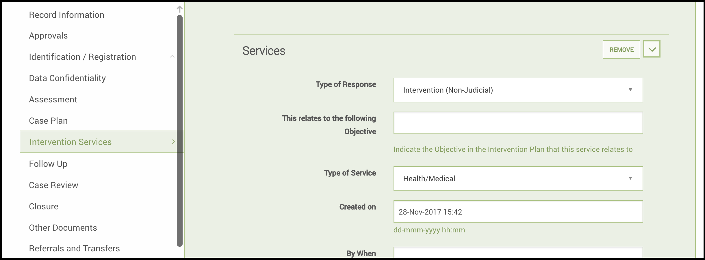

When selecting a Response Type, remember that this will help determine the workflow status of your case. So, for instance, if you select "Immediate Response," your case status will also be "Immediate Response" so long as you do not add any other responses or close the case.

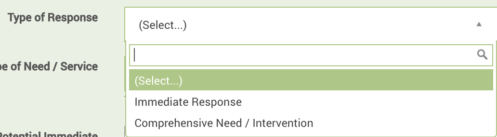

Another important field to fill in is the type of service that will be rendered for this particular response, whether it be medical, legal, or whatever other options have been specified in your implementation's configuration. This field will help service providers properly take care of your case.

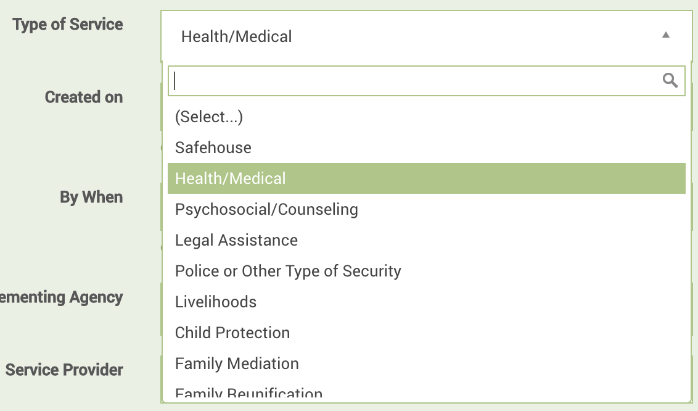

Choosing a timeframe for the response will help generate reminders in you or your manager's dashboard when the response is coming due or overdue. For more information on these reminders, check out the Dashboards section.

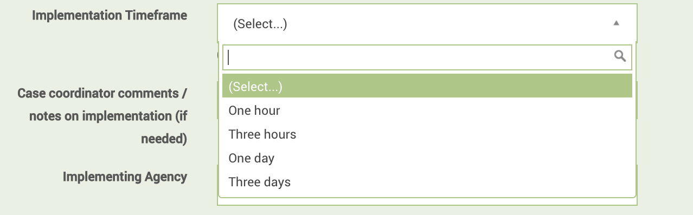

Selecting a service provider in this form will allow you to refer your case to the service provider directly from the form. Make sure you fill in this field, or no "REFER" button will appear for this particular response. In the situation below, we have selected a medical specialist to perform a medical service for our case.

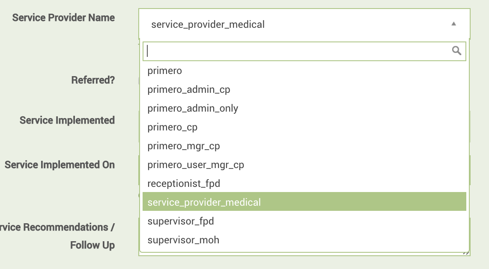

## Referring from Response Overview Form

Once you have saved the case with this new response, and have been redirected back to the view page, go to the Response Overview form and the response you just added. At the top of the response's subform, you should see a "REFER" button. Click on this button, and you will see a modal like the one pictured below. Here, you can enter information on your referral just like you normally would. However, if you have already filled out a service provider and a service type for your response, these fields will be pre-entered for you. Remember to ensure that your case has provided consent, or that you choose the override consent option before referring.

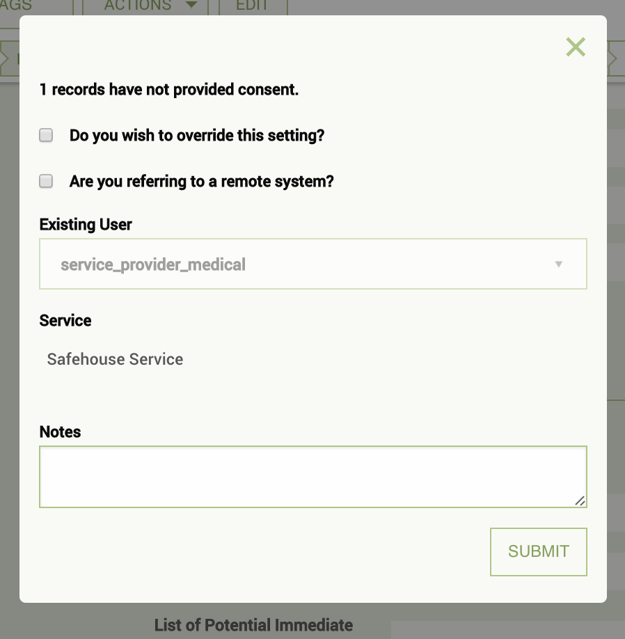

# Reports

Reports allow users to see a high-level, aggregate view of data, helping them to understand trends and coming challenges in their work. Only   certain roles--and thus certain users--will have the ability to create or view reports. Some users will be able to navigate to the **Reports** section of the application and view existing reports but not edit them or create new ones, while others will have the ability to view, create, edit, and export reports.

## Creating a Report

To create a report, first click the **Reports** icon in the top toolbar. You will see that there are already a number of pre-built reports which you can view at any time. To start your own, click the **Create Report** button at the top of the screen.

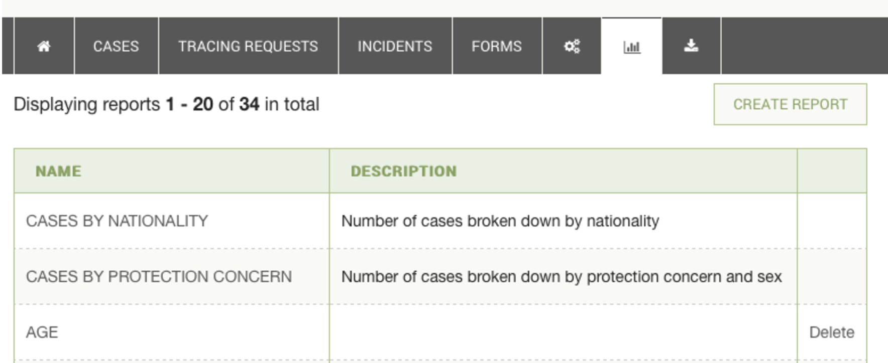

When you have reached the new report form, be sure to enter a name and description for your report. You must then specify the module from which to draw the records for your report, as well as the type of records you want to be drawing upon. Here, we have chosen the Child Protection module, and the Case record type.

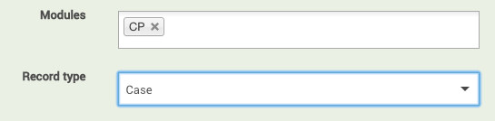

Next comes choosing the row and column attributes by which you want your data to be grouped. The first item you choose in each field will be the outer grouping layer, with each successive item acting as a sub-categorization. Taking a look at the example below, we can see that the columns of our report have been first divided by sex, and then sub-divided by permanent district/chiefdom, since these are the first and second “Group by column” attributes, respectively. We can see that the rows of the report follow the same pattern.

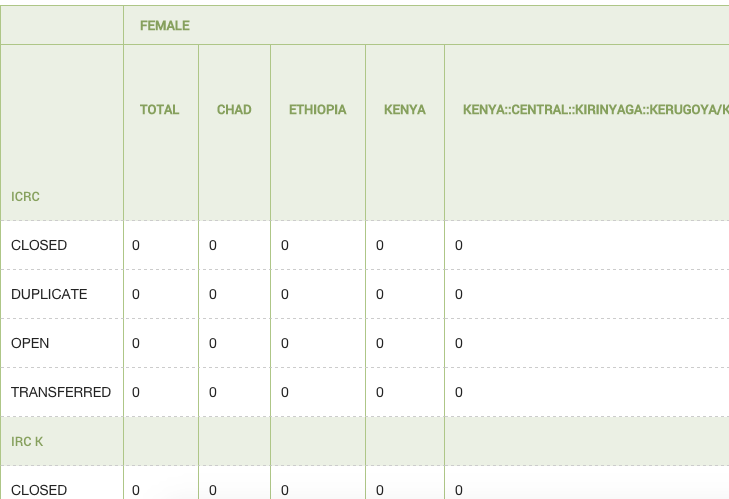

The columns of your report will be augmented by a final “Total” column, which shows the aggregate for each row. It is important to note that the numbers in each of your columns may not add up to the number in your total column, since many attributes will go undefined by the workers doing registration. For instance, in the example below, three cases with the “child has been abandoned” protection concern were never assigned a sex, resulting in a report with one female, no males, and four total cases.

Furthermore, any reports based on fields within certain nested forms will automatically count a field for each saved record, even if a nested form for this field was never filled out. This is because Primero automatically populates an empty subform on the page for form sections such as “Protection Concerns,” so that the user can easily enter information. When a user fails to enter information for that field, however, the field still counts as a single item. For instance, if you were to create a case and fail to enter any information into the blank Protection Concerns subform, a report outlining how many cases had each type of protection concern would still count your case as having a single protection concern type, even though you had never entered any information on the Protection Concerns subform. This would then count into the total, without counting into the column for any single one of the protection concern types. Taking a look at the example below, we can see that, in the Freetown district, one child has been registered as abandoned and one with a protection concern type of “Extreme levels of poverty.” But the total number of protection concerns for this district is three, meaning that one case was registered with a protection concern form where the protection concern type was never filled in.

After you have defined the row and column attributes for your report, you will choose the fields from which you will receive an aggregate count. This feature obviously only works on numeric fields. To give an example of how it works, imagine we have a report that disaggregates your cases based on number of children in the family and date of birth \(by year\). Three cases end up going into the report: one born in 2004 whose family has three children, one born in 2001 whose family has six children, and another born in 2001 whose family also has six children. Here is what the report would normally look like:

As you can see, the 2001 column has the number “2” in the “7” row, since there are two cases born in 2001 whose families have seven children. We see this same number in the “Total” column for the “7” row for the same reasons. If we choose to have aggregate counts on the “Number of children” field, however, the report would look like this:

Now, instead of seeing that there are two cases that meet the criteria for being born in 2001 and having a family with seven children, we instead see the number “14,” representative of fourteen total children. Once again, this field also shows up in the “Total” column.

### Age Range

The next field, specifying age range, helps make reports involving age more manageable by grouping them into a smaller list of ranges. The two images below exemplify the usefulness of this feature. The first shows part of a sprawling report without age ranges enabled. The second shows the same report with age ranges.

### Date Ranges

The next field, “Use date ranges,” allows you to do much the same thing, but with date fields instead of ages. Now, instead of having to have a column for every date over a two year period--as would be the case with the default, day-long range--you can disaggregate your records by whether or not they fit into week-, month-, or year-long spans of time.

### Filters

Next, you can put filters on the records you are using to eliminate irrelevant data. By default, each report filters to include only those records with a “Case Status” of “Open” and a “Valid Record?” value of “Yes.” You can create a filter on any single-select, multi-select, tick box, check box, radio button, number, tally, or date field, and for each one, you can specify which values are acceptable for records being included into the report.

Finally, you are asked whether you would like to generate an exportable graph of your report.

## Viewing your reports

If you click save on your report, and it saves successfully, you should arrive at the view page for your report. You will first see a table representing your report. Above the table, you should see either one or two tabs. The first, marked “Table,” represents what you currently see. The second, which will only appear if you specified that your report should generate a graph, will be marked “Graph” and will show you just that.

You can also use the **Export** button above the tabs to export either the data \(in CSV form\) or the graph \(as a .png image file\). Below is an example of a graph generated and then exported from a report.

