# Introduction

  
The _Information Management and Innovation to Protect Children in Emergencies_ project has developed a software application that will help partners securely collect, store, manage, and share data for protection-related incident monitoring and case management. The new platform is called _Primero_ \(Protection-related Information Management\). _Primero_ supports multiple modules, including the “next generation” of the field-tested, inter-agency CPIMS and GBVIMS systems, which are currently in use in 20+ countries. These new iterations, called the CPIMS+ and GBVIMS+, can operate separately or be deployed as integrated modules on the _Primero_ platform. The inter-agency Steering Committees that govern the use of each of these modules will continue to support the new system.

_Primero_ is flexible and adaptable to accommodate a broad range of protection concerns including GBV, unaccompanied and separated children, and monitoring grave violations of children’s rights in situations of armed conflict. To meet operational challenges, the application was designed to function both on- and off-line, with limited or no connectivity, and in multiple deployment configurations. A strong emphasis has been placed on security and confidentiality, with intuitive workflows designed to simplify processes while promoting good practice. Role-based access and granular security ensures that only those who need to see data will have access to it. All system transactions are time stamped, password protected and encrypted. _Primero_ has a user-friendly interface and intuitive tools, facilitating the work of field personnel while decreasing security risks and duplication. The application can leverage mobile data gathering tools such as the Primero mobile app on smart phones and tablets. In order to optimize results, _Primero_ was designed to be able to exchange data internally between modules, as well as externally with other IM systems. In addition to imports and exports, Primero has a highly secure application program interface \(JSON API\).

_Primero_ functions as a distributed database, meaning that implementing partners can retain ownership of data while contributing and sharing information on shared programmes. In child protection interventions, referrals and case transfers are critical to effective service provision. Sharing sensitive information is a part of good programming. Data exchanges between organizations should be governed by endorsed information sharing protocols adapted to local contexts. _Primero_ design is based on the “need to know” principle; it does not impose data sharing, but facilitates the process when consent is provided, and when it is deemed appropriate and safe by partners.

Good information management practice emphasizes the importance of making data actionable. _Primero_ has built-in customizable reports that can facilitate periodic reporting processes, and be used to analyze data for programmatic insights. A document and photo repository allows end users to organize relevant resources in one convenient place.

>  _A note for end users. Although there are a standard set of forms configured in the CPIMS+ based on the CPWG standard forms that we recommend using, your System Administrator may have configured these forms specific to your location and needs. For any questions about the forms and information you have or need, please reach out to this person_

## Logging In

When logging into Primero, you’ll see Username and Password boxes. Click in the Username box and type in your unique user name provided to you by your System Administrator. Then enter your password in the field below and click on 'LOG IN'.

# Navigating Primero

## Header Navigation Bar

The header navigation is the dark bar across the top of the screen in which you navigate to your home page \(or dashboard\), Cases, Tracing Requests, Reports, and bulk export downloads. It also has a quick search field that can help you find a specific case quickly. Your current page will be highlighted. See below:

## Dashboard

The Dashboard, or Home Page, is where you can quickly find information for your cases. Depending on the work you do in your organization, it contains a number of different types of information, which can include caseload summaries, recently flagged cases, cases for which approval has been requested or cases that are pending approval, referred cases, etc. The case worker dashboard will be different, from the managers and from the administrator.

## Case Dashboards

If your user has access to cases through either the CP or GBV module, you will see one--and only one--of the following three case dashboards.

### Cases Dashboard

The first example below is the basic Cases Dashboard. If you have any access to cases, but you are not a manager or an administrator, you will see this dashboard. The dashboard is divided into two main sections: one for cases, one for services. The first section (first picture below) begins with a few key metrics: total cases, total new cases, transfers awaiting acceptance, new incidents, services implemented, total referrals, new referrals, pending transfers, and rejected transfers. \(In these metrics, “new” means anything which has not been edited since its creation.\) Below these key metrics lie two columns. The first shows the number of total and new cases, subdivided by assessment level. The second column shows all the number of pending, rejected, and new approvals, subdivided by the type of approval.

The second portion of the cases dashboard outlines all services for the user's cases, with a column for each response type. Within each column, services are broken down by priority level, at which point numbers are given for total services as well as those nearing or past their deadlines \(as determined by the timeframe specified for a given service\). Clicking any of these numbers will take the user to a list of the cases in question. This allows users to easily manage the most urgent tasks for their cases, in order of priority.

### Manager Dashboard

The Manager Dashboard, meanwhile, appears if you have managerial tasks in your organization. This dashboard is similar to the cases dashboard, but includes the cases of the team you manage, and involves some tasks that managers have to perform. The first section, labeled "Cases," tells the manager how many of the team's cases are open or closed, as well as the number of cases have pending transfer requests, or whose transfer requests have been approved or rejected. Beneath that, a second section tells the manager how many unassigned cases have each priority level. These cases are then further broken down by due date. 

Next comes the third section, composed of two columns. In the first of these, figures are given for the number of cases with each priority level, and for each of these classifications, how many of the cases are new. The second column, meanwhile, gives the number of pending approvals, broken down by approval type (in this case, case plan approval and closure approval).

Once again, clicking on any of the numbers shown in the dashboard will take you to a list of cases which meet the criteria represented by that number.

### Admin Dashboard

Finally, you will see the Admin Dashboard upon login if your user’s role has access to all records in the system \(thus giving you an administrator’s functionality\). On this dashboard, you will see a table of cases by district, with each row broken down into total open cases, cases created last week, cases created this week, cases closed last week, and cases closed this week. \(Here, a week is measured from midnight Monday morning to 11:59 Sunday night. This means that for a case to have been created this week, it must have been created during or since the immediately preceding Monday morning.\) As stated previously, if you see the Admin Dashboard, you will not see the Cases Dashboard or the Manager Dashboard, since one user can only have one of the case dashboards display on their Dashboard Page.

Flags are, once again, on the right. Like the Manager Dashboard, and for similar reasons, the Admin Dashboard only lists those cases which you have flagged.

## Flagged Case Lists

If you see any of the case dashboards, the right of your screen will show one or two lists of flagged cases. These lists will keep you reminded of pending flags. The first list, shown above, consists of the cases which you have flagged most recently. The second list, shown below, is a list of your cases which someone else has flagged, and only displays for the Casesand Admin Dashboards. \(Since managers often do not even have the ability to make cases, it makes no sense for them to have a list of flagged cases which they own.\)

## Audit Logs

Some administrative users and team managers may have access to the *Audit Log*. To see the audit log, first navigate to Settings by clicking on the settings icon at the top of the page. In the side panel, you will see a link labelled "Audit Logs."

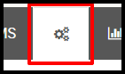
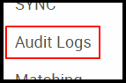

When you click on this link, you will see the table pictured below. This contains a list of all actions which users have committed in the system. Each row represents a different action, including the user name of the user, the type of action, the type (and some times the id) of the record on which the action was performed, and the date and time of the action. Using the filter inputs to the right of the list, you can filter which actions are displayed. You can filter by date and time or user name. To apply a set of filters, click "Apply," and to clear out all filters, click "Clear."

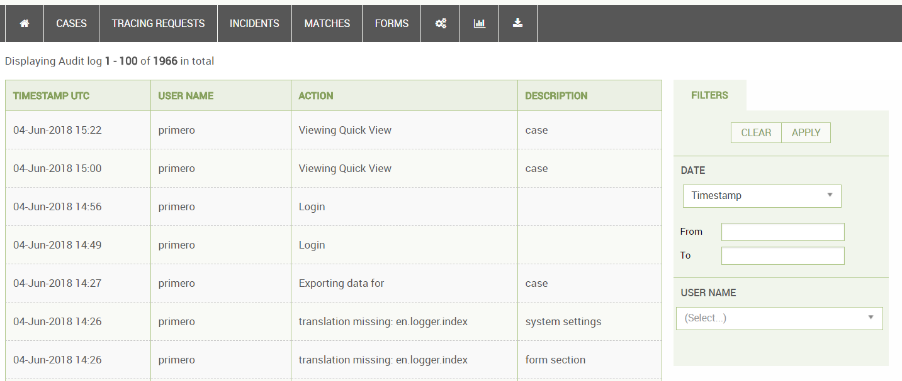 

## GBV Incident Dashboard

The GBV Incident Dashboard will appear below whichever case dashboard you have if your user’s role has access to incidents through the GBV module. The table in this dashboard lists out each incident, with columns for “Incident \#ID,” “Date of Interview,” “Date of Incident,” and “Violence Type.” Each incident’s id will link to the incident’s page, and each incident will feature an icon indicating the number of flags it has, provided it has at least one. To the right of the GBV Incident Dashboard will be a list of incidents flagged by the user.

## Tasks View

Next to the "Home" icon in the navigation bar, you may see a calendar icon (depending on your configuration). Clicking on this icon will take you to the **Tasks View**.

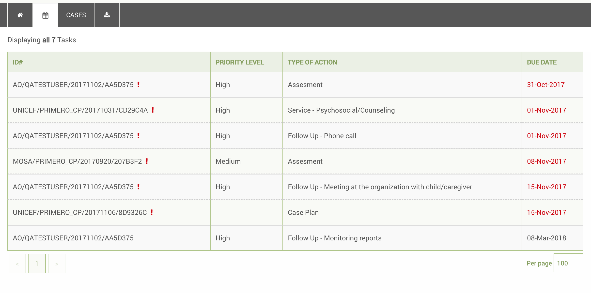

Here, you will see all of the pending, incomplete tasks present for all of your cases. These "tasks" can include assessments, case plans, follow ups, and services. As you can see, tasks that are upcoming have their due dates in black font, while those which are overdue have their due dates in red font and have small alert symbols next to their case links. Clicking on any of the case links will take you to the case which needs the task to be performed.

It is important to understand where the due dates for these tasks come from, as well as which tasks are considered "incomplete."

### Assessments

Assessments become due based on the "Date Assessment Due" field (or any field with the id "assessment_due_date") on the **Basic Identity** form. This field is not visible by default in Primero, meaning that, unless your system is configured to use the field, you will not see Assessments as tasks in the Tasks view. Furthermore, an assessment is considered incomplete if the "Assessment requested on" field (or any field with the id "assessment_requested_on") on the **Assessment** form has not been filled out.

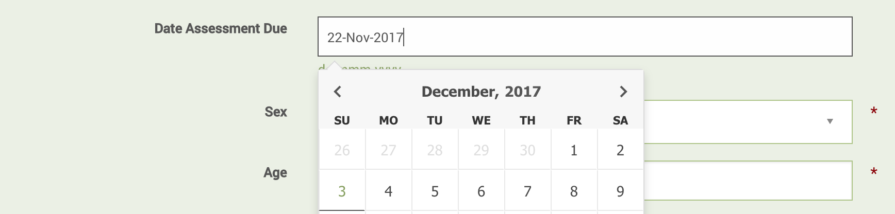

### Case Plans

Case plans become due based on the "Date Case Plan Due" field (or any field with the id "case_plan_due_date") on the **Assessment** form. Like the "Date Asssessment Due" field, this is also hidden by default, so unless your implementation makes the field visible, you will not see case plans in the Tasks view. A case plan is considered complete once the field "Date Case Plan Inititated" on the **Case Plan** form has been filled out.

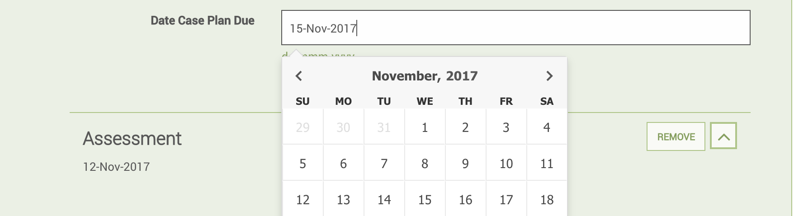

### Services

By default, services become due based on the "Implementation Timeframe" field (or any field with the id "service_response_timeframe") on the Services subform. For example, if a service is created on June 2, and the timeframe is set for "Three Days," the service will be considered due on June 5. Alternatively, however, depending on how your system is configured, the "Appointment Date" field (or any other field with the id "service_appointment_date") on the service subform may be used as a due date. For more information on the **Services** form and its configuration, see the **Services Form** section, or the **Primero Administration and Configuration Guide**.

A service is considered complete once the "Service Implemented On" field (or any field with the id "service_implemented_day_time") on the Services subform is filled out.

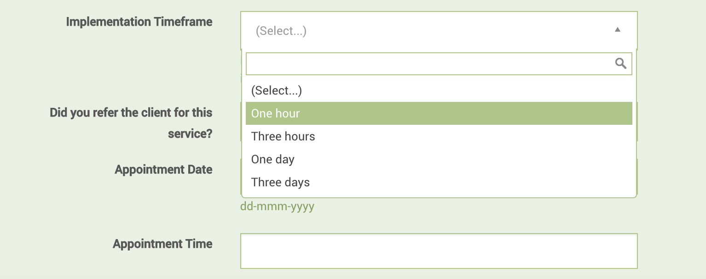

There is also an option to make services become due based on the "Appointment Date" field rather than the timeframe field. For more information on how to set this option, please see the **Primero Administration and Configuration Guide**.

### Follow Ups

Follow ups become due based on the "Follow up needed by" field (or any other field with the id "followup_needed_by_date") on the nested **Follow Up** form. A follow up is then considered complete when the "Follow Up Date" field (or any field with the id "followup_date") on the nested **Follow Up** form is filled out.

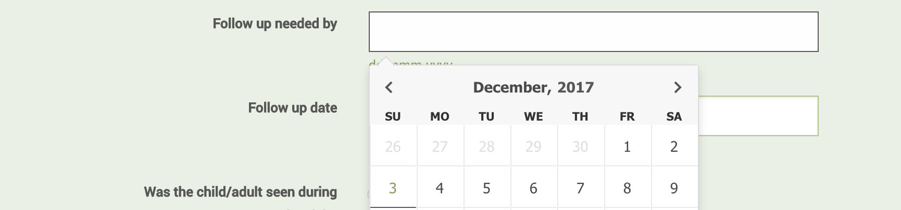

## List View

When selecting the record type or page you want to visit via the header navigation, you can see all cases or tracing requests that belong to you when you click on CASES. Once there, you see a list of the possible matching records, that you are able to filter and/or sort. See below:

## Edit and View a record

When creating a new record, you automatically are brought to the “Edit” page for that record. You can enter in all the relevant information you need at this time and save when done. 

When selecting an existing record, you are brought to “View” the record. This means you can view all the data and forms you have permission to, but cannot edit. You must click the Edit button in the Action Buttons section of the header to change any information that is currently represented.

## Case Status Bar

On the view and edit pages for a case, the user will see the case status bar, which lets the user know the current case management stage of the record.

When the case is first opened, before any services are added, the status bar will highlight the "New" status. Once a service has been added, however, the case status will correspond with the most recently-added response type. So, for instance, after a case is opened, if a case worker refers the case to a service provider for a service with a response type of "Action Plan", the case status will also be "Action Plan." When the case is closed, with manager approval, the case status will become "Closed." Keeping track of the case status helps the case worker keep track of the case's needs. Please note that the case status bar may or may not appear, depending on a given implementation's configuration.

## Action Buttons

Our Action Buttons are the buttons just below our Header Navigation, which allow a user to act on a case or cases. The actions, depending on your permissions, are:

* Flagging

* Export

* Custom Exports

* Import \(List View\)

* Transfer

* Refer

* Assign

* Disable

* Save \(edit view only\)

* Cancel \(edit view only\)

* Mark for mobile

* Un-mark for mobile

* Request Approvals

* Approvals

Please note that when using these actions you must work according to the CP SoPs that are in place. Also, the system does not replace the communication that you need to have in a child protection case management program, through case conferences, emails or other to ensure that people are aware of transfers and referrals and to follow up on referred and transferred cases.

This bar, along with the Header Navigation bar and the case status bar, are part of what is called the **Anchored Header**, meaning, they never leave the screen when scrolling. This allows a user to easily navigate or act on a case or number of cases at any time.

## My Account and Contact & Help links

Above the Header Navigation bar, there are small links that bring you to pages that help you manage your account and contact information, as well as find out who is your site administrator. Clicking on the Primero icon from any page will take you back to the dashboard from anywhere.

# Filtering

Filtering your Case List or search results is an efficient way to narrow down to the case or cases that need your immediate attention. You can filter the list to show not only if a case has other characteristics but contains specific information within those characteristics as well. For example, you can filter by males only, but you can also filter by specific Protection Concern, Current Location, and the case registration date range.

The Filter panel is visible on the search results page or when you click **CASES** tab in the header. See below:

In the image, there is the normal checkbox filter selection, in which you click using your mouse, but also date range and drop down fields. For Date Ranges, you can enter these using any of the date field type actions. You can set the range for one day as well. Drop down fields in the filters panel are clickable with the mouse and only allow you to select one value at a time.

Once you have selected one or more filters (e.g. Female cases with ages between 0 and 5), you can apply them to the case list. To do this, simply click the "Apply" button at the top of the filters panel.

You can also save a set of filters for later use by clicking the "Save" button, positioned next to the "Apply" button. This will take you to the modal pictured below.

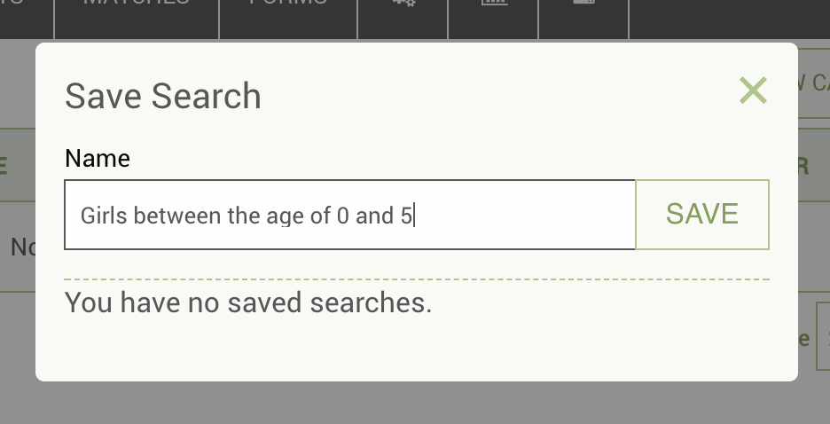

Here, you enter a name for this new saved search. In this case, we have entered the name "Girls between the age of 0 and 5." Click "Save" to save the search. Once the search has finished saving, click on the "Saved Searches" tab in the filters panel.

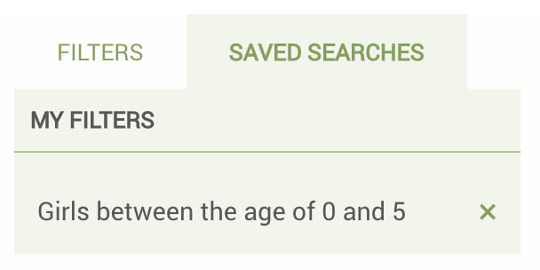

Here you see the search you had saved earlier. If you click on it, you'll notice that the filters you had previously selected have been applied to the case list. To delete a saved search, you can click on the 'x' next to the search's row in the "Saved Searches" tab.

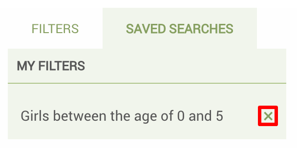

# Flagging

Flagging a case is a way to alert either yourself or a manager that a case needs additional work or attention. To flag a case:

 1. Once you have opened the case, click on Flags
 2. Enter the flag reason and if applicable the Date by which this flag
    needs to be addressed
 3. Click flags to complete

Note that only the person who flagged the case can unflag the case. To do so:

 1. Click on the (+) button next to the flag, under the Unflag Case heading.
 2. Enter a reason for unflagging the case.

A history of the flags and unflags for the case is stored. To see the history, click on the View History tab, you can view the details of the flags and unflags.

# Assign Users

Managers have ability to assign a case to a different user. If you select the Assign option from the Actions dropdown menu, a modal will appear that allows you to select from existing users. Assigning the case will change the record owner to the selected user, that record will no longer be available to the previous case worker.

# Reopen

Users have the ability to reopen closed cases. Reopen displays in the Action menu on the case view page below Disable; it does not display on the case list view . Clicking Reopen brings up a confirmation dialog saying that clicking ok will change the status of the case to open. When the user clicks OK, the “Case Reopened?” field in the **Basic Identity** form is checked, the case status is set to Open, and the case’s state is set to Valid. This also creates an entry on the **Record Information** form.

# Approvals

## Caseworker

Case worker roles have the ability to request approval for a case plan, BIA, or closure from the manager. This is done by going into the ACTIONS button dropdown, clicking on "Request Approval," and then clicking on the type of approval you would like to request. This will produce a modal to submit the request.

If you request a case plan approval, the below modal will appear. Select a case plan type \(the options will correspond with the various response types\) and then click "OK."

The modal for requesting closure approval will be similar, except that it wil not have a dropdown for case plan type. Here, simply click "OK" to request approval.

Once the approval request is made, it will show up as pending under the approvals section on the caseworker dashboard. It will also appear on the manager’s dashboard as a pending approval. Once the manager approves or rejects the form for the case, the status will change on both the case worker and manager dashboards.

All approvals for a case will also appear in the **Approvals** form section on the case edit and view pages. Here, you will see the type of approval (case plan or closure), the approval's status, the date of the approval request, and, if the approval is for a case plan, the type of case plan.

## Managers

Managers may have the ability to approve a case's case plan and/or closure, depending on configuration. To check to see if any approvals have been requested for a case, a manager can go to the **Approvals** form on the case view page (pictured above). As you can see, an entry for an approval in the forms will tell you what type of approval it is (BIA, Case Plan or Closure).

To perform an approval, go into the ACTIONS button dropdown, click "Approvals," and then click either "Approve Case Plan," "Approve Closure," or "Approve BIA," depending on the type of approval. You will see a modal like the one pictured below. To complete the approval, simply click the "Yes" check box, add in any necessary comments, then click "SUBMIT."

# Manager Notes

Managers overseeing a team of case workers may want to add notes to a particular case so that they can give the case worker guidance on case management. When viewing a case, managers should see a button marked "Add Notes" at the top of the page.

Click this button. A modal will appear. Here, you can write the subject of your note, as well as its full text. Click submit to add the note to the case.

When the case worker logs in and views this case, a notification will appear on the form tab for the Notes or "Other Comments" form.

If the case worker then clicks on the form, they will be able to see the manager's note, including the subject, full text, the manager's username, and the date the note was added.

Case workers will also see a notification about the new note when viewing the case on mobile as well. For more information on this, please see the **Primero Mobile User Guide**

# Create Incident from Case

When viewing a GBV case, a case worker can create an incident directly from the case by clicking the "CREATE INCIDENT" button, located next to the ACTIONS button in the **Anchored Header**. Doing so will re-direct the user to the create incident form, with case information automatically loaded into the **Survivor Information** form.

Alternatively, a user--depending on configuration--can create an incident from any case from the case list or search results views. To learn more about this capability, read the section labeled "Adding Incident to Case from List View".

# Search and Advanced Search

## Quick Search

Quick Search refers to the search field in the header navigation bar. From here you can type in your search and return a list of possible matches. If you are searching from the cases page you can enter your case’s value for one of the following fields to find a match: “Long ID,” “Case ID,” “proGres ID,” “Name,” “Nickname,” “Other Name,” “Ration Card Number,” “ICRC Ref No.,” “RC ID No.,” “UNHCR ID,” “UN Number,” “National ID Number,” “Number of Other ID Document,” and “Other Agency ID.” When looking for a tracing request, you can search these fields: “Long ID,” “Inquirer ID,” “Name of inquirer,” and “Nickname of inquirer.” After searching, you can filter results further.

## Searching for Records Owned By Other Users

Depending on your configuration, some users may have the ability to search for records owned by other users. In this case, the records are only visible in the list view. Clicking on a record in this view does not take the user to the view page for that record. Instead, the user can perform actions on the record from the list view.

To do this, go to the record list page, and search for your record using an id or other searchable field. Once your search results appear, select the check box for the record on which you wish to perform an action. Now, select the action you wish to perform in the action button dropdown.

## Viewing Record Details

Before performing an action, you may wish to see some information about the record you have selected, even if you do not have permission to see all of the record's information. Some users will have permission to see a limited set of attributes for other users' records, using what is known as the *View Details* modal. To see information on such a record, click on the "View" link at the right-hand side of the record's entry in the list. You will then see a modal containing information on the case.

Depending on your user's role configuration, you may be able to see the case's photo in this modal. The permission to view this photo is different from the one which allows you to see the *View Details* modal. For more information on configuring user roles, please see the **Primero Administration Guide**.

## Adding Incident to Case from List View

Depending on your configuration, a user may be able to add an incident to a case from the list view or when searching for a case. To add an incident to a case, select your case's check box on the search results page, then, under the action button dropdown, select "Add Incident." You will see the following modal. Here, enter information on the incident you are adding, and then save.

Depending on your user's configuration, you may also see a second button, marked "Save and Add Service Provision." Clicking on this will save the incident details you have entered and then take you directly to the add service modal, where you can enter information on a service rendered for the child.

## Adding Service Provision to Case from List View

Depending on your configuration, a user may be able to add a service provision to a case from the list view or when searching cases. To add a service to a case, select your case's check box on the search results page, then, under the action button dropdown, select "Add Service Provision." You will see the following modal. Here, enter information on the service you are adding, and then save.

# Exporting Information on Records

Exporting individual cases or a list of cases can be useful in a number of ways. This action can be found in the **ACTIONS** header button which   will display a drop down to select what format you want to export - PDF, XLS, CSV, etc.

| **Format** | **Description** | **Fields Included** |
| --- | --- | --- |
| CSV | Stands for “Comma-Separated Values.” Readable in excel, and can be imported back into any Primero instance. | All fields to which the user’s role has access. |
| Excel | Exports to a standard .xls file, which can be re-imported back into Primero. | All fields to which the user’s role has access. |
| JSON | Easiest format to be read \(only\) by Primero, and the preferred format for importing. | All fields to which the user’s role has access. |
| Photo Wall | Exports a PDF file with the photo of each selected case along with the case’s ID. Cannot be re-imported into Primero. | Photo, ID. |
| PDF | PDF file containing a profile on each case, including the fields from the forms specified by the user. Cannot be imported. | All fields specified by the user, to which the user’s role has access. |
| UNHCR | CSV file specifically formatted to be compatible with UNHCR’s data import. | All fields to which the user’s role has access. |
| Custom | Excel file containing all the fields specified by the user. Can be imported back into Primero. | All fields specified by the user, to which the user’s role has access. |

Once you’ve selected your format, the export window will appear, allowing you to set your own password for the file, and create your own file name.

To export a list of cases, while in the case list view, you can select as many as you’d like to export via the check boxes:

To export all cases, you can leave all unchecked and it will export all cases you have access to. The bulk export will generate in the background. You can continue to use the app while it is generating. To access it, click on the tab with the download icon. 

To export a single case, you can either check only that case in the case list, or enter into the case to view it, then use the ACTIONS button to export.

# Navigating Primero Forms

Once you are creating or editing a record, you will see a navigation list in the left panel. This list is an organized way to navigate through your forms. The initial titles you see are called **Form Groups** and are set up by your site administrator. The current form you are on will be highlighted - see below:

If a Form Group has only one form, you can simply click on it and it will populate the form. If it has more than one, you can click on the Form Group name or the expand icon to the right of the name to expand it and see all the forms in the group. Once expanded you can then click on any of the form names to enter into the chosen form. For example, in the image above, the user has selected the **Identification / Registration** form group and the **Basic Identity** form.

## Navigating Sub-Forms

In certain data sets and forms, we find that information pertaining to an event or entity is nearly identical. For example, information on specific family members can be the same form, just labeled per family member name and relationship. So in cases like this, we’ve designed these forms as “sub-forms,” and you manually add additional individual forms to add information on family members, individual follow ups, etc. To navigate those, there is an expand/collapse function, and an add/remove function.

## Alerts

When an incident has been added to your case, you will see a small alert badge next to the incident subform. This helps users keep track of updates to a given case's situation and immediately undertake any necessary services.

There are two other situations which would cause an alert to appear: the addition of a service provision to your case, and an approval request being made on a case. In the first situation, if another user adds a service provision to your case, an alert will appear next to the Services form tab in the forms side bar. (Depending on your configuration, this form may also be called "Response Overview.")

You may also see a message at the top of the form informing you of the reason for the alert.

An alert may also appear on a case form if a request was recently requested for case plan, closure, or best-interest assessment approval. Whenever an approval is requested for one of these situations, an alert will appear next to the appropriate form tab: Services (also called Response Overview in some implementations) for case plan approval, Closure for closure approval, and BIA for best interest assessment approval.

# Creating, Updating, or Editing a Case

## Creating a Case

To create a case from the case list view, click on the "NEW CASE" button. You will see a modal like the one pictured below. Here, you have two options. The first option is to simply create a case by clicking the "CREATE CASE" button. However, you can also check to see if a case already exists for a child by running a search. \(For a list of fields that are searchable, read the "Quick Search" section.\) To run a search, simply type your search query into the search box and click the "SEARCH" button. This will take you to a search results page. If no search results appear, you can just create a case by clicking on the "NEW CASE" button again on the search screen.

Once you have reached the new case page, you can navigate to different forms as we describe in the “Navigating Primero Forms” section.

## Editing a Case

To edit a case, simply located it in the case list view and then click on it. Once you’ve entered into the case you would like to update, you must click the **EDIT** button in the actions header. The page will then refresh and allow you edit individual form fields.

There are a number of different field types in which you can edit differently.

* **Text** - Type normally using your keypad or keyboard.

* **Text Area** - Similar to the Text field. Type normally, the field expands for more information as you continue to enter information.

* **Date** - Multiple ways to edit

  * You can type in a numerical date in the format of dd-mm-yyyy

  * You can type in the first three letters of the month in the format of 01-Jan-2014

  * You can use the calendar widget to go to the correct day and select it directly

* **Check Boxes** - You may click one or many of the options using the mouse.

* **Tick Box** - You may click on the box using the mouse.

* **Select Drop Down** - Click any option to select it.**Multi-Select Drop Down** - Begin typing and either hit ‘enter’ or click to select multiple options.

* **Radio Button** - Similar to Tick Box, click on the correct answer using the mouse

* **Numeric Field** - Key the number into the field.

* **Tally Field** - Key in the number you need for each tally. The total automatically calculates based on the tally fields and is not editable in itself.

When you attempt to save, there is always the possibility that one or more of the fields you entered will be formatted incorrectly. For instance, if you try to fill in the “Date of Registration or Interview” field--which is supposed to be a current or past date--with a date in the future, Primero will be unable to save the information. In this case, after you hit the “save” button, the case will fail to update with your new information, and the “Date of Birth” field’s label will be highlighted in red, to inform you that the field has been entered incorrectly.

In addition, it may be possible that, when you try to save, you will have forgotten to fill out some fields that are required. In this case, the required fields will be highlighted in red to inform you that they are required. In addition, a message will appear at the top of the form, telling you which un-filled fields are required, and on which forms these fields are located. In the form tabs, small red numbers will appear next to each form section or form group name to tell you how many fields on each need amending, due to their being either blank or improperly formatted. Another way to tell which fields are required is that each will have a small, red star to its right.

When a required field is located on a nested subform, a user must either fill out the required field or remove the subform entry with the un-filled field. The red number next to the name of each form section representing the number of un-filled fields in a form section will reflect the total number of required fields across all subform instances in that form section. So, for instance, if there are two required fields on the Family Details subform, and the user has created subform entries for each of three family members without filling out any of the required fields, the number '6' will appear next to **Family Details** form section name in the forms list (2 × 3 = 6).

Once again, if you wanted to avoid filling out the fields on one of these subform entries, you could just click the "Remove" button to remove that subform entry. For more information on how you can set which fields are required, please see the **Primero Administration and Configuration Guide**.

# Generating Automatic Follow Ups

While you are making changes to a case, you can make your job managing the case easier by having Primero generate reminders to perform a follow up every two weeks. To do this, click on the **Protection Concerns** Form Section, under the **Identification / Registration** Form Group and check the “Generate follow up reminders?” tick box. If you click save, Primero will automatically create a flag \(to be discussed later\) on the case for you, once every two weeks, which will remind you to perform a follow up. This feature may or may not be turned on.

# Transfers and Referrals

## Transfers

Transferring a record is a way of providing another care provider with a record. There are some processes surrounding this for a transfer to a non-Primero individual or a Primero user outside your instance. However, those will be determined by your organization and the sharing protocol of the organization of the person you are transferring to.

To transfer a record from either the individual record page or the list view, use the ACTIONS button in the Action Header to initiate the drop down of options. Within the options, select “Transfer Case.”

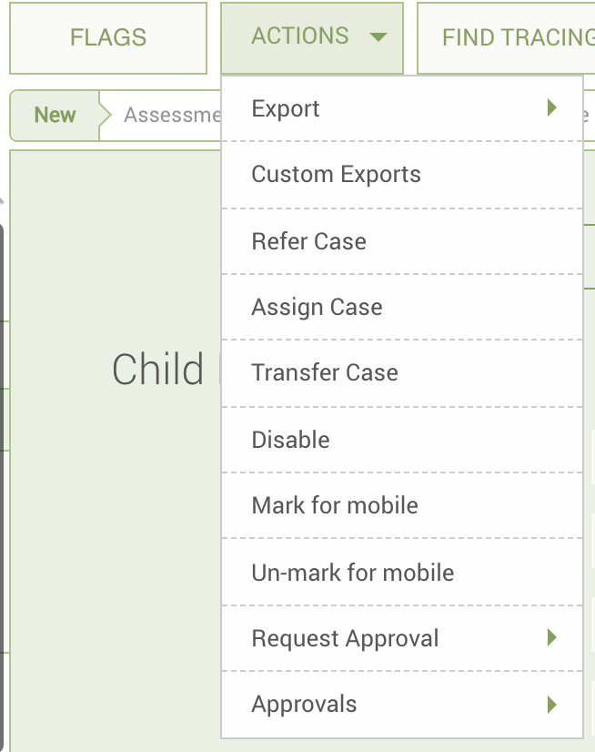

The following modal form will appear and allow you to select options for your transfer. Consent of the individual \(or a consent override\) is  
generally needed for transfers, although not for those which take place within the same Primero instance.

You will also be asked if you are transferring to a remote system, that is a system outside of Primero. If you are transferring outside of Primero, click the check box "Are you transferring to a remote system?"

To select the user that you are transferring to, first select the agency and location associate with the user.

If you are transferring within your Primero instance, select the “Existing User”--a user within your deployment of Primero. If the desired user is not in the drop down, it means this user does not have privileges to be transferred to or that the user does not meet the criteria selected in the Agency or Location fields.

If you are not transferring within the Primero instance, check the “Are you transferring to a remote system?” tickbox, and more options will appear for this “remote” transfer. For an external transfer, you must type in the name and agency of the user you are transfering to. You will then create a transfer export that is password protected to be shared outside the system.

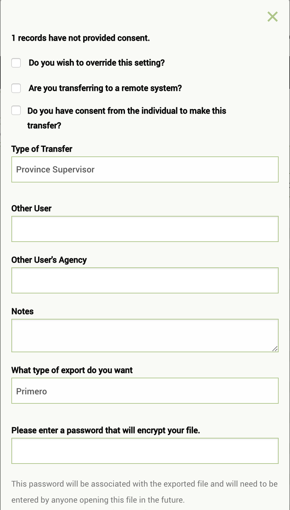

After indicating that you are transferring to an external user, you must fill in the precise name and agnecy of the user you are referring to. You must select "Primero" in the drop down asking "What kind of export do you want?." This means the file Primero exports will be a JSON file which can be imported into the remote Primero system. 

> _Note:  
> When transferring any such password-protected export/import file, the means of sending the file, filename, and the password that opens it, will be determined by the Information Sharing Protocol \(ISP\) decided by the appropriate local steering committee. When determining this policy, on-the-ground security considerations will be at play, as well as the ease and speed of physical transport within the country._

## Accepting or Rejecting Transfers

Based on your deployment's configuration, you may have the ability to accept or reject a case that has been transferred to you. You will be able to see if any cases have been transferred to on your dashboard. If you click on the Referrals and Transfers form for the case that has been transferred to you, you will see that the status is in progress and that there are buttons to either accept or reject the transfer. If you click to accept the case, the status will change to accepted, and you will become the record owner, rather than an “other assigned user”. The record information is updated with this change. If you click Reject, it brings up a dialog box with an OK button and a textbox to enter the Rejection Reason. When you click OK, the rejection reason is saved to the nested subform. The status is changed to 'rejected, and you are removed from 'other assigned users' and no longer have access to the record.

## Requesting a Record Transfer

If you find a record owned by another user and need full access to it, you can ask the record owner to transfer the record to you. In Primero, this is known as a *Transfer Request*. Your ability to perform a *Transfer Request* will depend on your instance's configuration. To request a transfer, first search for your case from the case list view. When you identify the entry in the list for the case you are seeking, click the "View" link at the right of the case's row.

Scroll to the bottom of the *View Details* modal. Here, you will see a button marked "Request Transfer". Click it, and a modal will appear.

Here, you will see information on the record owner and a text box where you can enter a note to the owner of the record. Click "Send Request" to submit.

### Notifications for the Case Owner

Once you have sent the transfer request, the record owner - if their user account is configured with an email address and the ability to receive email notifications - will receive a notification telling them about your request for a record transfer.

If the case owner clicks on the link in the email, they will be redirected to the Primero login page and then to the case record, where they will see a notification in the forms side bar and on the *Transfers and Referrals* form alerting them to the transfer request. Here, they will also see the note you included in your request.

At this point, the record owner can choose whether or not to transfer the record to you.

## Referrals

Referring a record is a way of giving a user limited access to a record without transferring it completely. To refer a record from either the individual record page or the list view, use the ACTIONS button in the Action Header to initiate the drop down of options. Within the options, select “Refer Case.”

The below modal form will appear and allow you to select options for your referral. As with transfers, there are some processes surrounding consent for referral and referrals to remote systems. These processes will be determined by your organization and the sharing protocol of the organization of the person you are referring to. 

The following modal form will appear and allow you to select options for your referral. As with transfers, consent \(or a consent override\) of the individual is generally required for a referral. Consent for referral is found on the Data Confidentialty form under the Identification/Registration Form Group. If your case has not provided consent for referral, you will see a sentence at the top of the referral screen "Do you wish to override this setting?" If consent has not been provided, but the referal is needed, select this box. If you are referring a case outside of your Primero instance, select the button "Are you referring to a remote system?" and you will be take to the external referal form. If you are making a referral within Primero, you will use the Primero referal form:

The Service field identifies what specific service you are requesting the other user perform or examine. Select the service you wish to refer. The Agency field provides a selection of agencies associated users. Select the agency of the user you wish to refer to. The location field provides a list of locations associated with the country of origin.

Now, select the “Existing User”--a user within your deployment of Primero. A list of all users that perform the service selected, from the agency selected, and in the location selected will appear. If the desired user is not in the drop down, it means this user does not have privileges to be referred to or does not meet one of the matching criteria. 

If you are not making a referral within the Primero instance, check the “Are you referring to a remote system?” tickbox, and more options will appear for this “remote” referral. A remote referral creates a referral export that is password protected to be shared outside the system.

If you are making a referral to a user outside your system who is using another Primero instance, you simply select “Primero” in the drop down marked “What type of export do you want.” In this case, the file Primero exports will be a JSON file which can be imported into the remote Primero system.

To specify which service a referral is for, go to the **Services** form and click on the "refer" button on the header for any service you have saved.

Once you have clicked "refer" you will see the below modal. Once again, make sure you have consent \(or a consent override\), and select a user who will receive the referral. The service type should already be selected for you, based on what you entered in the **Services** form.

## Relinquishing Referral

Based on the deployment, you may have the ability to relinquish a case that has been referred to you. You can see if any cases have been referred to you on your dashboard. When you click on the **Referrals and Transfers** form for the case that has been referred to you, you will see a DONE button next to the referral that has been made to you. If you are done reviewing the case, you can click the done button. Once clicked, it will be removed from your case list and you will no longer have access to it.

# Services

A core part of the case management process is responding to the needs of a case. Primero manages these through the **Services** form and through the provision of services (sometimes also referred to as "responses").

## Services Form

To add a service to a case, simply go into the **Services** form on the case edit page, and click the "add" button. You will see a subform like the one in the picture below. Here, you can enter information on the service.

When selecting a "Type of Response", remember that this will help determine the workflow status of your case. So, for instance, if you select "Action Plan," your case status will also be "Action Plan" so long as you do not add any other services or close the case.

Another important field to fill in is the type of service that will be rendered for this particular response, whether it be medical, legal, or whatever other options have been specified in your implementation's configuration. This field will help service providers properly take care of your case.

Choosing a timeframe for the service will help generate reminders in you or your manager's dashboard when the service is coming due or overdue. This timeframe, depending on your configuration, will take one of two forms: the time period after which the service will be due (e.g. three hours, one day); or the actual due date for the service (e.g. November 30, 2017). Both these forms are displayed in the pictures below. For more information on these reminders, check out the Dashboards section.

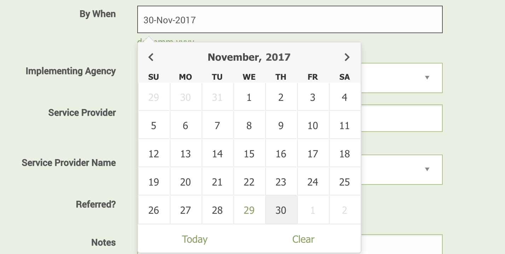

Selecting a service provider in this form will allow you to refer your case to the service provider directly from the form. When selecting a service provider, fill in Implementing Agency and Service delivery location. When you fill in the "Service Provider Name" field you will be shown a list of users filtered by the selected agency and delivery location. The "REFER" button will appear for this particular service. In the situation below, we have selected a medical specialist to perform a medical service for our case.

## Referring from **Services** Form

Once you have saved the case with this new service, and have been redirected back to the view page, go to the **Services** form and the service you just added. At the top of the service's subform, you should see a "REFER" button. Click on this button, and you will see a modal like the one pictured below. Here, you can enter information on your referral just like you normally would. However, if you have already filled out a service provider and a service type for your service, these fields will be pre-entered for you. Remember to ensure that your case has provided consent, or that you choose the override consent option before referring.

# Workflow Status

## The Workflow Status Bar

The **Workflow Status** allows the user to quickly understand where in the case management process the current case stands. This value can be seen at the top of the case forms, in the **Workflow Status Bar**. By default, Primero is not set to display this bar, but the system can be configured to change this. (See the **Primero Administration and Configuration Guide**.)

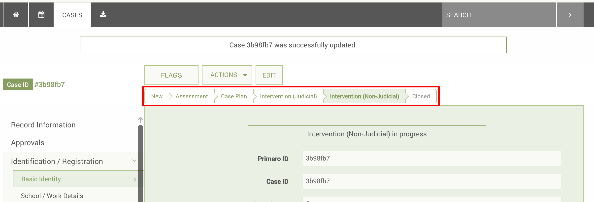

Above is the default **Workflow Status Bar**. Here you see the following statuses: "New," "Case Plan," "Care plan," "Action plan," "Service provision," "Service Implemented," and "Closed." The first of these statuses, "New," is applied when a case is first created. The second, "Case Plan," is applied after the "New" status, when the field "Date Case Plan Initiated" (or any other field with the id "date_case_plan") is filled out by the user.

The next three statuses, "Care plan," "Action plan," and "Service provision," correspond to the three potential "Response Type" values for a service. A case is given one of these statuses if the case is still open, and still has non-implemented services planned for it. The "Response Type" value for the most-recently-added, non-implemented entry in the **Services** form will be the new workflow status.

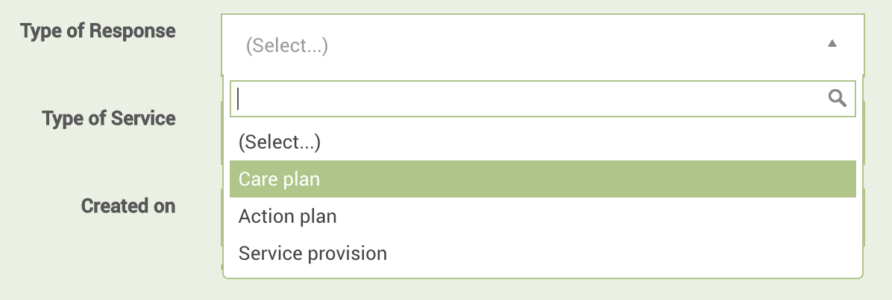

For example, let's suppose I have a case with three services: one created on June 1 with a type of 'Action plan' which is *implemented*; one created on June 20 with a type of 'Care plan' which is *not implemented*; and one created on June 25 with a type of 'Service provision' which is *implemented*. In this situation, the case's workflow status would be 'Care plan', since this is the Response Type of the most-recently-added, non-implemented entry in the **Services** form.

These statuses will vary depending on the options in your configuration for the "Response Type" lookup. So, for instance, if your "Response Type" options are "Remote Contact" and "In-Person," you will see these two as potential workflow statuses, rather than the three that we see here.

The next status, "Service provision," is deprecated, and should be left out of any configuration. The "Service Implemented" status, meanwhile, applies when all of the entries in the **Services** form have been implemented. One of these services is considered implemented if the "Service Implemented" field (or any field with the id "service_implemented") on the service subform is set to "Implemented."

Finally, the "Closed" status applies when a case's case status has been set to "Closed."

Please see the **Primero Administration and Configuration Guide** for more details on how to change which workflow statuses appear for your implementation.

# Notification Emails

Users may receive notification emails that either welcome them to the application, or alert them to changes to their cases. Only user accounts which have been designated to receive notification emails will receive anything, and only if the system as a whole has been set to send notification and welcome emails. The following users will receive emails in the following circumstances:

* Managers whose case workers have requested approval for case plans, closures, etc.

* Case workers whose managers have responded to approval requests for case plans, closures, etc.

* Users who have received a case transfer

* Users who have received a case assignment

* Users who have received a case referral

Welcome emails will look something like the below message. If the new user clicks the "Primero" link in the message, they will be sent to the system login screen. Once again, users will only receive welcome emails if the system has been configured to send them, and if the user in question has been set up to receive them.

For more information on how turn welcome and notification emails on or off in the system's configuration, please see the **Primero Administration and Configuration Guide**.

# Tracing

Using Primero's **Tracing** functionality, users can perform searches on behalf of parents or guardians looking for unaccompanied or separated children.

## Consent for Tracing

**IMPORTANT NOTE**: Cases will only appear as potential matches for tracing request if they have provided consent for tracing. Users can record a case's consent to take part in tracing by filling out the tracing consent field in the "Data Confidentiality" form. This field is pictured below.

## Tracing Requests

If your user is configured for tracing activities, you should have access to **Tracing Requests**, and you should see the "Tracing Requests" link in the navigation bar at all times.

If you click on this link, you will see a list of all the tracing requests you have access to. Click "New Tracing Request" to begin tracing.

First, you will fill out the "Inquirer" form. This contains information on the parent or guardian who has initiated tracing. Primero will use much of the information in this form to search against information recorded about family members in each case's "Family Details" subform entries. So, for instance, if a child's father, named "Ibrahim," is the inquirer, Primero will search for cases with a family member whose relationship to the child is recorded as "Father", and whose name is "Ibrahim."

Next, you will fill out information on the child by filling out a subform entry in the "Tracing Request" form. Primero will use the information here to search for cases with similar attributes. So, for instance, if the father mentioned above is looking for a daughter named "Fatima," who is 15 years old, Primero will search for cases with the name "Fatima" and an age of 15.

## Matches

Once you have saved the tracing request, you will see a "Find Match" link at the top of your "Tracing Request" subform. If you click on this link, you arrive at a page which displays a number of cases which are potential matches for your tracing request. This list will contain the case's ID, the record owner's user name, the record owner's agency, the approximate likelihood of the case being the right match (either "Possible" or "Likely"), and (depending on your user's configured permissions) a link which displays the *View Details* modal (See "Viewing Record Details" section above).

### Scoring

Primero gives potential matches a score based on how similar they are to the tracing request *compared to other potential matches Primero has found*. This means that, if scoring were done on a 1-10 scale, The lowest potential match in a list would get a score of 1, the highest would get a 10, and the median match would get a 5. To simplify things, Primero instead simply scores a potential match as "Likely" or "Possible."

When looking at the potential matches for your tracing request, you can see which case attributes matched your tracing request by clicking on the score label. This will reveal a modal which compares a number of case attributes side-by-side with the attributes you gave your tracing request. Attributes which are the same get a '✔', attributes which are different get a 'X', and attributes which were left blank on both the case and the tracing request get a '-'.

To see more details about the potential match, click the "View" link to the right of the case entry (this may or may not appear, depending on your configuration). You will then see the *View Details* modal, which will display a number of attributes of the case. (Please see the "Viewing Record Details") section above.

### Linking Tracing Requests with Cases

Once you have identified a match which you think is the correct one, you can link this case to your tracing request, provided your user is configured to be able to see the case record in its entirety. If so, you should be able to click on the case's ID, after which you will arrive at the case record page. At the top of the page, you should see a button that says "Match." 

Click on this button to link the case to your tracing request. You should then see a notification at the top of the screen, indicating that your match succeeded.

Now, if you return to your tracing request's list of matches by hitting the back button, you will see that the entry for the case you just linked to your tracing request is in bold.

Similarly, when the user responsible for the case goes to the case's "Tracing and Separation Details" form, they will see a label marked "Matched tracing request," and to the right of this, a link to the tracing request which you created.

At this stage in the tracing process, the user who initiated the tracing request would manually contact the user and/or agency responsible for the case to initiate the verification and reunification process.

# Reports

Reports allow users to see a high-level, aggregate view of data, helping them to understand trends and coming challenges in their work. Only certain roles--and thus certain users--will have the ability to create or view reports. Some users will be able to navigate to the **Reports** section of the application and view existing reports but not edit them or create new ones, while others will have the ability to view, create, edit, and export reports.

## Creating a Report

To create a report, first click the **Reports** icon in the top toolbar. You will see that there are already a number of pre-built reports which you can view at any time. To start your own, click the **Create Report** button at the top of the screen.

When you have reached the new report form, be sure to enter a name and description for your report. You must then specify the module from which to draw the records for your report, as well as the type of records you want to be drawing upon. Here, we have chosen the Child Protection module, and the Case record type.

Next comes choosing the row and column attributes by which you want your data to be grouped. The first item you choose in each field will be the outer grouping layer, with each successive item acting as a sub-categorization. Taking a look at the example below, we can see that the columns of our report have been first divided by sex, and then sub-divided by permanent district/chiefdom, since these are the first and second “Group by column” attributes, respectively. We can see that the rows of the report follow the same pattern.

The columns of your report will be augmented by a final “Total” column, which shows the aggregate for each row. It is important to note that the numbers in each of your columns may not add up to the number in your total column, since many attributes will go undefined by the workers doing registration. For instance, in the example below, three cases with the “child has been abandoned” protection concern were never assigned a sex, resulting in a report with one female, no males, and four total cases.

Furthermore, any reports based on fields within certain nested forms will automatically count a field for each saved record, even if a nested form for this field was never filled out. This is because Primero automatically populates an empty subform on the page for form sections such as “Protection Concerns,” so that the user can easily enter information. When a user fails to enter information for that field, however, the field still counts as a single item. For instance, if you were to create a case and fail to enter any information into the blank Protection Concerns subform, a report outlining how many cases had each type of protection concern would still count your case as having a single protection concern type, even though you had never entered any information on the Protection Concerns subform. This would then count into the total, without counting into the column for any single one of the protection concern types. Taking a look at the example below, we can see that, in the Freetown district, one child has been registered as abandoned and one with a protection concern type of “Extreme levels of poverty.” But the total number of protection concerns for this district is three, meaning that one case was registered with a protection concern form where the protection concern type was never filled in.

After you have defined the row and column attributes for your report, you will choose the fields from which you will receive an aggregate count. This feature obviously only works on numeric fields. To give an example of how it works, imagine we have a report that disaggregates your cases based on number of children in the family and date of birth \(by year\). Three cases end up going into the report: one born in 2004 whose family has three children, one born in 2001 whose family has six children, and another born in 2001 whose family also has six children. Here is what the report would normally look like:

As you can see, the 2001 column has the number “2” in the “7” row, since there are two cases born in 2001 whose families have seven children. We see this same number in the “Total” column for the “7” row for the same reasons. If we choose to have aggregate counts on the “Number of children” field, however, the report would look like this:

Now, instead of seeing that there are two cases that meet the criteria for being born in 2001 and having a family with seven children, we instead see the number “14,” representative of fourteen total children. Once again, this field also shows up in the “Total” column.

### Age Range

The next field, specifying age range, helps make reports involving age more manageable by grouping them into a smaller list of ranges. The two images below exemplify the usefulness of this feature. The first shows part of a sprawling report without age ranges enabled. The second shows the same report with age ranges.

### Date Ranges

The next field, “Use date ranges,” allows you to do much the same thing, but with date fields instead of ages. Now, instead of having to have a column for every date over a two year period--as would be the case with the default, day-long range--you can disaggregate your records by whether or not they fit into week-, month-, or year-long spans of time.

### Filters

Next, you can put filters on the records you are using to eliminate irrelevant data. By default, each report filters to include only those records with a “Case Status” of “Open” and a “Valid Record?” value of “Yes.” You can create a filter on any single-select, multi-select, tick box, check box, radio button, number, tally, or date field, and for each one, you can specify which values are acceptable for records being included into the report.

Finally, you are asked whether you would like to generate an exportable graph of your report.

## Viewing your reports

If you click save on your report, and it saves successfully, you should arrive at the view page for your report. You will first see a table representing your report. Above the table, you should see either one or two tabs. The first, marked “Table,” represents what you currently see. The second, which will only appear if you specified that your report should generate a graph, will be marked “Graph” and will show you just that.

You can also use the **Export** button above the tabs to export either the data \(in CSV form\) or the graph \(as a .png image file\). Below is an example of a graph generated and then exported from a report.

