# Introduction

  
The _Information Management and Innovation to Protect Children in Emergencies_ project has developed a software application that will help partners securely collect, store, manage, and share data for protection-related incident monitoring and case management. The new platform is called _Primero_ \(Protection-related Information Management\). _Primero_ supports multiple modules, including the “next generation” of the field-tested, inter-agency CPIMS and GBVIMS systems, which are currently in use in 20+ countries. These new iterations, called the CPIMS+ and GBVIMS+, can operate separately or be deployed as integrated modules on the _Primero_ platform. The inter-agency Steering Committees that govern the use of each of these modules will continue to support the new system.

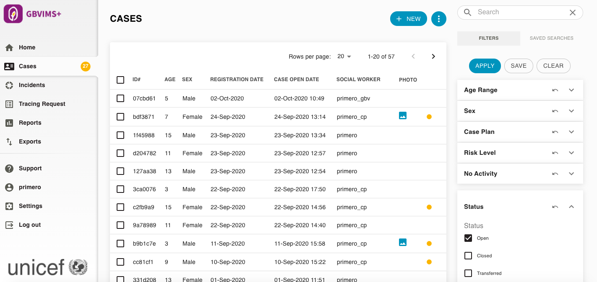

_Primero_ is flexible and adaptable to accommodate a broad range of protection concerns including GBV, unaccompanied and separated children, and monitoring grave violations of children’s rights in situations of armed conflict. To meet operational challenges, the application was designed to function both on- and off-line, with limited or no connectivity, and in multiple deployment configurations. A strong emphasis has been placed on security and confidentiality, with intuitive workflows designed to simplify processes while promoting good practice. Role-based access and granular security ensures that only those who need to see data will have access to it. All system transactions are time stamped, password protected and encrypted. _Primero_ has a user-friendly interface and intuitive tools, facilitating the work of field personnel while decreasing security risks and duplication. Primero functions as a Progressive Web Application (PWA), which means some functionality, such as basic information collection, continues to work even when the user is offline. In addition to exports in a number of formats, Primero has a highly secure application program interface \(JSON API\), which facilitates interoperability with other systems.

_Primero_ functions as a distributed database, meaning that implementing partners can retain ownership of data while contributing and sharing information on shared programmes. In child protection interventions, referrals and case transfers are critical to effective service provision. Sharing sensitive information is a part of good programming. Data exchanges between organizations should be governed by endorsed information sharing protocols adapted to local contexts. _Primero_ design is based on the “need to know” principle; it does not impose data sharing, but facilitates the process when consent is provided, and when it is deemed appropriate and safe by partners.

Good information management practice emphasizes the importance of making data actionable. _Primero_ has built-in customizable reports that can facilitate periodic reporting processes, and be used to analyze data for programmatic insights. A document and photo repository allows end users to organize relevant resources in one convenient place.

>  _A note for end users. Although there are a standard set of forms configured in the CPIMS+ based on the CPWG standard forms that we recommend using, your System Administrator may have configured these forms specific to your location and needs. For any questions about the forms and information you have or need, please reach out to this person. To find contact information for your system administrator, please click the "Support" link in the navigation menu of Primero_

## Logging In

When logging into Primero, you’ll see Username and Password boxes. Click in the Username box and type in the unique user name provided to you by your System Administrator. Then enter your password in the field below and click on 'LOG IN'.

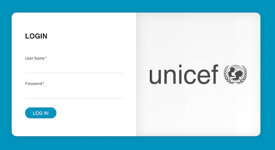

# Navigating Primero

## Navigation Menu

The Navigation Menu appears at the left side of your screen. You can access this menu from any page of the app.

On smaller devices, such as tablets or phones, you will need to click or tap on the menu button to show the Navigation Menu. The menu button will appear at the top left of your screen.

  ------------------->   

## Dashboard

The Dashboard is where you can quickly find information about the records you manage in Primero. The type of information that appears here will depend on the type of work you do for your organization. For instance, social workers, managers, and agency administrators will each see dashboards which are tailored to the needs of their day-to-day work.

A few notes about dashboards:
- You can always get back to the dashboard by clicking on the "Home" link in the Navigation Menu. 
- Clicking on any of the numbers in the dashboard sections below will take you to a list of the records which that number represents.
- In general, numbers in the dashboard represent records to which you have access. For example:
	- If you have access to only your own cases, numbers in the dashboard will reflect only those cases which you manage directly, or which have been referred to you.
	- If you are a manager and have access to all the cases managed by users in your team (user groups), the numbers in your dashboard will reflect these cases.
	- Administrator dashboards generally reflect all records in the system.
- Dashboard numbers also tend to represent only open records. Unless the dashboard explicitly mentions closed records, assume that it represents only open ones.
- Dashboard numbers also exclude disabled records.

### Case Worker Dashboards

The image below shows an example of the dashboard you might see as a case worker when you first login to Primero.

- *Cases by Assessment Level* - This section tells you how many of your cases are at each "Assessment Level" (sometimes also called "Risk Level")
- *My Cases* - This includes two indicators:
	- "Total" - The total number of cases you manage
	- "New and Updated" - A case is included in this number if 1.) a supervisor has just assigned it to you; or 2.) another user in the system has added information to the case since the last time you saw it.
- *Shared with Me* - This shows you the number of cases which have been referred or transferred to you. We will review referrals and transfers in a later section.
- *Shared with Others* - This shows you how many of your cases have been referred or transferred to someone else in the system. We will review referrals and transfers in a later section.
- *Approvals* - This tells you how many of your approval requests are pending, approved, or rejected. Each type of approval appears with its own column.
- *Workflow - Individual Cases* - This tells you how many of your cases are at each stage of the case management workflow. Please note that different implementations may use different specific workflow stages.

Please note that these dashboard sections are only meant to serve as an example. The exact dashboards you see when you login will depend on your Primero implementation's configuration.

### Manager Dashboards

Below are some examples of sections which may appear in your dashboard if you are a manager.

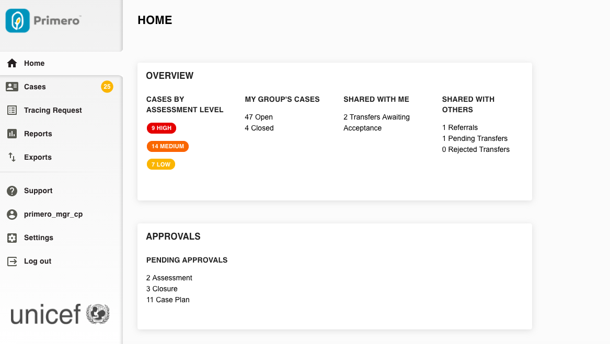

- *Cases by Assessment Level* - See description above.
- *My Group's Cases* - This shows the total number of open and closed cases managed by all of the case workers in your team.
- *Shared with Me* - See description above. Note that, because the user in the example is not able to receive referrals, they only see information on the number of cases which other users have transferred to them, and which still have not been accepted. We will discuss referrals and transfers in a later section.
- *Shared with Others* - See description above.

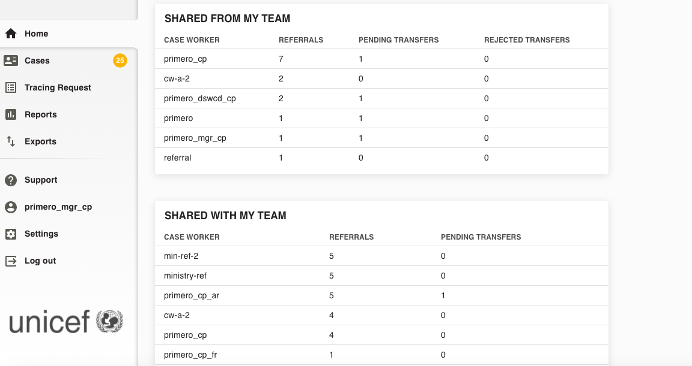

- *Shared from My Team* - This is similar to the "Shared with Others" section, except that it shows how many of the cases managed by each of the case workers in your team have been transferred or referred to other users.
- *Shared with My Team* - This is similar to the "Shared with Me" section, except that it shows how many of the cases other users have referred or transferred to case workers in your team.

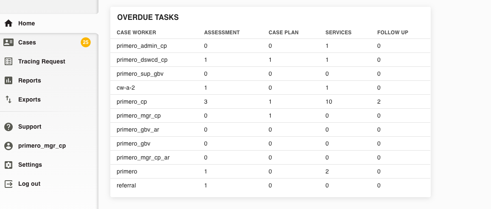

- *Overdue Tasks* - This section shows how many of your team's cases have tasks past their due dates. This is broken down by case worker and by the four types of tasks: Assessment, Case Plan, Service, and Follow Up.

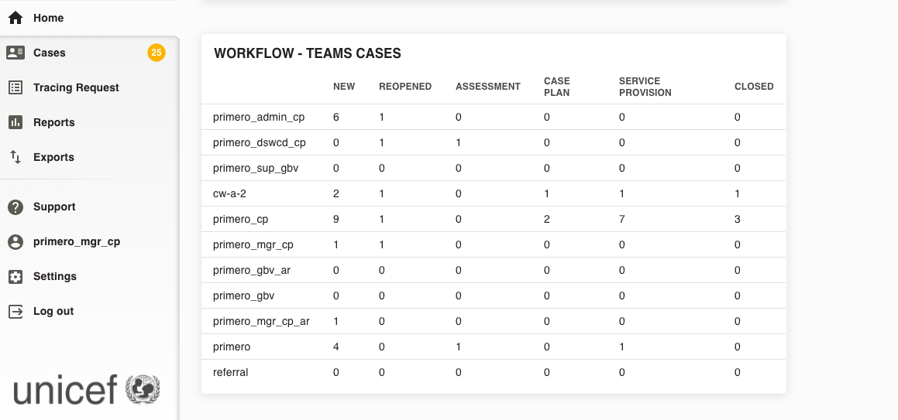

- *Workflow - Team Cases* - For each case worker in your team, this section shows how many cases are at each stage of the case management workflow. Please note that different implementations may use different specific workflow stages.

### Admin Dashboards

The below image gives an example of the sections you may see in your dashboard if you are an administrator.

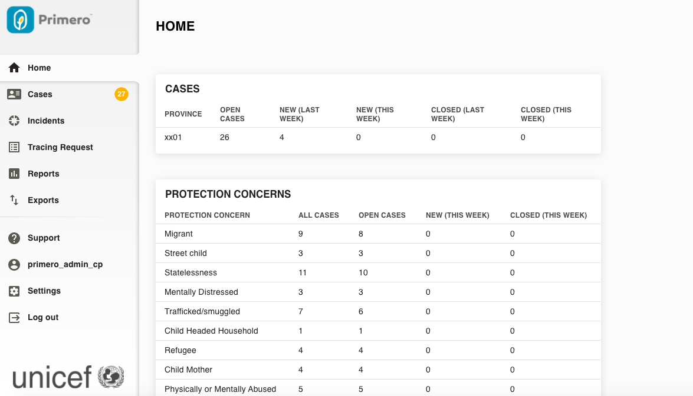

- *Cases by Location* - This table shows the number of cases registered in each location. For each location, the table also shows:
	- "Open Cases" - Total number of open cases registered in this location.
	- "New (Last Week)" - Cases registered in this location 7-14 days ago.
	- "New (This Week)" - Cases registered in this location 0-7 days ago.
	- "Closed (Last Week)" - Cases registered in this location which were closed 7-14 days ago.
	- "Closed (This Week)" - Cases registered in this location which were closed 0-7 days ago.
- *Cases by Protection Concern* - Shows the number of cases with each type of protection concern, broken down by:
	- "All Cases" - This includes both open and closed cases.
	- "Open Cases" - This includes only cases which are still open.
	- "New (This Week)" - Open cases registered 0-7 days ago.
	- "Closed (This Week)" - Cases which were closed 0-7 days ago.

## Audit Logs

Some administrative users and team managers may have access to the *Audit Logs*. To access this feature, click the Settings link in the Navigation Menu. Once you are in Settings, click "Audit Logs" in the Settings Navigation Menu.

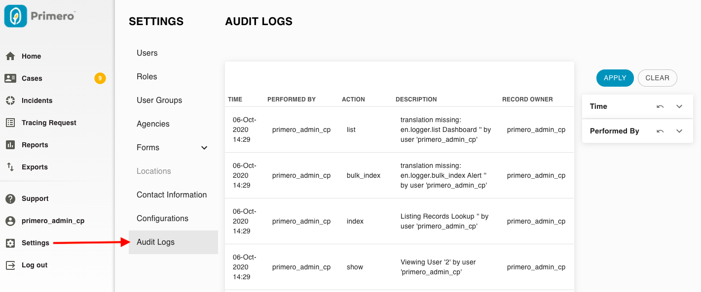

The Audit Logs page shows you a list of all actions which users have committed in the system. Each row represents a different action, including the username of the user, the type of action, the type (and sometimes the ID) of the record on which the action was performed, and the date and time of the action. Using the filters menu to the right of the list, you can limit which audit log entries are displayed. You can filter by date and time or username. To apply a set of filters, click "Apply," and to clear out all filters, click "Clear."

NOTE: The Audit Logs do not contain identifiable information from records. For instance, an audit log entry might tell you that the user "john-case-worker" edited a case with the ID "abcd123" at 10:15 on October 1, 2020. However, it will not tell you what specific information was added to the case.

## Tasks List

If you click on the "Tasks" link in the Navigation Menu, you will arrive at the **Tasks** page.

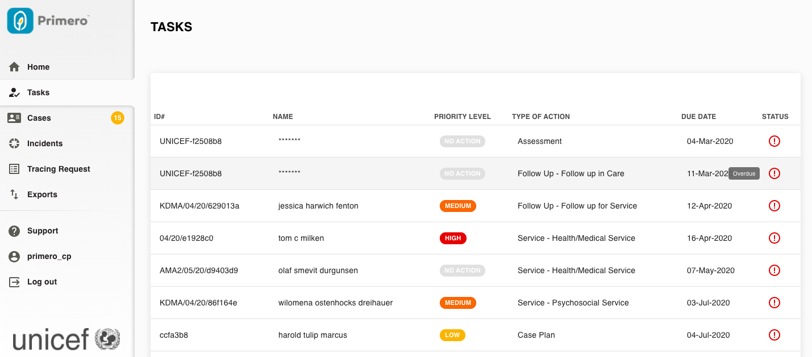

Here, you will see the incomplete Tasks present for all of the cases you manage. Primero automatically generates Tasks for four types of actions: assessments, case plans, services, and follow ups. For each Task, the list shows:
- Case ID
- Name of the Case
- Priority Level (also sometimes called "Risk Level" or "Assessment Level").
- Type of Action
- Due Date
- Status (either "Overdue" or "Almost due")

Primero automatically generates Tasks based on information you fill out in the Case forms. Each type of Task action has a date field in the Case forms that acts as its due date. As soon as a user enters a date value into one of these fields, Primero generates a Task with that due date. To find out which field sets the due date for a Task, hover over the due date for any Task you find in the Tasks page.

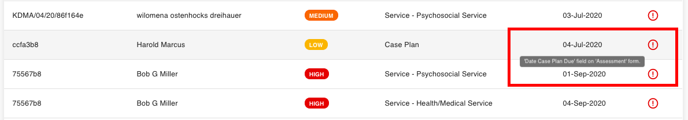

Each type of Task action also has a date field in the Case forms which marks the Task as "complete". Once a user enters a date value into this field, the Task is marked as "complete" and disappears from the Tasks list.

To complete a Task, click on that Task in the list. You will arrive at that Task's Case, on the form which corresponds to that Task and contains its "complete" field. (Note: Usually the "complete" field for a Task will have help text to let you know it is used to complete a Task.) For example, if I click on a Case Plan Task, I will arrive at the Case Plan form for that Case. This form contains the field "Case Plan Initiated". If I fill out this field, the Task will be marked as "complete."

TODO Screenshot

Note that each Primero configuration may have different names for the fields which set and complete Tasks. Below is a list of the fields used for each type of Task action in the Primero default configuration.

- Assessment
	- Due Date: "Date Assessment Due" on the "Basic Identity" form.
	- Complete: "Assessment requested on" on the "Assessment" form.
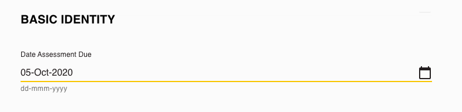

- Case Plan
	- Due Date: "Date Case Plan Due" on the "Assessment" form.
	- Complete: "Date Case Plan Initiated" on the "Case Plan" form.
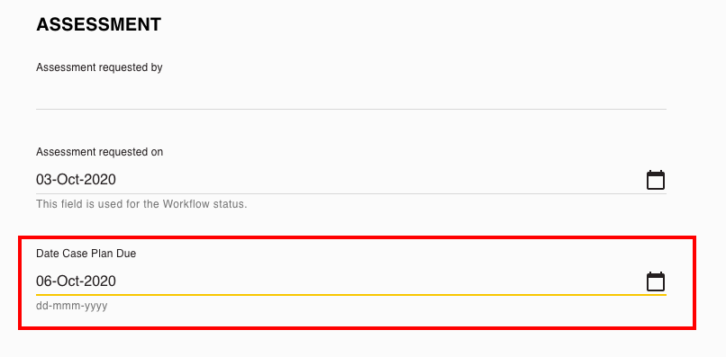

- Service:
	- Due Date: "Implementation Timeframe" on the "Services" subform.
		- NOTE: Each Service subform entry will generate its own Task.
		- NOTE: "Implementation Timeframe" is a dropdown, not a date field. In some configurations, the "Appointment Date" field is used to set the Task due date instead.
	- Complete: "Service Implemented On"

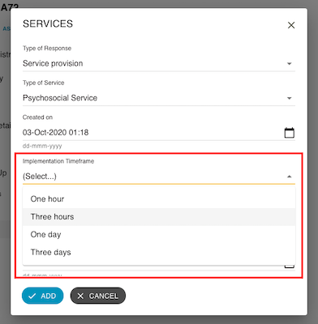

- Follow Up:
	- Due Date: "Follow up needed by" on the Follow Up subform.
		- NOTE: Each Follow Up subform entry will generate its own Task.
	- Complete: "Follow Up Date" on the Follow Up subform.

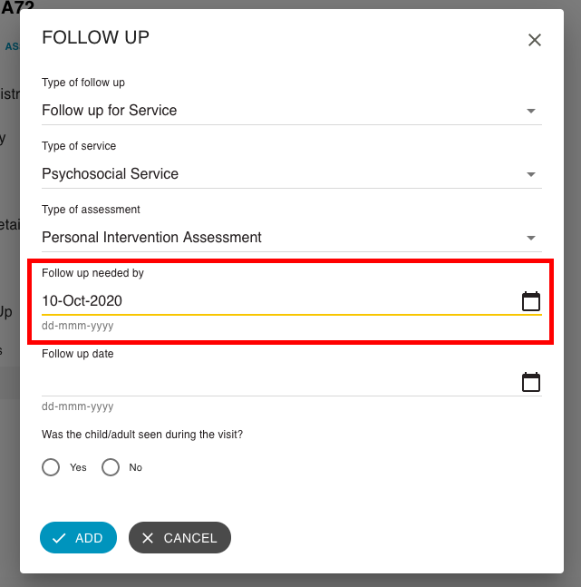

## Record Lists

There are three main types of records in Primero: **Cases**, **Incidents**, and **Tracing Requests**. In the Navigation Menu, below the Tasks link are the links to the List pages for each type of record. These are the **Case List**, the **Incident List**, and the **Tracing Request List**. Depending on the work you do for your organization, you may only have access to one or two of these pages. For instance, in most Child Protection contexts case workers only deal with Cases, and so only have access to the Case List. For this reason, we will use the Case List to explain how the record list pages work.

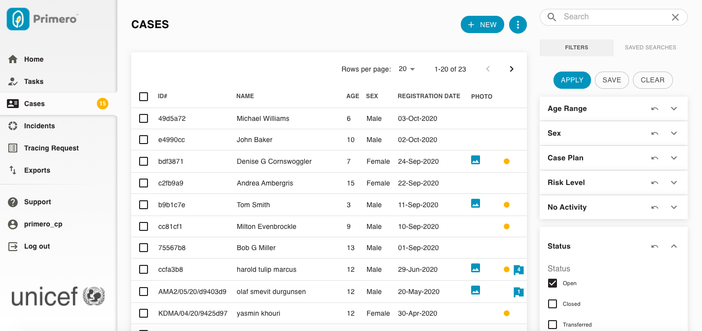

## View and Edit a Record

In the Case List, you can click on any Case to see more details. You will arrive at the View Case page. On this page, you can only _view_ information about the case; you cannot _edit_ it. In order to edit information about the case, click the "Edit" button with the pencil icon at the top right of the page.

You should now be able to update information about the case. Once you have made changes, click the **SAVE** button in the header. NOTE: If you do not click the Save button, your changes will be lost.

### Workflow Status Bar

On the view and edit pages for a Case, the user will see the **Workflow Status Bar**. This tells the user which stage of the case management workflow the case has reached. 

While each configuration will have its own specific workflow statuses, the default Primero configuration has the following:
- **New** - When the case is first created it gets this status by default.
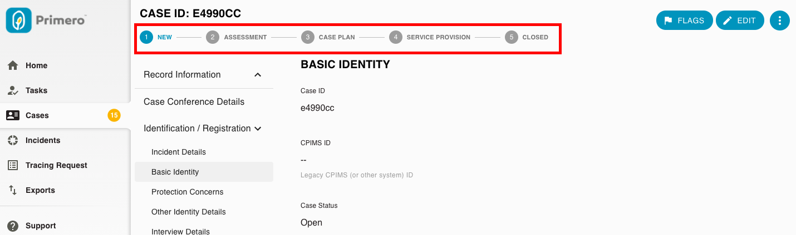
- **Assessment** - This status is set when the user records a value for the "Assessment requested on" field on the Assessment form.
- **Case Plan** - This status is set when the user records a value for the "Date Case Plan Initiated" field on the Case Plan form.
- **Service Provision** - If the user adds an entry to the Services subform, this status gets set.
	- NOTE: In some configurations, services are categorized by "Response Type". In these configurations, the "Service Provision" status is split into multiple statuses - one for each "Response Type" option. The case gets the status which corresponds with the Response Type of the service which the case worker added most recently. For instance, if a case worker refers the case to a service provider for a service with a Response Type of "Immediate Response", the workflow status will also be "Immediate Response."
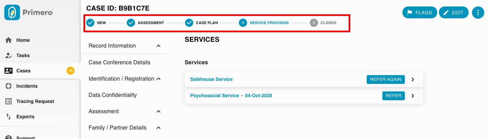
- **Closed** - This status is applied when a user performs the "Close" action on a Case.
- **Reopened** - This status is applied when a user performs the "Reopen" action on a Case. In this situation, the "Reopen" status appears where the "New" status normally appears in the Workflow Status Bar. This indicates that the case management workflow has started from the beginning.

## Action Buttons

To the right of the "Edit" button on the View Case page, you should see a small button with three dots. This is the **Actions** button.

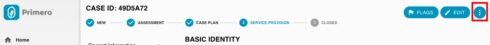

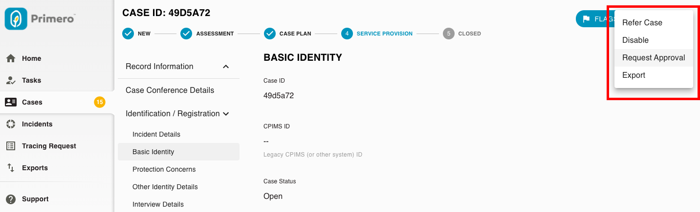

The actions, depending on your permissions, are:

- Refer
- Assign
- Transfer
- Close / Reopen
	- Note: This action will appear as "Close" if the Case is open, and "Reopen" if the Case is closed.
- Disable / Enable
	- Note: This action will appear as "Disable" if the Case is enabled, and "Enable" if the Case is disabled.
- Request Approval
- Approvals
- Export

NOTE: When using these actions, you must follow the your local Standard Operating Procedures (SoPs). Primero  does not replace normal day-to-day communications (e.g. email, text, WhatsApp) between the people and organizations that perform Child Protection work.

## Language Toggle 

At the bottom of the Navigation Menu, you will see a dropdown with a small globe icon and the your current language. This is the **Language Toggle**. Click this to view Primero in a different language.

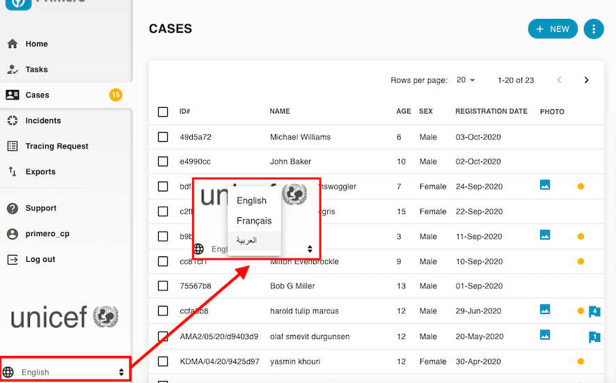

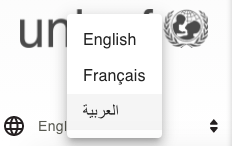

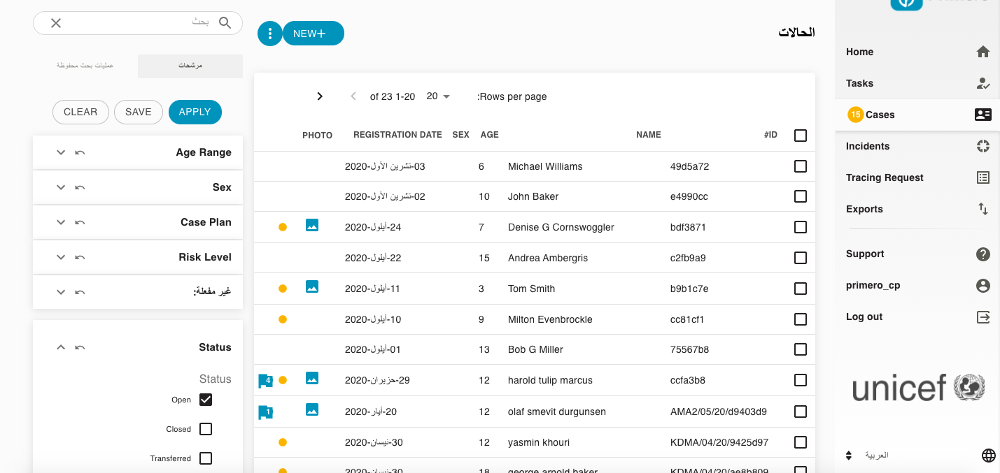

## Support

In the Navigation Menu, below the Exports link, you should see the **Support** link. Clicking on this will bring you to page with contact information for your system administrator, as well as links to support forums and documentation.

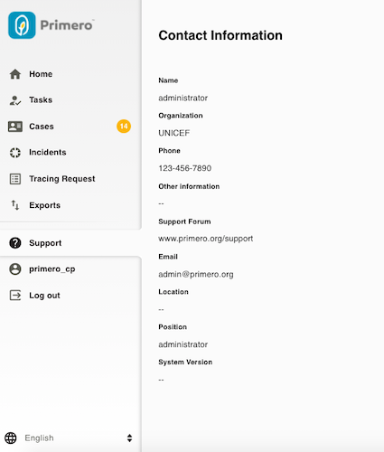

## My Account and Password Change

In the Navigation Menu, below the Support link, you will see a link with your username. Click this to go to the **My Account** page.

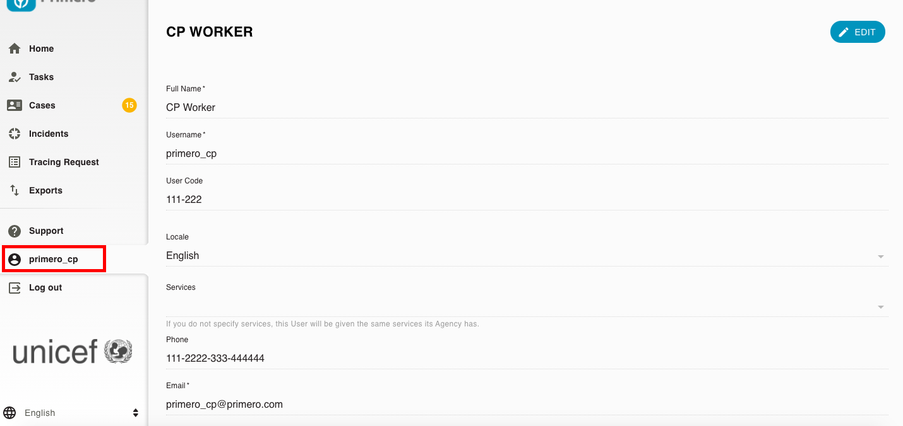

Here, you can see details about your user account. Click the Edit button at the top right of the page to update any of these details or to change your password.

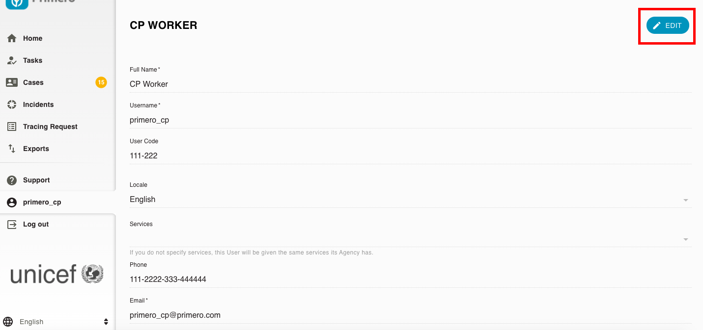

Here, you will be able to update the following:

 * **Full Name**: The name managers and administrators will see when looking at your account.
 * **User Code**: Depending on configuration, may impact composite ID field generated for records you create. This is not often used.
 * **Password**: Must be at least eight characters and contain both letters and numbers.
 	* To update your password, please click the "Change Password" link. Otherwise, your password will stay the same.
 * **Language**: This will be the default language in which you will see the application.
 * **Phone**: Allows other users with the ability to view your profile to contact you.
 * **Email**: Will be used for any email notifications.
 * **Services**: Any services you will be providing through Primero. This will determine whether and when you appear as a potential recipient for record referrals.
 * **Position**: Your official title within your organization.
 * **Current Location**: The location where you are always or most-often based. This will determine whether and when you appear as a potential recipient for record referrals and transfers.
 * **Receive email notifications**: Will determine whether you receive email notifications, including the following:
   * Cases assigned, transferred, or referred.
   * Requests from other users for you to transfer one of your cases to them.
   * Manager approvals and requests for manager approval.

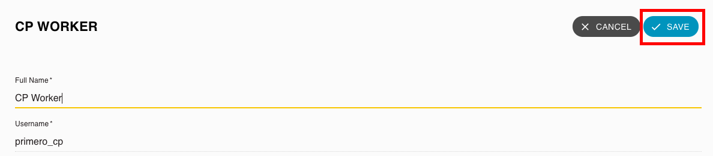

Click the **SAVE** button once you are finished making changes.

# Filtering

On the right side of all of the record list pages, you will see the **Filters Panel**. Filtering is an efficient way to find the record or records that need your immediate attention. 

**NOTE** By default, the record list pages will only show records which are open and enabled. You can choose to show closed or disabled records using the "Status" and "Enabled / Disabled" filters.

The most-commonly-used filters are always visible at the top of the Filters Panel. To expose more specific filters, click the "More" button below the panel. To re-hide these, click "Less".

Once you have set one or more filters, click the "Apply" button at the top of the Filters panel to update your list results. To clear the filters you have selected, click the "Clear" button.

You can also save a set of filters for later use by clicking the "Save" button at the top of the Filters Panel. This opens the modal pictured below.

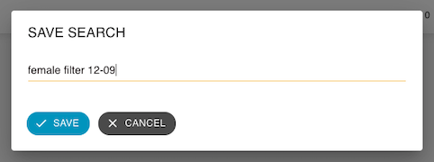

Enter a name for your new saved search and click "Save". Once the search has finished saving, click on the "Saved Searches" tab at the top of the filters panel.

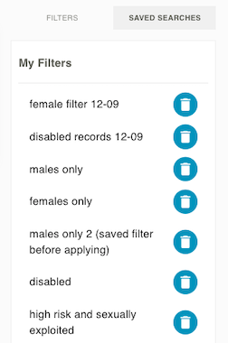

Here, you can find the search you had saved earlier. Click on the saved search to apply the filters that were saved. To delete a saved search, you can click on the trash can button next to it.

# Flagging

The **Flags** button allows a case worker or manager to leave a message or a "Flag" on a record. Usually, this is a reminder to other users that they need to perform an action (example: reminding a case worker to perform an assessment or reminding a manager to approve the Case Plan).

When you click the Flags button, a modal appears with two tabs: "Flags" and "Add New Flag". The "Flags" tab will open by default. Here, you will see a list of all flags that have already been added to this record. To add a new flag, click on the "Add New Flag" tab. Here, you can enter a reason for your flag, as well as a flag date.

Once you click "Save", you will arrive back on the "Flags" tab. Here, you will see the flag you just saved.

Once a flag is no longer relevant (example: your manager read the flag and approved your Case Plan as you requested), you can _resolve_ the flag. To do this, click the "Resolve" button next to the flag. A modal will now appear where you can enter your reason for resolving the flag. NOTE: Only the user who created a flag can resolve it.

Once the flag is resolved:
- It will appear under the "Resolved" header in the "Flags" tab of the Flags modal.
- It will no longer be included in the count of active flags which appears in the record list and on the "Flags" button (see below).

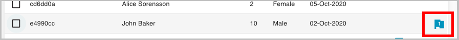

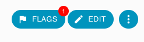

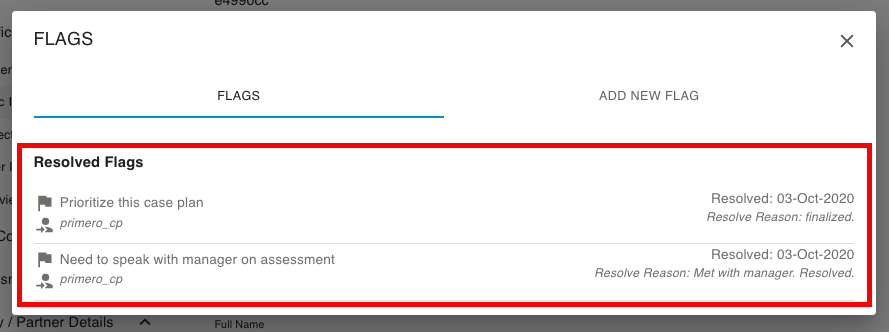

# Close / Reopen

The **Close / Reopen** action allows you to change a Case's "Case Status" field. Only certain users have the ability to perform this action.

When a Case is open, this action appears as **Close** in the Actions menu. Clicking this action will change the Case Status field to "Closed", and the Workflow Status to "Closed". NOTE: Once a Case is closed, it will not appear by default on the Case List page. For information on how to find closed Cases, please see the [Filtering](UsersGuide#filtering) section.

When a Case is closed, the action appears as **Reopen** in the Actions menu. clicking this action will change the Case Status field to "Open" and set the "Case Reopened?" field on the Basic Identity form. It will also set the Case's Workflow Status to "Reopened".

# Approvals

## Requesting Approval for a Form

Case workers can request a manager's approval on the following Case forms:

- Assessment
- Case Plan
- Closure

**NOTE**: Based on your Primero implementation's configuration, only some of these forms may have approvals enabled. If you have questions about which approvals are enabled in your configuration, please contact your system administrator.

To request approval for one of these forms, click the **Request Approval** action in the Actions menu.

The below modal will appear. Select the form for which you would like to request approval, then click "OK." In the example here, the user has selected approval for the Case Plan form.

Once you have requested approval, you will notice that an alert appears on the link to the corresponding form on your Case's Form Navigation Menu (in our example, this would be the "Case Plan" form). Click into this form. Note that there is an alert message at the top of the form. Also, note that the "Approval Status" field is set to "Pending." This means that you are still waiting for your manager to either approve or reject the form.

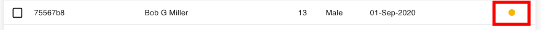

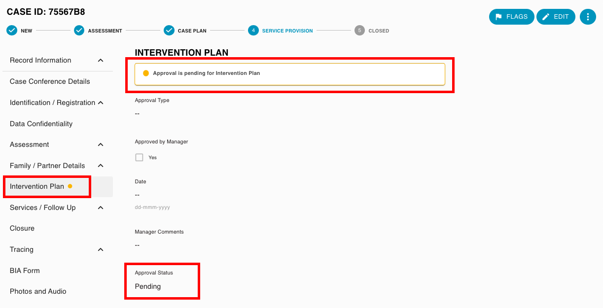

Now, click into the "Record Information" section of the Form Navigation Menu. Click "Approvals". Here, you will see a list of all approval requests and approvals made on your Case. The approval request you just submitted should appear here.

Now, go to your dashboard. In the "Approvals" section, your case will now be counted as "Pending" in the column for the form where you requested approval (in our example, this is "Case Plan").

## Approving or Rejecting a Form

Managers will also have the ability to approve or reject certain Case forms. Once again, these are:

- Assessment
- Case Plan
- Closure

A manager can check for pending approvals in the "Approvals" section of their dashboard.

The numbers here represent the number of Cases with pending approvals for each approvable form.

Using our previous example, if a manager clicks on the number for "Case Plan," they will arrive at a list of Cases with pending Case Plan approval requests. Clicking into one of these Cases, they will see an alert on the Case Plan form in the Form Navigation Menu. The manager can then click into the Case Plan form, read through the Case Plan that the case worker has recorded, and decide whether to approve or reject it.

To approve or reject the Case Plan, the manager clicks the **Approvals** action in the Action Menu.

In the modal that appears, the manager can select "Approve" to approve the Case Plan, or "Not Approve" to reject it. Note that the manager can also use the "The form for" dropdown to select a different form to approve. The manager can also leave a comment on their decision, which will appear both on the approved / rejected form and in the Approvals form.

Once a manager has approved or rejected the Case Plan, the "Approval Status" on that form will update to be either "Approved" or "Rejected." The alert will also disappear from the "Case Plan" form. For both the case worker and the manager, the "Approvals" section of the dashboard will show one less pending Case Plan approval. In the "Approvals" section of the case worker's dashboard, the number for "Approved" or "Rejected" Case Plans will have increased by one, depending on how the manager responded.

# Add Notes

Managers overseeing a team of case workers may want to add notes to a particular Case so that they can give the case worker guidance on case management.

**NOTE**: This action is particularly useful for managers who do not have the ability to edit Cases. If managers do have the ability to edit Cases, they can always add a note by editing the case, going to the Notes form, and adding a subform entry.

To add a note, in the Actions menu, click the **Add Notes** action.

A modal will appear. Here, you can write the subject of your note, as well as its full text. Click **SAVE** to add the note to the case.

When the case worker logs in and views this case, an alert will appear on the link for the Notes form in the Form Navigation Menu.

If the case worker then clicks on the form, they will be able to see the manager's note, including the subject, full text, the manager's username, and the date the note was added.

# Searching for Records

On all of the record list pages, you will find a search bar at the top right of the page. When you perform a search, Primero compares your query against the following fields for each record type:
- **Cases**: “Long ID,” “Case ID,” “proGres ID,” “Name,” “Nickname,” “Other Name,” “Ration Card Number,” “ICRC Ref No.,” “RC ID No.,” “UNHCR ID,” “UN Number,” “National ID Number,” “Number of Other ID Document,” and “Other Agency ID.”
- **Incidents**: "Long ID," "Incident Code," "Account of Incident," "Survivor Code", and "Incident ID IR."
- **Tracing Requests**: “Long ID,” “Inquirer ID,” “Name of inquirer,” and “Nickname of inquirer.”

**Note**: You can search and filter the record lists at the same time (example: Search for Cases with the name "Smith" while filtering for only Male Cases with a Risk Level of "High").

## Searching for Cases Managed By Other Users

Depending on your Primero implementation's configuration, some users may have the ability to search for and view limited information about records managed by other users. When users with this ability perform a search and arrive at the Search Results page, they may see Cases for which they have full access (for example, a Case they manage) as well as Cases for which they _do not_ have full access (for example, a Case managed by another user at another organization). 

When the user clicks on a Case in the Search Results page...
- If they have full access, they arrive at the View Case page.
- If they _do not_ have full access, the **View Details** modal appears.

## The View Details Modal

The **View Details** modal displays a small set of fields about a Case. This allows you to see some limited information about a Case managed by another user, without endangering the data confidentiality of the Case.

At the bottom of this modal, you may see a button labelled **Request Transfer**. For more information on this action, please see the [Requesting a Case Transfer](UsersGuide#requesting-a-case-transfer) section

**NOTE**: Depending on the system's configuration, you may also be able to see the Case's photo in this modal.

For more information on configuring the **View Details** modal and which information appears there, please see the **Primero Administration Guide**.

## Adding an Incident to a Case from the Search Results Page

Depending on your Primero implementation's configuration, some users may be able to add an Incident to a Case from the Search Results page. To do this, select the Case's check box on the Search Results page. Then, in the Action menu , click **Add Incident**.

A modal will appear. Enter information about the Incident, then click **SAVE**.

Depending on your user's configuration, you may also see a second button next to the **SAVE** button, marked **SAVE AND ADD SERVICE PROVISION**. Clicking on this will save the Incident details you have entered, then take you directly to the Add Service modal, where you can enter information on a service you have performed for the Case.

## Adding a Service Provision to a Case from the Search Results Page

Depending on your Primero implementation's configuration, some users may be able to add a service provision to a case from the Search Results page. To do this, select your case's check box on the search results page, then, in the Actions menu, click **Add Service Provision**. A modal will appear. Here, enter information on the service you are adding, and then click **SAVE**.

TODO Fix screenshot

## Alerts for Information Added to a Case

If another user adds an Incident or a service to your Case, an alert will appear on the corresponding form on your Case. For example, in the image below, another user has added a service to the Case. An alert appears on the "Services" form in the Form Navigation Menu, and an alert message appears at the top of the form, telling the case worker which user added the service and when.

TODO Screenshot

# Exporting Information on Records

Primero allows users to export information about records in a number of formats. Users can export information from the View Record or Record List pages.

| **Format** | **Description** | **Fields Included** |
| --- | --- | --- |
| CSV | Stands for “Comma-Separated Values.” Readable in Excel. This format does not support languages with non-UTF-8 characters (e.g. Arabic, Bangla, etc.) | All fields to which the user’s role has access. |
| List View | CSV file containing the fields which are visible in the list view. Readable in Excel. This format does not support languages with non-UTF-8 characters (e.g. Arabic, Bangla, etc.) Only available from the list view. | All fields visible from the list view. |
| Excel | Exports to a standard .xls file. Each form gets its own tab in the file. | All fields to which the user’s role has access. |
| JSON | Easiest format to be read \(only\) by Primero. Not easy for users to read. | All fields to which the user’s role has access. |
| Photo Wall | Exports a PDF file with the photo of each selected Case along with the Case’s ID. Only available for Cases. Only available from the list view. | Photo, ID. |
| PDF | PDF file which displays data as it appears in Primero. Not available from the list view. Does not support encryption. | Fields on all forms specified by the user, to which the user's role has access. |
| UNHCR | CSV file specifically formatted to be compatible with UNHCR’s data import. Only available for Cases. | Decided by partners and UNHCR on an implementation-specific basis. This export is not used or available in all contexts. |
| Custom | Excel file containing all the fields specified by the user. | All fields specified by the user, to which the user’s role has access. |

To export one or more records, in the Actions menu, click **Export**. A modal will appear. You will see a dropdown labelled "Type of export." Click into this dropdown and select an export format.

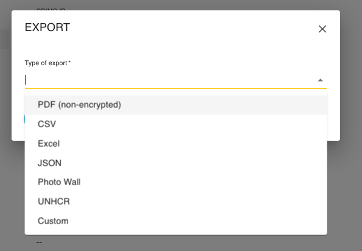

Depending on the format you choose, you may then be able to select forms and fields to export, specify a file name, and choose a password to encrypt your export file.

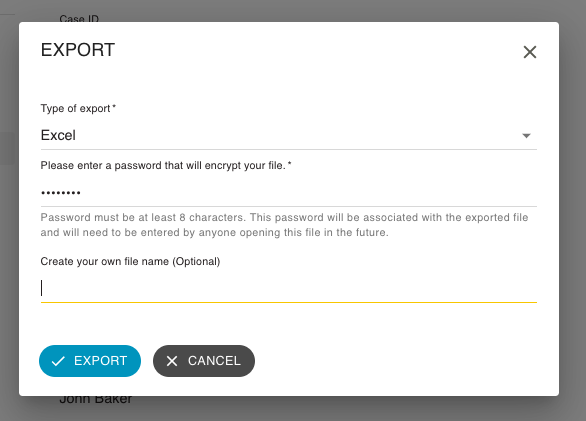

## Custom Exports

If you select **Custom** as your export type, you will see the below fields appear in the Export modal.

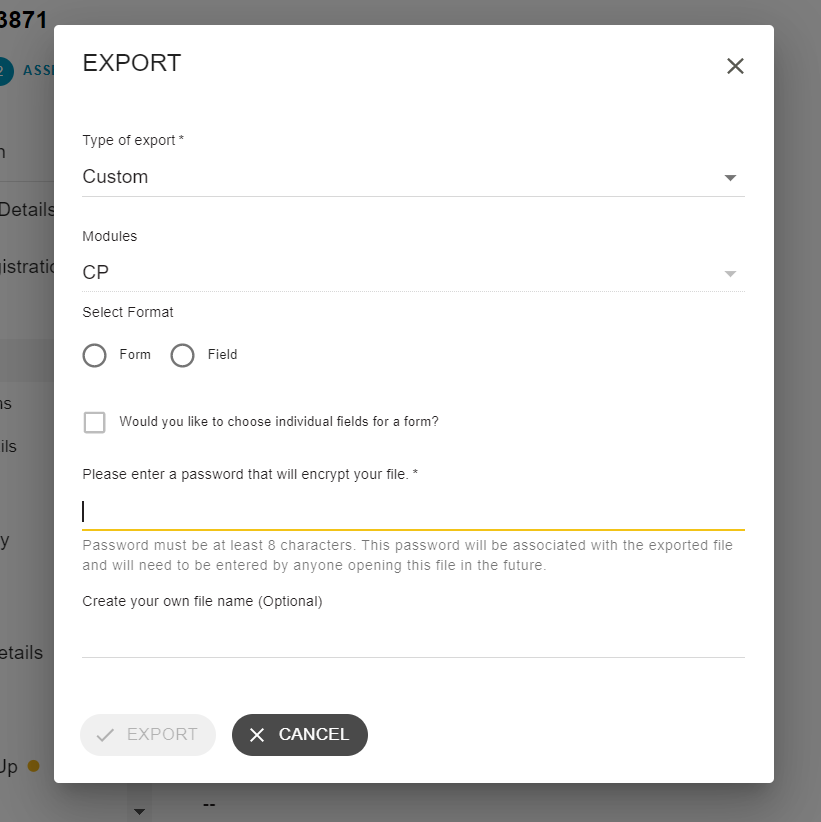

There two formats for the Custom export are:
- _Form_ - The user selects a list of forms or a list of fields to include in the export. Primero exports an Excel file with a _tab for each form_ included in the export.
- _Field_ - The user selects a list of fields to include in the export. Primero exports an Excel file with _one tab_, which includes all exported fields.

If you select "Form" as your format, a checkbox appears with the label "Would you like to choose individual fields for a form?"
- If you leave this un-checked, you will choose a list of _forms_ you would like to include in the export file. All fields on these forms will be included.
- If you check this box, you will choose a list of individual _fields_ to include in the export file. In the Excel file Primero exports, the fields you choose will be organized by form, so that each form gets its own tab.

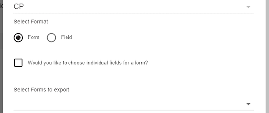

## Downloading Exports

To create the export file, click **Export**. A notification will appear with a link to the Exports page. Click on this.

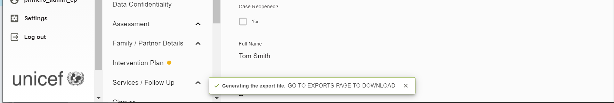

You will now arrive at the Exports page. You can always access the Exports page by clicking the **Exports** link in the Navigation Menu. Here you will see a list of all of the exports you have created. When Primero is still loading an export, you will see a "loading circle" spinning next to it. If an export is ready to download, you will see a "download" icon next to it. Click on an export in the list to download the file.

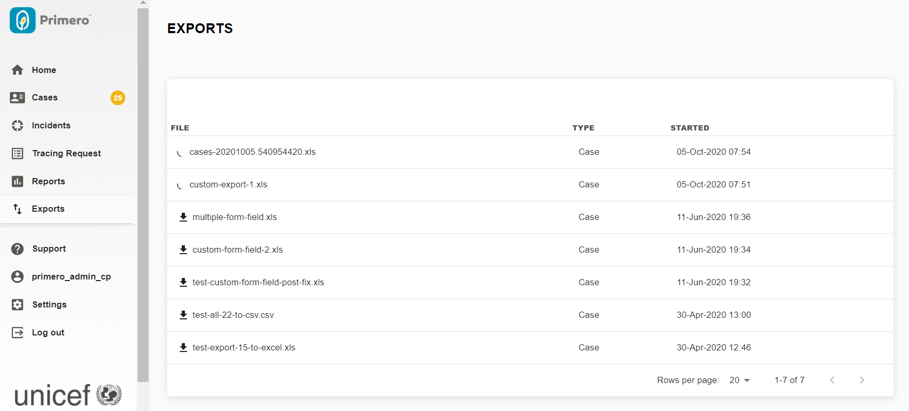

**NOTE**: PDF exports do not appear on the Exports page. Instead, these download automatically once you submit your export.

# Navigating Primero Forms

When you are viewing, creating, or editing a record in Primero, you can move between Forms using the **Form Navigation Menu**, which appears on the left side of the screen.

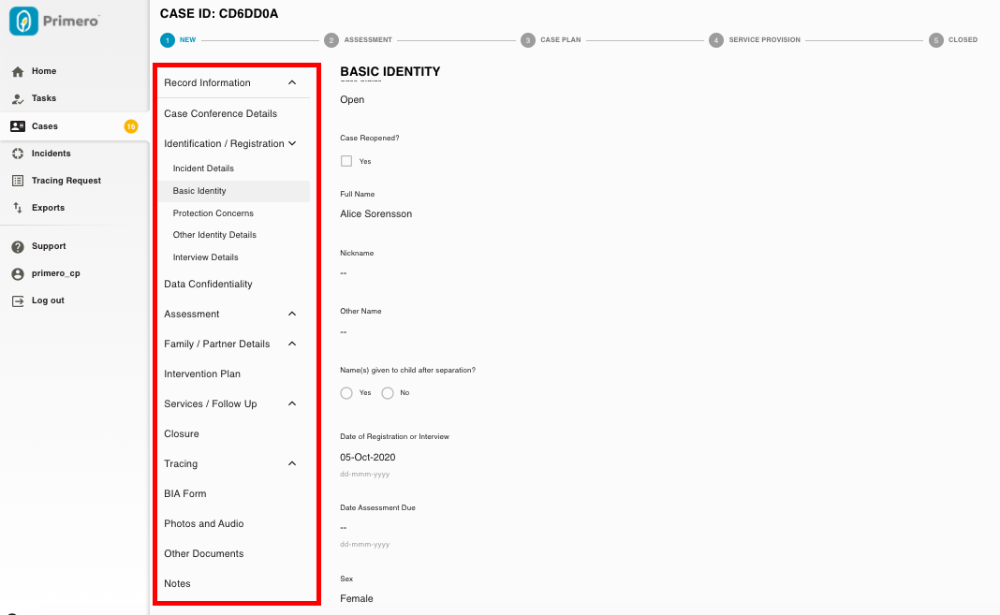

You will notice that some Forms appear under a collapseable header. This is called a **Form Group**. In the above image, "Identification / Registration" is a Form Group, which contains a number of Forms, including "Basic Identity." When you click on a Form Group, the Form Group opens, and you arrive at the first Form in the group. Click on any other Form in the group to view that Form. To collapse an open Form Group, click on it again.

## Navigating Subforms

Some Forms contain information that is entered multiple times. For example, a case worker might fill out the Name, Age, Date of Birth for multiple family members on the same Case. In situations like this, Primero organizes information in **Subforms**.

### Adding Subforms

When you click into a Form that contains a subform, you will see an **ADD** button. Click this to add a **Subform Entry**. 

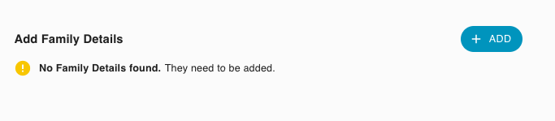

A modal will appear. Here, you fill out information about the entry you want to add. For example, on the "Family Details" subform, you might add information about the Case's sibling.

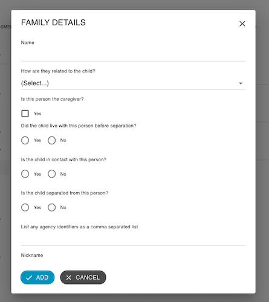

When you are done filling in information, click **ADD** at the bottom of the subform modal. Note that if you click **CANCEL** instead, you will lose all of your changes.

### Updating Subforms

If multiple subforms are added in this way, they will be listed in collapsed form. Each can be reopened by clicking on the right-side arrows. Once you are finished with your edits, click **UPDATE** at the bottom of the subform in order to add your changes.

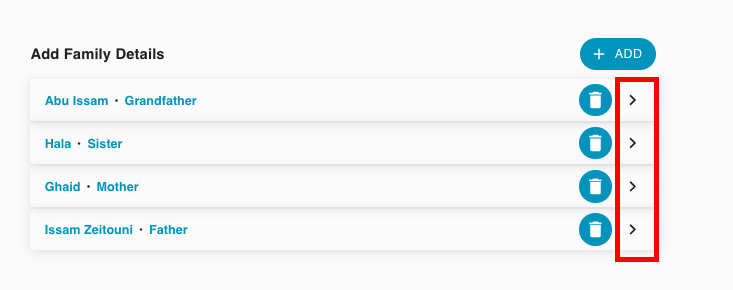

### Removing Subforms

To remove a subform, click on the trashcan icon on the collapsed subform. A modal will appear asking you to confirm your decision.

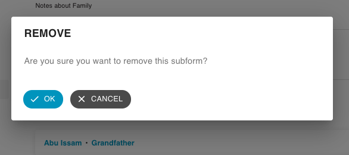

## Alerts

Alerts help you keep track of updates to a given case's situation. Alerts consist of either small gold dots or message banners. 

Case-level alerts: 
 - On the Navigation Menu, an alert next to Cases keeps track of total cases with alerts.
 - In the Case Records List, a small gold dot appears next to Cases with alerts.

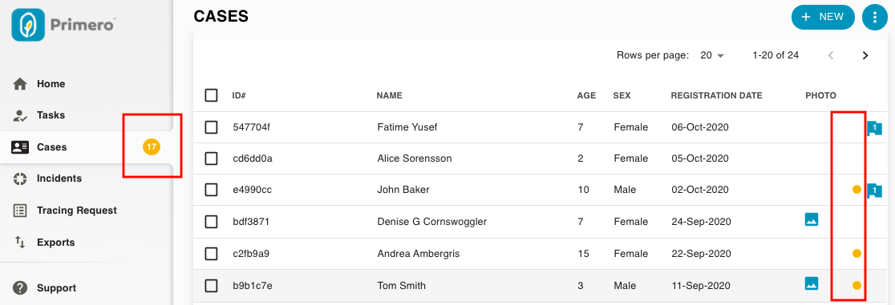

Form-level alerts:
 - When you click into a case, an alert in the Form Navigation Menu indicates the form with pending / updated information.
 - When you click into the form, you can see a message banner alert that informs you of the reason for the alert.

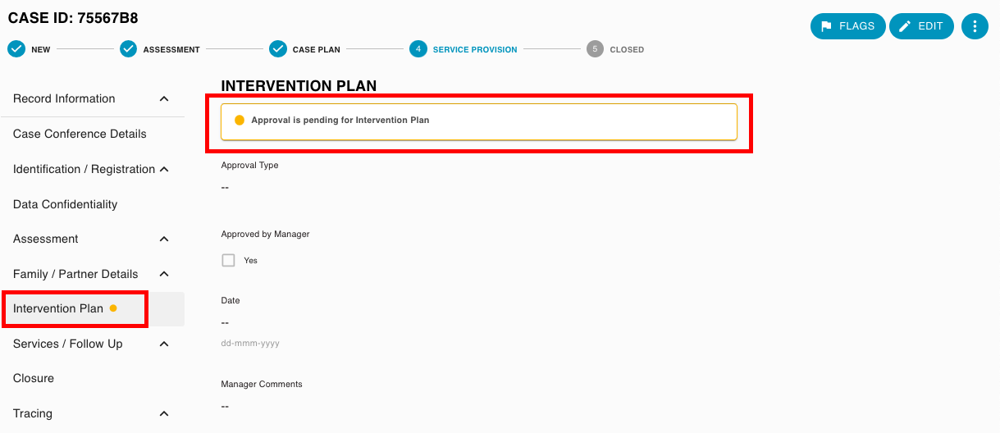

Alerts appear in any of the following situations:

 - When you request approval for Assessment, Case Plan, and/or Closure. Alerts will appear on the corresponding form or forms pending approval. Once the form is approved or rejected by your supervisor, the alert goes away.

 - When a supervisor adds a Note to your case. Once you edit and save the Note, the alert goes away.

 - When another user directly edits a Services subform on your case. Once you edit and save the Services subform, the alert goes away.

 - When another user adds information to your case, such as an Incident or a Service Provision. Once you edit and save these additions, the alerts go away.

Note that dependng on your configuration, some form names may be different from the User Guide examples.

# Creating, Updating, or Editing a Case

## Creating a Case

To create a case from the Case List, click on the "NEW" button. You will see a modal like the one pictured below. Here, you have two options. 

The first option is to simply create a case by clicking the "CREATE NEW CASE" button on the bottom left of the modal. The second option is to first run a search to check if a case already exists for the child. To do so, type the child's name or ID into the search bar and click the "SEARCH" button at the bottom right of the modal. If there is a match in the system, you will be taken to a search results page, which may include cases managed by other users. \(For more information on fields that are searchable and case access, read the [Searching for Records](UsersGuide#searching-for-records) section.\) If there is no match, you will be taken to a blank form and asked to create a new case.

Once you have reached the new case page, you can navigate to different forms as we describe in the “Navigating Primero Forms” section.

## Editing a Case

To edit a case, locate it in the Case List and click on it. Once you’ve entered into the case, click the **EDIT** button in the actions header. The page will then refresh and allow you to edit individual form fields.

There are a number of different field types which you can edit differently.

* **Text Field** - Type normally using your keypad or keyboard.

* **Text Area** - Similar to the Text Field, but the field expands as you type in order to enter more information.

* **Date Field** - Opens a calendar widget where you can directly select the correct day, month, and year. 
	- To go to another calendar month, click the side arrows to navigate forwards or backwards. 
	- To choose another year, click on the year at the top left of the widget and select a year from the scrolling menu. 
	- Clicking "OK" sets your choice; "Clear" returns you to today's date; "Cancel" does not make any changes.

* **Checkboxes** - Select one or many of the checkbox options.

* **Tick Box** - Select the tick box if it applies to you.

* **Select Dropdown** - Select an option from the dropdown menu. You can also try typing a word into the select field to narrow down the menu and find a desired option faster.

* **Multi-Select Dropdown** - Similar to Select Dropdown, but you can select more than one option from the dropdown menu. 

* **Radio Button** - Similar to Tick Box, click on the correct answer.

* **Numeric Field** - Type a number into the field. Non-numeric numbers will return an error.

* **Tally Field** - Type in the number you need for each tally. The total is automatically calculated based on the tally fields and is not editable in itself.

Note that some of the fields are required. Required fields can be identified by the asterisk next to the field name. If you forget to fill out those fields, the system will return an error message when you try to save the case, and you will not be able to save the rest of your data until you have completed them. Red error alerts will appear on the corresponding forms in the Form Navigation Menu to further help you identify the required fields. 

If you enter a field incorrectly, the system will return a similar series of error messages and alerts when you try to save the case. In the example below, a negative age and a “Date of Birth” in the future causes errors until you fix those fields. 

 For more information on how to set which fields are required and other data constraints, please see the **Primero Administration and Configuration Guide**.

# Assignments, Transfers, and Referrals

There are three actions which allow you give another user access to your case: *Assign*, *Transfer*, and *Refer*.

## Assignments

Managers have ability to assign a case to a different user. If you select the Assign option from the Actions dropdown menu, a modal will appear that allows you to select from existing users. Assigning the case will change the record owner to the selected user. The new owner will have full access to the record, and the previous case worker will lose their access.

## Transfers

Much like assignments, transfers send a record to a different user. Unlike assignments, however, transfers give the recipient the opportunity to accept or reject the record. If they reject it, the record will stay with its original owner. If they accept it, the recipient will now have full ownership of the record, and the original owner will no longer have access. 

The following modal form will appear and allow you to select options for your transfer. Consent of the individual \(or a consent override\) is required for transfers. You may also be asked if you are transferring to a remote system (ie. someone who does not use Primero). As this feature is not currently enabled for most configurations, you can ignore this field without affecting the Transfer action. 

To select the user that you are transferring to, first select the agency and location associated with the user.

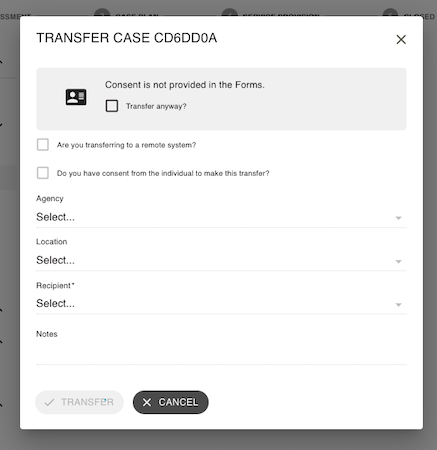

Once you have selected an agency and location for your transfer, the "Recipient" field will only display users who are part of that agency and based in that location.

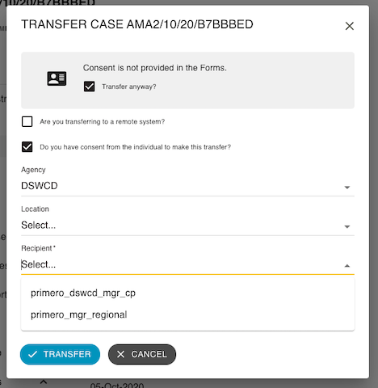

If the desired user is not in the drop down, it means this user does not have privileges to be transferred to or that the user does not meet the criteria selected in the Agency or Location fields.

### Accepting or Rejecting Transfers

Based on your deployment's configuration, you may have the ability to accept or reject a case that has been transferred to you. You can see if any cases have been transferred to you on your dashboard under "Shared With Me - Transfers Awaiting Acceptance".

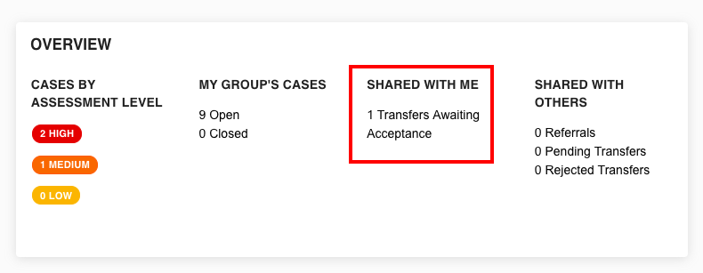

 When you enter the case that has been transferred to you, open up the Record Information form group and click on the Transfers / Assignments form. You will see that the status is in progress. Clicking on the menu at the far right displays buttons to either accept or reject the transfer. 

 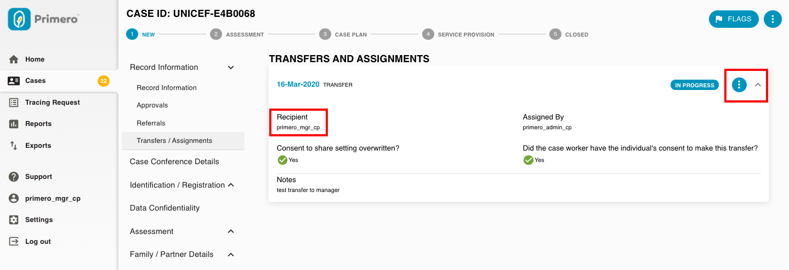

 

 If you click to accept the case, the status will change to accepted, and you will become the record owner, rather than an “Other Assigned User”. The record information is updated with this change (see below images).

 Before accepting the transfer:

 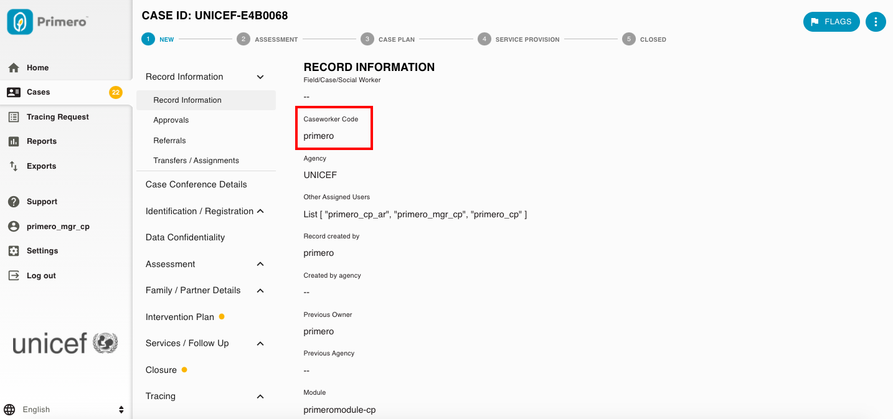

 After accepting the transfer: 

 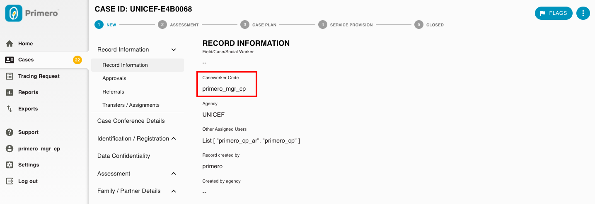

  If you click Reject, a modal opens with text box for entering the Rejection Reason. When you click REJECT, the rejection reason is saved to the nested subform and the transfer status is changed to 'Rejected.' You are also removed from "Other Assigned Users" and will no longer have access to the record.

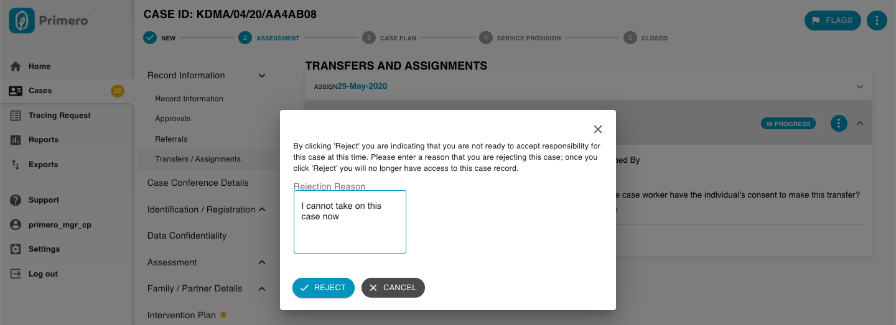

### Requesting a Case Transfer

If you find a record owned by another user and need full access to it, you can ask the record owner to transfer the record to you. In Primero, this is known as a *Transfer Request*. Your ability to perform a *Transfer Request* will depend on your instance's configuration. To request a transfer, first search for your case from the case list view. When you identify the case in the search results, clicking on the case will open the *View Details* modal.

At the bottom left of the *View Details* modal, you will see a button marked "Request Transfer". Click it, and a modal will appear.

Here, you will see information on the record owner and a text box where you can enter a note to the owner of the record. Click "Send Request" to submit.

#### Notifications for the Case Owner

Once you have sent the transfer request, the record owner - if their user account is configured with an email address and the ability to receive email notifications - will receive a notification telling them about your request for a record transfer. They can also see any Pending Transfers in the "Shared With Others" section of their dashboard.

If the case owner clicks on the link in the email or the pending transfer in the dashboard, they will eventually be redirected to the case record, where they will see an alert in the Form Navigation Menu and on the *Transfers / Assignments* form. Here, they can expand the transfer request subform to see the details of your request, including any notes you have included.

At this point, the record owner can choose whether or not to transfer the record to you.

TODO - confirm: accepting transfer functionality is not in v2 yet...?

## Referrals

Referring a record is a way of giving a user limited access to a record without transferring it completely. While referring a record allows the recipient to access your record, the referring user will maintain full record ownership and will be able to remove the recipient's access at any time. To refer a record from either the individual record page or the list view, go to the Action menu at the top of the page and select "Refer Case."

You may also refer a case directly from the services subform. For more information on how to do this, see the **Referring From Services Form** section below.

The following modal form will appear and allow you to select options for your referral.

As with transfers, consent of the individual is required for referral. Consent for referral is found on the Data Confidentialty form. 

The following fields are important for selecting a user:
 * **Service** you are requesting the other user perform
 * **Agency** you would like to perform the service
 * **Location** where you would like the service to take place

TODO - format v2 screenshots (below) like above image ^

Now, select the “Recipient” - who must be a user within your deployment of Primero. A list of all users that perform the service selected, from the agency selected, and in the location selected will appear. If the desired user is not in the drop down, it means this user does not have privileges to be referred to or does not meet one of the three criteria listed above.

For more information on how to specify the Agency a user belongs to, the Location where they are based, and the Services they offer, please see the **Primero Administration and Configuration Guide**.

### Referring to a Remote System

TODO review section

The "Remote System" option allows you to create either a PDF or password-protected export file which you can give to the recipient. To start this process, select the tick box for "Are you transferring to a remote system?"

The "Type of Referral" field indicates the level of information access your export file will include. The options in this list will generally be roles in the system which are permitted to see specific forms on the child's case, depending on the role's expertise. For instance, one option might be "Medical Service Provider." Selecting this option will produce an export file which only contains the information a Medical Service Provider would be able to see in Primero. In the example above, we have chosen a generic "Referral" type.

There are three types of exports which you can create as part of an "external" referral, each for a different type of recipient:
 * **Primero**: Someone who uses a different instance of Primero. This produces a JSON file which can then be imported into the recipient's Primero instance. 
 * **Non-Primero**: Someone who is using a different type of information management system. This also produces a JSON file.
 * **PDF**: Someone who is not using an information management system, and does not have a user account in Primero. 

> _Note:  
> When referring any such password-protected export/import file, the means of sending the file, filename, and the password that opens it, will be determined by the Information Sharing Protocol \(ISP\) decided by the appropriate local steering committee. When determining this policy, on-the-ground security considerations will be at play, as well as the ease and speed of physical transport within the country._

### Revoking a Referral

The case owner can remove a referral recipient's access to a case, usually upon completion of the referral work. To revoke a case you have referred to another user, simply enter the case and go to the Referrals form in the **Record Information** form group. Expand the referral subform for the recipient you wish to remove and select REVOKE from the top right menu.

Once you have revoked the referral, click **SAVE**. The referral recipient will no longer have access to the case. The *In Progress* button changes to *Done* to indicate that the referral has been closed and the recipient no longer has case access.

For more information about how to edit a case, please see the **Editing a Case** section.

### Relinquishing a Referral

Based on the deployment, you may have the ability to relinquish a case that has been referred to you. Go to the case record, click on the *Referrals* form, and select the appropriate referral subform. If you are done reviewing the case, you can click the DONE button from the actions menu. The system will then ask you to confirm your decision in a modal window. Once done, the referred case will be removed from your Case List and you will no longer have access to it.

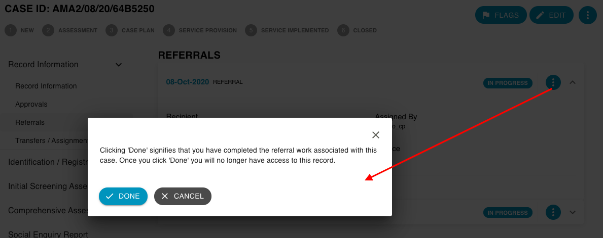

# Services

Case workers can plan, document, and refer for services using the **Services** form.

## Services Form

To add a service to a case, go to the **Services** form, and click the "Add" button. A modal will appear. NOTE: The screenshot and description below are based on the default configuration. The fields on the Services subform may vary depending on your configuration.
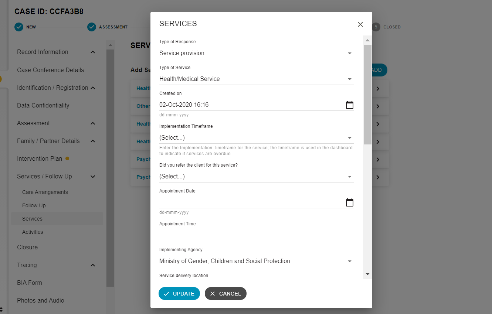

The first two fields on the subform provide information about the type of service you are providing, and in which part of the case management workflow it belongs.
- **Type of Response** - This field is a _general_ category for the service. For instance, some contexts require that services be divided into "Immediate" responses and "Comprehensive" responses, to distinguish quickly-implemented, one-time actions from long-term, ongoing ones. In contexts where this kind of distinction is not necessary, the only option for this field will be "Service Provision". When you add a service to a Case, the Workflow Status is set to be the Response Type of the most-recently-added service. For instance, if a user adds a service with a Response Type of "Immediate Response" on Monday, the Workflow Status will be set to "Immediate Response." If, the next day, the user then adds a service with a Response Type of "Comprehensive Response," the Workflow Status will then change to "Comprehensive Response."
- **Type of Service** - This is the _specific_ type of service being provided (example: "Medical Examination" or "Psychosocial Counseling"). When you enter a value in this field, Primero uses it to search for Agencies and Users capable of providing the chosen service type.
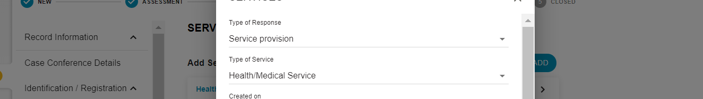

_Setting a Due Date_ - Each service has a due date, which will appear on your service's Task in the Tasks list page. Depending on your Primero implementation's configuration, one of the below two fields will set the service's due date:
- **Implementation Timeframe** - When you select an option in this dropdown, Primero sets a due date based on the selected timeframe and the current date. For instance, if you select a timeframe of three days on October 8, your service's due date will be October 11.
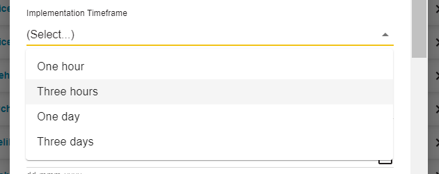
- **Appointment Date** - In some configurations, selecting an Appointment Date sets the service due date.
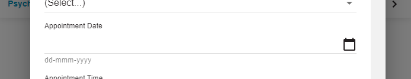

_Referral information (internal)_ - If another user in Primero will be providing this service, fill out the below fields to start the process of referring your Case to that user.
- **Implementing Agency** - The Agency which will be providing the service. The dropdown will only display Agencies which are able to provide the type of service you entered in the **Type of Service** field (see above).
- **Service delivery location** - Location where you would like the service to occur. To find a location in the dropdown, start typing the location's name; Primero will update the options to show all locations which match the name you have entered. Selecting a location here will narrow down which Users appear in the **Service Provider Name** field (see below).
- **Service Provider Name** - This the Primero User who will perform the service. The options in this dropdown will be all Users who are able to perform the selected **Type of Service**, belong to the selected **Implementing Agency**, and are in the selected **Service delivery location**. When you refer the case for this service, this User will gain temporary access to the Case.
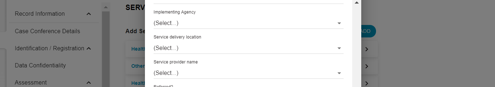

_Referral information (external)_ - If an individual or organization who does not use Primero will be providing the service, fill out the below fields.
- **Is this a referral to an external system / user?** - Check this box to indicate that this service will be provided by an individual or organization not using Primero. Checking this box also allows you to perform an **External Referral** for this service.
- **Service Provider** - Name of the individual who will provide the service.
- **Implementing Agency** - Agency or organization who will provide the service.
- **Service Location** - Place where the service will be provided.
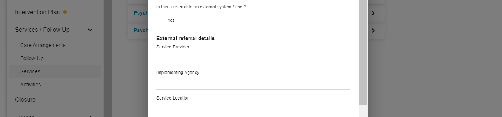

_Marking a service as implemented_ - The two fields below indicate whether and when the service was implemented.
- **Service implemented** - This field is disabled. Any service saved to a Case gets a value of "Not Implemented" in this field by default. To change this fields value to "Implemented," fill out the "Service Implemented On" field (see below). Once all services on a case are marked as "Implemented," the Case's Workflow Status will update to "Service Implemented".
- **Service Implemented On** - When the user fills out a date and time in this field and then saves their Case, the "Service implemented" field (see above) is set to "Implemented."

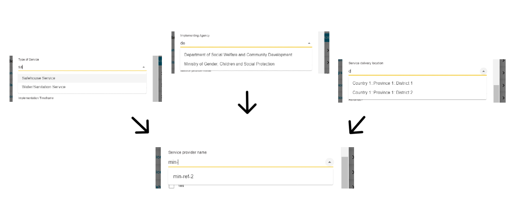

## Referring from **Services** Form

Once you have saved the case with this new service, and have been redirected back to the view page, go to the **Services** form and the service you just added. If you have filled out the the _Response Type_, _Service Type_ and _Service Provider Name_ fields for your service, the "REFER" button will appear in the subform header.

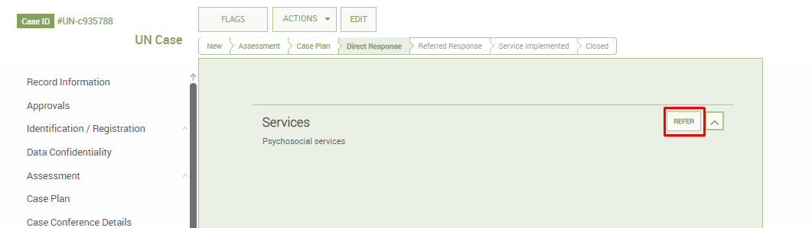

Click on this button, and you will see a modal like the one pictured below. Here, you can enter information on your referral just like you normally would. However, if you have already filled out a service provider and a service type for your service, these fields will be pre-entered for you. Remember to ensure that your case has provided consent, or that you choose the override consent option before referring.

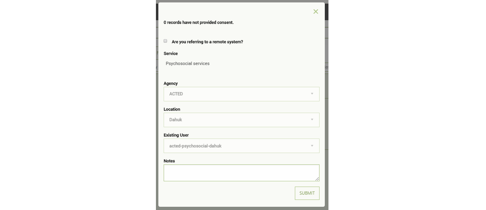

# Notification Emails

Users may receive notification emails that either welcome them to the application, or alert them to changes to their cases. Only user accounts which have been designated to receive notification emails will receive anything, and only if the system as a whole has been set to send notification and welcome emails. The following users will receive emails in the following circumstances:

* Managers whose case workers have requested approval for case plans, closures, etc.

* Case workers whose managers have responded to approval requests for case plans, closures, etc.

* Users who have received a case transfer

* Users who have received a case assignment

* Users who have received a case referral

Welcome emails will look something like the below message. If the new user clicks the "Primero" link in the message, they will be sent to the system login screen. Once again, users will only receive welcome emails if the system has been configured to send them, and if the user in question has been set up to receive them.

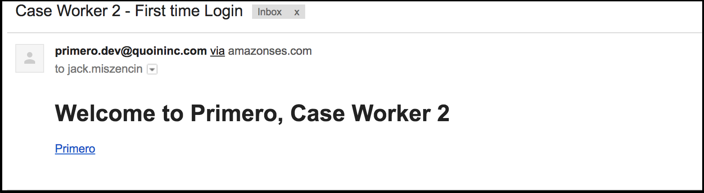

For more information on how turn welcome and notification emails on or off in the system's configuration, please see the **Primero Administration and Configuration Guide**.

# Tracing

Depending on your deployment, you may have access to Primero's **Tracing** records and forms. This functionality enables certain users to record Tracing Requests on behalf of parents or guardians looking for unaccompanied or separated children.

## Consent for Tracing

**IMPORTANT NOTE**: Cases will only appear as potential matches for tracing requests if they have provided consent for tracing. Users can record a case's consent to take part in tracing by filling out the tracing consent field in the "Data Confidentiality" form. This field is pictured below.

## Tracing Requests

If your user is configured for basic tracing activities, you should have access to *Tracing Requests* in the Navigation Menu. If you click on this link, you will see a list of all the tracing requests you have access to. This is called the Tracing Request List. Click NEW to begin tracing.

First, you will fill out the "Inquirer" form. This contains information on the parent or guardian who has initiated tracing. Primero will use much of the information in this form to search against information recorded about family members in each case's "Family Details" subform entries. So, for instance, if a child's father, named "Ibrahim," is the inquirer, Primero will search for cases with a family member whose relationship to the child is recorded as "Father", and whose name is "Ibrahim."

Next, you will fill out information on the child by filling out a subform entry in the "Tracing Request" form. Primero will use the information here to search for cases with similar attributes. So, for instance, if the father mentioned above is looking for a daughter named "Fatima," who is 15 years old, Primero will search for cases with the name "Fatima" and an age of 15.

**IMPORTANT NOTE**: Even if a user has access to the Tracing Request List and/or can add new records, they may not be configured for full tracing functionality (running searches, viewing matches, etc.). If you have questions about which tracing activities are enabled in your configuration, please contact your system administrator.

## Matches

If you are configured for searching, you will see a "Find Match" link at the top of your "Tracing Request" subform once you have saved the tracing request.

If you click on this link, you arrive at a page which displays a number of cases which are potential matches for your tracing request. This list will contain the case's ID, the record owner's user name, the record owner's agency, the approximate likelihood of the case being the right match, and (depending on your user's configured permissions) a link which displays the *View Details* modal.

# Reports

Reports allow users to see a high-level, aggregate view of data, helping them to understand trends and coming challenges in their work. Only certain roles - and thus certain users - will have the ability to create or view reports. Some users will be able to navigate to the **Reports** section of the application and view existing reports but not edit them or create new ones, while others will have the ability to view, create, and edit reports.

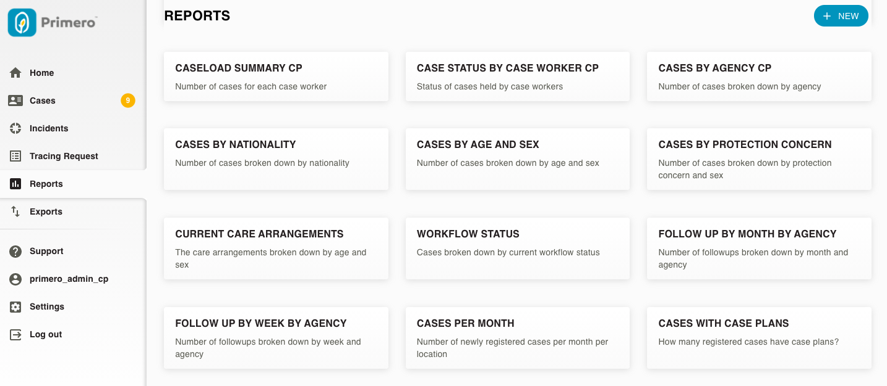

## Creating a Report

To create a report, first click on **Reports** in the Navigation Menu. You will see that there are already a number of pre-built reports which you can view at any time. To start your own, click the NEW button at the top of the screen. Complete all of the fields as detailed below, and then click SAVE to generate and view your report. 

**Name and Description**: Type in a title for the report, so you can find it on the Reports List later.

**Module and Record Type**: Specify the module and type of records you want to draw the records from for your report. Below, we have chosen the Child Protection module, and the Case record type.

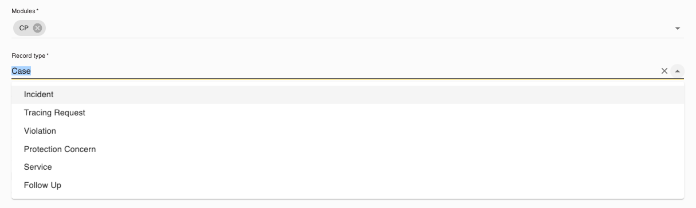

**Rows and Columns**: Group your data by row and by column by selecting one or multiple fields from a dropdown menu. The options in the menu depend on the type of record and module you selected above. For instance, if you selected Case records, you will only see the fields that would appear on a Case record form, as opposed to an Incident record. 

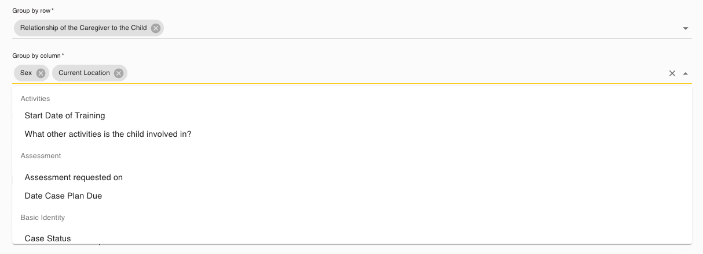

In the example below, the rows are divided by sex and the columns by marital status. It is also possible to select more than one attribute per row or column, for further subdivision of data. In that case, the first item you choose in each field will be the outer grouping layer, with each successive item acting as a sub-categorization.

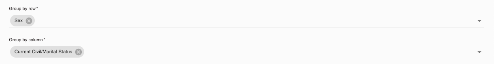

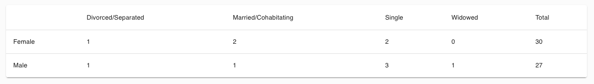

**Age and Date Ranges**: Select the tickboxes for age and date ranges to group these large data sets into a smaller, more manageable set of ranges. 

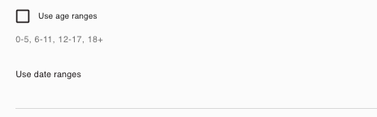

The two images below exemplify the usefulness of this feature. The first image shows part of a sprawling report showing every age. The second shows the same report with age ranges enabled.

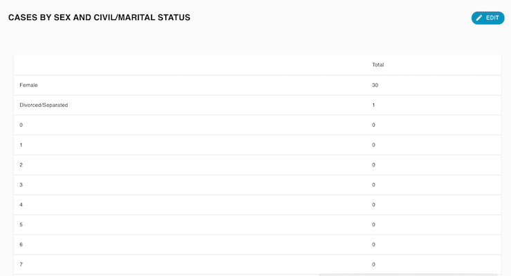

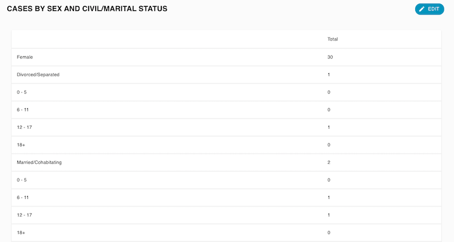

**Generate a Graph**: Select this tickbox to generate a bar graph of your data in addition to a table report.

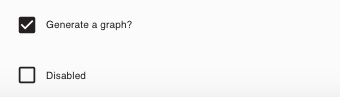

**Disabled**: Select to disable this report.

**Filters**:  Put filters on the records you are using to eliminate irrelevant data. The two default filters are set to ensure that reports include only "Open" and "Valid" records. You can create a filter on any field, as well as specify which values are acceptable for records being included into the report.

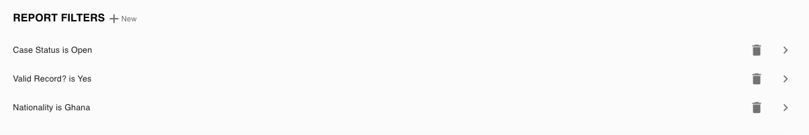

## Viewing a Report

If you click SAVE on your report, and it saves successfully, you will arrive at the view page for your report. If you did not select the "Generate a graph" tickbox, you will see a data table representing your report. If you specified that your report should generate a graph, you will see the graph followed by the table report.

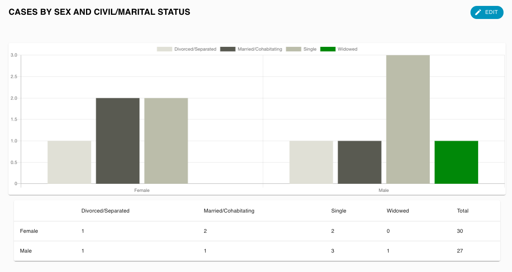

Note that the columns of your report contain a “Total” column, which shows the aggregate for each row. The numbers in each of your columns may not add up to the number in your total column, since many fields will go undefined by the workers doing registration. For instance, in the example above, there were a total of 30 female cases, but only 5 in which the marital status field was filled out. 

If you wish to view only the cases that contain relevant data, you can select EDIT to go back into the case. Then, create a new report filter and select the "Is not blank?" tick box. Once saved again, the report generated with this criteria has a Total column that only calculates based on the completed fields.

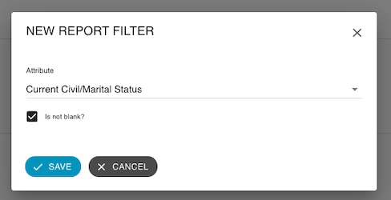

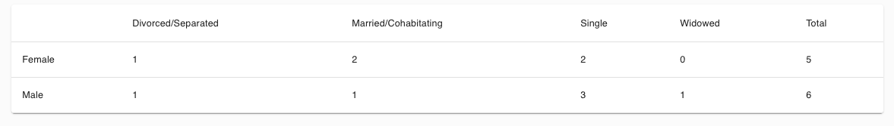

